# Multi-machine deployments using VSTS

## Overview

 To be added

## Pre-requisites

1. **Microsoft Azure Account**: You need a valid and active azure account for the labs.

2.  You need a **Visual Studio Team Services Account** and <a href="https://docs.microsoft.com/en-us/vsts/accounts/use-personal-access-tokens-to-authenticate">Personal Access Token</a>

## Setting up the Environment

Let us use ARM template to provision below resources on Azure:

-  Six VMs with IIS configured

-  A SQL server VM and

-  Azure Network Load Balancer

1. Click on **Deploy to Azure** to provision these resources. It takes approximately 10-15 minutes to complete the deployment.

   

2. Once the deployment is successful, you will see all the resources in your Azure Portal.
   
   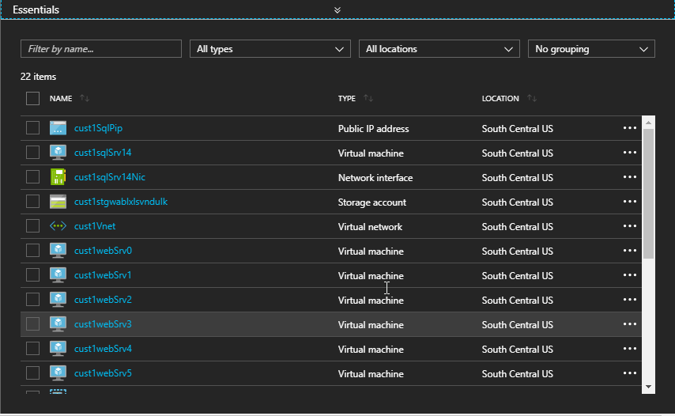

## Setting up VSTS Project

1. Use <a href="">VSTS Demo Data Generator</a> to provision a project on your VSTS account.

   

2. Once the project is provisioned, click the URL to navigate to the project.

   #Image To be added

## Exercise 1: Endpoint Creation

Since the connections are not established during project provisioning, we will manually create the endpoints.

1. In VSTS, navigate to **Services** by clicking on the gear icon, and click on **+ New Service Endpoint**. Select **Azure Resource Manager**. Specify **Connection name**, select your **Subscription** from the dropdown and click **OK**. We use this endpoint to connect **VSTS** and **Azure**.

    

## Exercise 2: Creating Deployment Group

[Deployment Groups](https://docs.microsoft.com/en-us/vsts/build-release/concepts/definitions/release/deployment-groups/) in VSTS make it easier to organize the servers that you want to use to host your app. A deployment group is a collection of machines with a VSTS agent on each of them. Each machine interacts with VSTS to coordinate deployment of your app.

1. Go to **Deployment Groups** under **Build & Release** tab. Click **Add deployment group** .

    

2. Provide a name for **Deployment group name**, Description (optional) and click create. You will see a script generated.

    

    

## Exercise 3: Associating target VMs to Deployment Group

In this exercise, we will associate all 7 machines which have been provisioned earlier. We will run the VSTS agent registration script on each machine to associate with the deployment group.

1. Login to the **web server** using [RDP](https://support.microsoft.com/en-in/help/17463/windows-7-connect-to-another-computer-remote-desktop-connection) with the following details.
   
   - Use Public IP and port number of the VM to login. For example,  **public ip:50001**
   
   - Use the credentials which were provided during the environment set up.

   >Note: Public IP is obtained from Azure Portal. Go to the resource group where you have the resources, click on **cust1webSrv0** VM and copy the Public IP. The port number is **50001** because we have a load balancer setup. The port number for other VMs are already set while being provisioned and are listed in the below table.

   <table width ="75%">
   <th>Machine Name (Web Servers)</th>
   <th>Port Number</th>
   <tr>
      <td>cust1webSrv0</td>
      <td>50001</td>
   <tr>
      <td>cust1webSrv1</td>
      <td>50002</td>
   <tr>
      <td>cust1webSrv2</td>
      <td>50003</td>
   <tr>
      <td>cust1webSrv3</td>
      <td>50004</td>
   <tr>
      <td>cust1webSrv4</td>
      <td>50005</td>
   <tr>
      <td>cust1webSrv5</td>
      <td>50006</td>
    </table>
     
    

2. Copy the generated registration script. Open **Powershell** in **administrator** mode, paste and **execute** the script.

   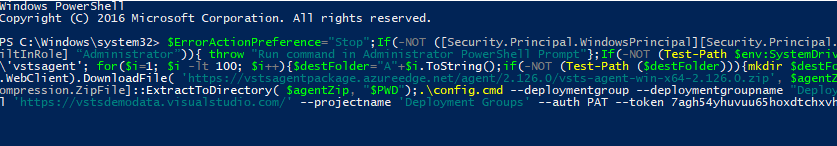 

3. When **Enter deployment group tags for agent?(Y/N)** message is prompted in the powershell window, type **Y** and hit **enter**.

   

4. Tag VM 1 (**cust1webSrv0**) by entering the tag as **web**.
   
    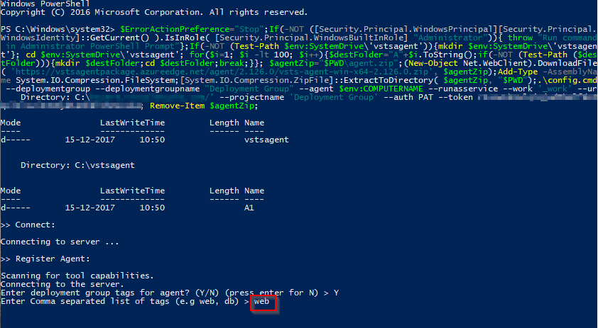 

5. The next prompt in the window is the **User Account** to be used to run the deployment agent as a service. We will use the default service account. Press **enter** key without any input.

    >Note: For all web servers, the user account used is **NT AUTHORITY\SYSTEM**.

6. You will see the deployment agent is configured successfully.

    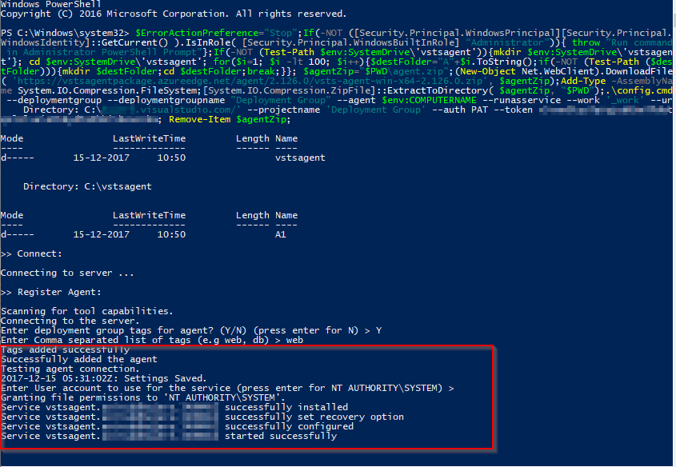 
  
7. Repeat steps from 1 to 5 to tag other **web** servers.

8. Login to the SQL **DB** server VM using the Public IP.

   >Note: Obtain the Public IP from your Azure Portal by going to the resource with the name **cust1SqlPip** and copy the IP address.

   

9. In this case, follow only the 2nd and 3rd steps of Exercise 3.

10. Tag DB server (**cust1sqlSrv14**) by entering the tag as **db**.
  
    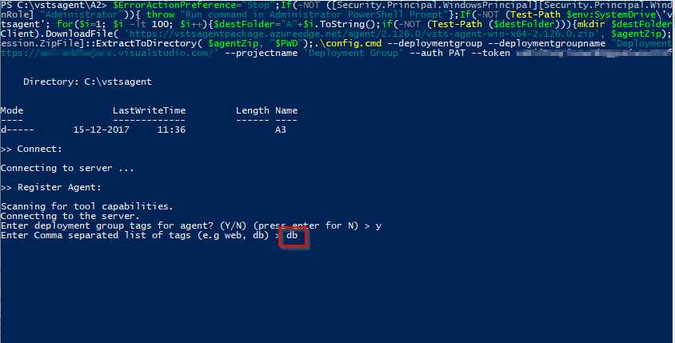 
       
11. Enter the **User Account** to configure the deployment agent.

    >Note: In this example, provide the credentials of the user account **vmadmin**. 

    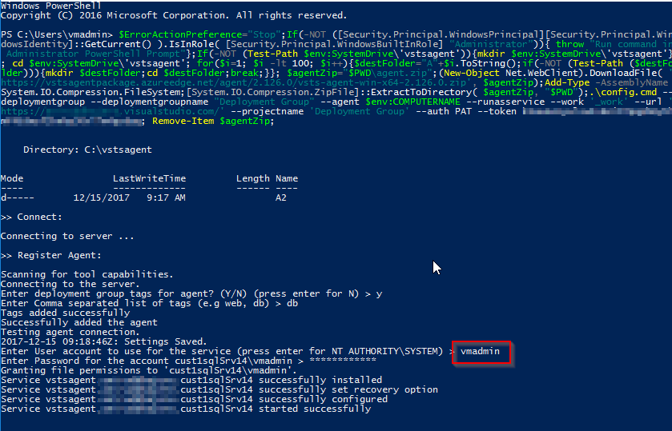 
    

12. 
## Exercise 4: Configure Release

We have target machines available in the deployment group to deploy the application. The release definition uses **Phases** to deploy to target servers.

A phase is a logical grouping of tasks that defines the runtime target on which the tasks will execute. A deployment group phase executes tasks on the machines defined in a deployment group.

1. Go to Releases under **Build & Release** tab. Edit the release definition **Deployment group** and select **Tasks**.

    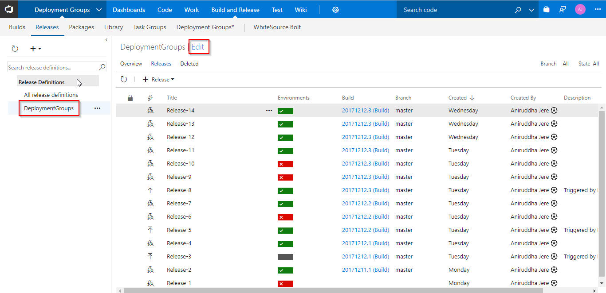 

     
     
     
 
2. You will see tasks grouped under **Database deploy phase** and **IIS Deployment phase**.

   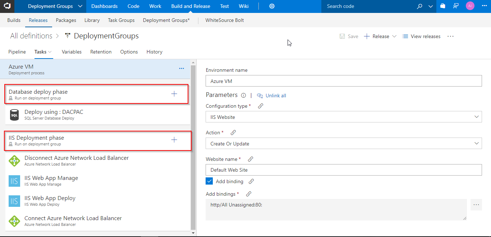 

   - **Database deploy phase**: In this phase, we use [**SQL Server Database Deploy**](https://github.com/Microsoft/vsts-tasks/blob/master/Tasks/SqlDacpacDeploymentOnMachineGroup/README.md) task to deploy [**dacpac**](https://docs.microsoft.com/en-us/sql/relational-databases/data-tier-applications/data-tier-applications) file to the DB server.
 
    
     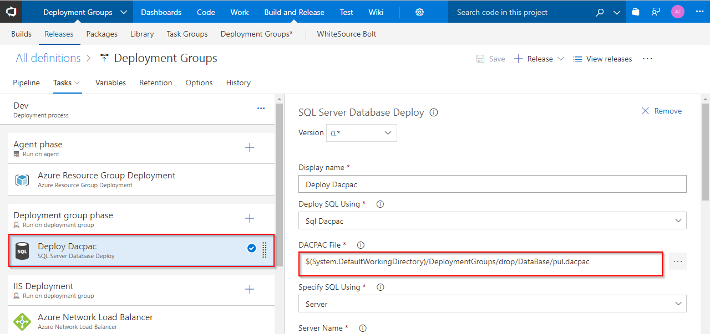

     This phase is linked to **db** tag.

     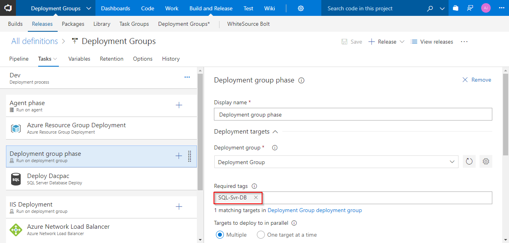

   - **IIS Deployment phase**: In this phase, we deploy application to the web servers. We use following tasks- 
      
      - **Azure Network Load Balancer**: As the target machines are connected to NLB, this task will disconnect machines from NLB before the deployment and re-connects to NLB after the deployment.

      - **IIS Web App Manage**: The task runs on the deployment target machine(s) registered with the Deployment Group configured for the task/phase. It creates a webapp and application pool locally with the name **PartsUnlimited** running under the port 
      **80**  -  http://localhost:80

      - **IIS Web App Deploy**: The task runs on the deployment target machine(s) registered with the Deployment Group configured for the task/phase. It deploys the application to the IIS server using **Web Deploy**.

     This phase is linked to **web** tag.

     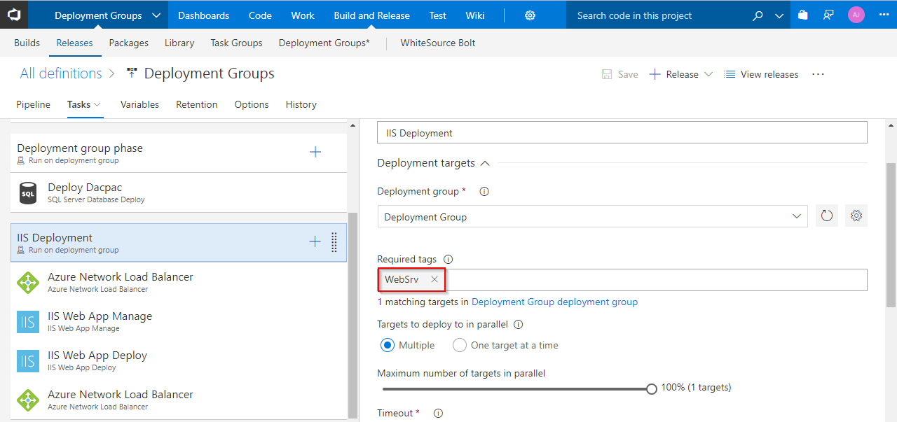

3. Control the number of concurrent deployments by setting the **Maximum number of targets in parallel**. 

   >In this case we have 6 web servers. Setting it to 50% will deploy to 3 servers at a time.

   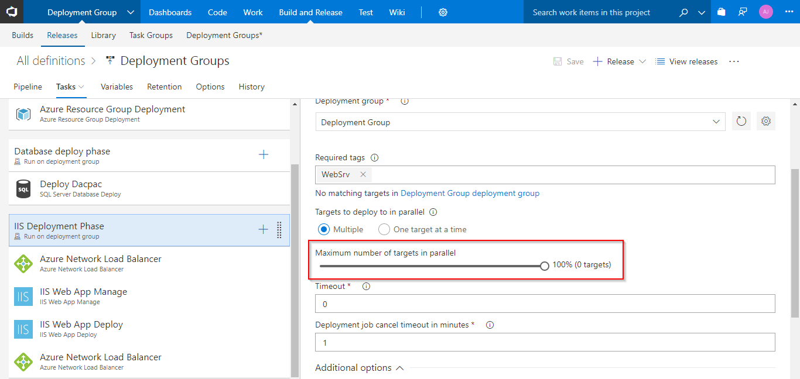
 

4. Go to **Disconnect Azure Network Load Balancer** task and update the following details-

   - **Azure Subscription**: ARM Endpoint created in **Exercise 1**

   - **Resource Group**: Name of the Resource Group which was created while provisioning the environment

   - **Load Balancer Name**: Select the name **cust1webSrvlb** from the dropdown

   - **Action**: Set the action to **Disconnect Primary Network Interface**

   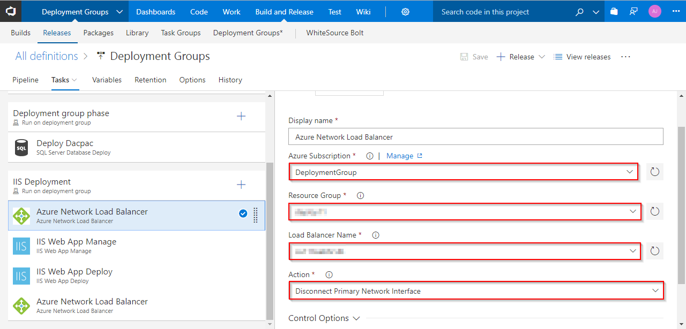

5.  Go to **Connect Azure Network Load Balancer** and update the following details-

    - **Azure Subscription**: ARM Endpoint created in **Exercise 1**

    - **Resource Group**: Name of the Resource Group which was created while provisioning the environment

    - **Load Balancer Name**: Select the name **cust1webSrvlb** from the dropdown

    - **Action**: Set the action to **Connect Primary Network Interface**

    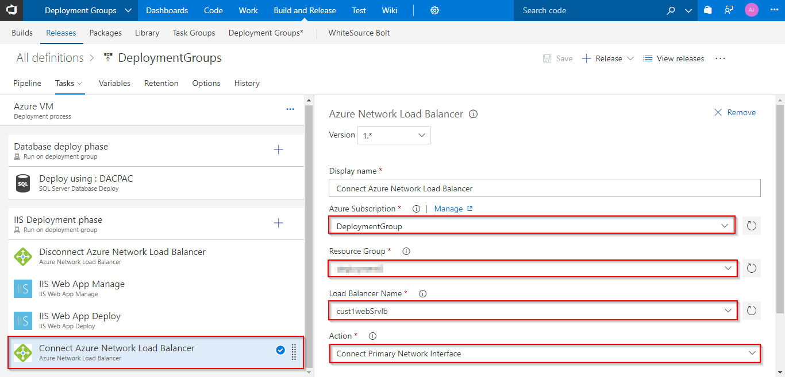

6. Click **Save** and **Create release**.

   

    

   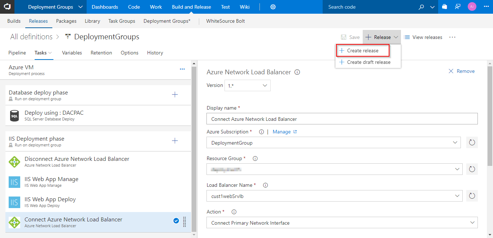

7. Once the release is complete, you will see the deployments are done to DB and Web Servers. Go to Logs to see the summary.

   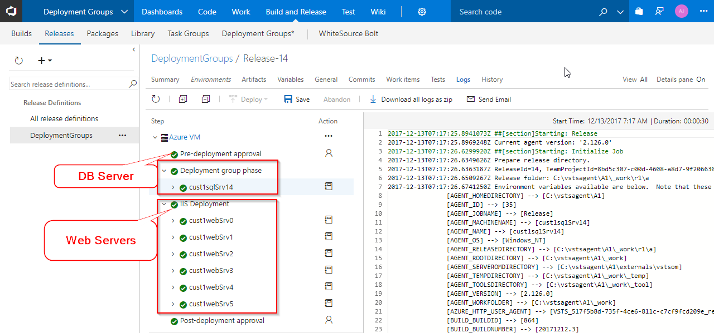

   >In one of your web servers, go to http://localhost:80/ to access the application. 

8. The deployed web application is displayed.

   

## Summary

With Visual Studio Team Services and Azure, we can build and release dotnet applications to multiple target servers using Deployment Groups.

## Feedback

Please email [us](mailto:devopsdemos@microsoft.com) if you have any feedback on this lab.

