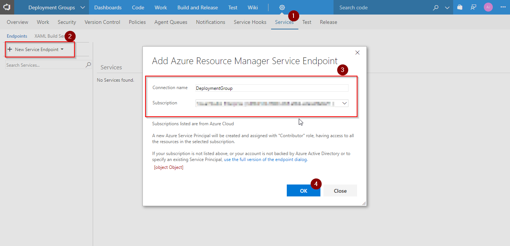

# Authoring release using Deployment Groups in VSTS

## Overview

 [Deployment Groups](https://docs.microsoft.com/en-us/vsts/build-release/concepts/definitions/release/deployment-groups/) is a logical set of deployment target machines that have agents installed on each one. Deployment groups represent the physical environments; for example, "Dev", "Test", "UAT", and "Production". In effect, a deployment group is just another grouping of agents, much like an agent pool.

## Pre-requisites

1. **Microsoft Azure Account**: You need a valid and active azure account for the labs.

2.  You need a **Visual Studio Team Services Account** and <a href="https://docs.microsoft.com/en-us/vsts/accounts/use-personal-access-tokens-to-authenticate">Personal Access Token</a>

## Setting up the Environment

We will provision 7 VM's which includes 6 app tiers with a load balancer, and a data tier which includes SQL components.

1. Click on **Deploy to Azure** to provision. It takes approximately 10-15 minutes to deploy.                                                                 

2. Once the deployment is successful, you will see all the resources in your Azure Portal.
   
   

## Setting up the VSTS Project

1. Use <a href="">VSTS Demo Data Generator</a> to provision a project on your VSTS account.

   

2. Once the project is provisioned, select the URL to navigate to the project.

image

## Exercise 1: Endpoint Creation

Since the connections are not established during project provisioning, we will manually create the endpoints.

1. In VSTS, navigate to **Services** by clicking on the gear icon, and click on **+ New Service Endpoint**. Select **Azure Resource Manager**. Specify **Connection name**, select your **Subscription** from the dropdown and click **OK**. We use this endpoint to connect **VSTS** and **Azure**.

    

## Exercise 2: Creating Deployment Group

[Deployment Groups](https://docs.microsoft.com/en-us/vsts/build-release/concepts/definitions/release/deployment-groups/) in VSTS make it easier to organize the servers that you want to use to host your app. A deployment group is a collection of machines with a VSTS agent on each of them. Each machine interacts with VSTS to coordinate deployment of your app.

1. Go to **Deployment Groups** under **Build & Release** tab. Click **Add deployment group** .

    

2. Provide a name and click create. You will see the script generated.

    

    

## Exercise 3: Associating target VMs to Deployment Group

In this exercise, we will associate all 7 machines which are created while provisioning. We will run the registration script on each machine to associate with the deployment group.

1. Login to the app server using [RDP](https://support.microsoft.com/en-in/help/17463/windows-7-connect-to-another-computer-remote-desktop-connection) with the following details.
   
   - Use public ip and port number to login. For example  **public ip:50001**
   
   - Use the credentials which was provided during the environment set up.

   >Note: The Public IP is obtained from Azure Portal. Go to the resource group where you have the resources, click on **cust1webSrv0** VM and copy the Public IP. The port number is **50001** becuase we have a load balancer setup. The port number for other machines is listed in the below table.

   <table width ="75%">
   <th>Machine Name (Web Servers)</th>
   <th>Port Number</th>
   <tr>
      <td>cust1webSrv0</td>
      <td>50001</td>
   <tr>
      <td>cust1webSrv1</td>
      <td>50002</td>
   <tr>
      <td>cust1webSrv2</td>
      <td>50003</td>
   <tr>
      <td>cust1webSrv3</td>
      <td>50004</td>
   <tr>
      <td>cust1webSrv4</td>
      <td>50005</td>
   <tr>
      <td>cust1webSrv5</td>
      <td>50006</td>
    </table>

    

2. Copy the script from the deployment group and **execute** using PowerShell console in administrator mode.

    

3. Type **Y** and hit enter when prompted to **Enter deployment group tags for agent**.

   

4. Tag VM 1 (**cust1webSrv0**) by entering the tag as **web**.
   
     

5. You will see the deployment agent is configured successfully.

     
  
6. Repeat the steps from 1 to 5 to tag other web servers.

7. Login to the DB server using the Public IP.

   >Note: Obtain the Public IP from your Azure Portal by going to the resource with the name **cust1SqlPip** and copy the IP address.

   

8. In this case, repeat the steps 2 and 3 only.

9. Tag the DB server (**cust1sqlSrv14**) by entering the tag as **db**.
  
    
       
10. Enter the **User Account** to configure the deployment agent.

    >Note: In this example the user account is **vmadmin**. 

     

## Exercise 4: Configure Release to Deployment Groups
 Now we have web server and data server ready for deployment. Deployment is done in phases.  

 > A phase is a logical grouping of tasks that defines the runtime target on which the tasks will execute. A deployment group phase executes tasks on the machines defined in a deployment group.

1. Go to Releases under **Build & Release** tab, edit the release definition **Deployment group** and select Tasks.

     

     
     
 
   You will see task grouped under **Database deploy phase** and **IIS Deployment phase**

    

**Database deploy phase**: Under this phase we use database deploy task which will deploy dacpac to database server 
    

This phase is linked to **db** tag.

This task will deploy Dacpac to server which is taged as **db** server.

**IIS Deployment phase**: Under this phase we deploy web app to web server.

This phase is linked to **web** tag.

**Maximum number of targets in parallel** allows us to set parallel deployment on multiple web server. In this case we have six server and if we set 50% parallel deployment will happen  on three servre at a time.

   
 

2. Go to **Disconnect Azure Network Load Balancer** and update as shown.

   

This task will disconnect VMs from load balance network.

 **IIS Web App Manage** : This task will create web app on web apps server.

 

**IIS Web App Deploy** : This task will deploy artifact to web apps server.

3.  Go to **Connect vAzure Network Load Balancer** and update as shown.

    

This task will connect VMs from load balance network.

4. Click **save** and **create release**

     

   

5. Once the release is successful go to any web server and browse below URL:

       Web Application URL(http://localhost:80/)

7. You will see web application as shown below.

   

  

# Summary

With Visual Studio Team Services and Azure, we can build and release dotnet applications to multiple target servers using Deployment Groups.

# Feedback
