## Docker Deployment using VSTS and Azure for ASP.NETCORE

## Overview

This lab shows how to build custom images of <a href="http://dockr.ly/2zLiDPy">**Dockerized ASP.NETCORE**</a> application, push those images to <a href="http://dockr.ly/2AJLgge"> **Private Repository** </a> (<a href="http://bit.ly/2jssVQy"> Azure Container Registry </a>), and pull these images to deploy to containers in **Azure Web App** (Linux) using Visual Studio Team Services.

Web App for containers lets you bring your own <a href="http://dockr.ly/2imRbR4">Docker</a> formatted container images, easily deploy and run them at scale with Azure. Combination of Team Services and Azure integration with Docker will enable you to:

1.  <a href="http://dockr.ly/2z2Qsi2"> Build </a> your own custom images using <a href="http://bit.ly/2jqGujv"> VSTS Hosted Linux agent </a>
2. <a href="http://dockr.ly/2hAZco0"> Push </a> and store images in your private repository
3. Deploy and  <a href="http://dockr.ly/2AJPaEW"> run </a> images inside containers

Below screenshot helps you understand the VSTS DevOps workflow with Docker: 

## Pre-requisites

1.  **Microsoft Azure Account**: You need a valid and active azure account for the labs.

2. You need a **Visual Studio Team Services Account** and <a href="http://bit.ly/2gBL4r4">Personal Access Token</a>.

3. You need to install **Docker Integration** extension from <a href="http://bit.ly/2hurgK3">Visual Studio Marketplace</a>.

## Setting up the Environment

We will create an **Azure Container Registry** to store the images generated during VSTS build. These images contain environment configuration details with build settings.  An **Azure Web App** (with Linux OS) is created where custom built images will be deployed to run inside containers. 

1. Click on **Deploy to Azure** to spin up **Azure Container Registry** and **Azure Web App**.

    

    

   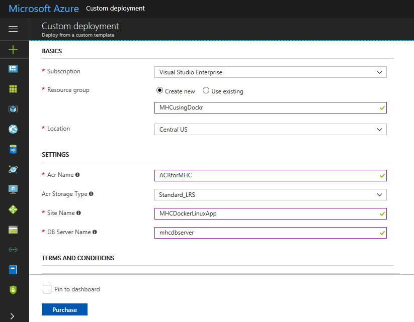

2. It takes approximately **3 to 4 minutes** to provision the environment. 

   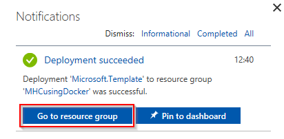

3. Below components are created post deployment. Click on **Azure Container Registry**.

   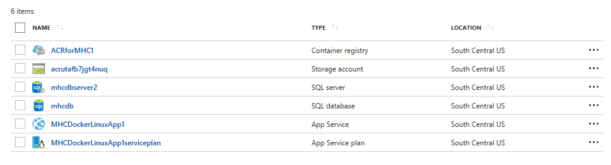

    
    <table width="100%">
     <thead>
      <tr>
         <th width="50%"><b>Azure Components</b></th>
         <th><b>Description</b></th>
      </tr>
    </thead>
    <tr>
      <td><a href="http://bit.ly/2mwVYUz"><b>Azure Container Registry</b></a></td>
      <td>Used to store images privately</td>
    </tr>
    <tr>
      <td><a href="http://bit.ly/2iYiCQx"><b>Storage Account</b></a>  </td>
      <td>Container Registry resides in this storage account</td>
    </tr>
    <tr>
      <td><a href="http://bit.ly/2ALhdES"><b>App Service</b></a>  </td>
      <td>Docker images are deployed to containers in this App Service</td>
    </tr>
    <tr>
      <td><a href="http://bit.ly/2AINQ5x"><b>App Service Plan</b></a>  </td>
      <td>Resource where App Service resides</td>
    </tr>
    </table>

4. Click on **Access keys** under **Settings** node. Note down the **Login server**,  **Username** and **Password**. We need these in **Exercise 1**.

   

## Setting up the Project

1. Use <a href="https://vstsdemogenerator.azurewebsites.net" target="_blank">VSTS Demo Data Generator</a> to provision a project on your VSTS account 

2. Select **Docker** for the template.
   

3. Once the project is provisioned, select the URL to navigate to the project that you provisioned.

   

## Exercise 1: Endpoint Creation

Since the connections are not established during project provisioning, we will manually create the endpoints. 

1. In VSTS, navigate to **Services** by clicking on the gear icon, and click on **+ New Service Endpoint**. Select **Azure Resource Manager**. Specify **Connection name**, select your **Subscription** from the dropdown and click **OK**. We use this endpoint to connect **VSTS** and **Azure**.

   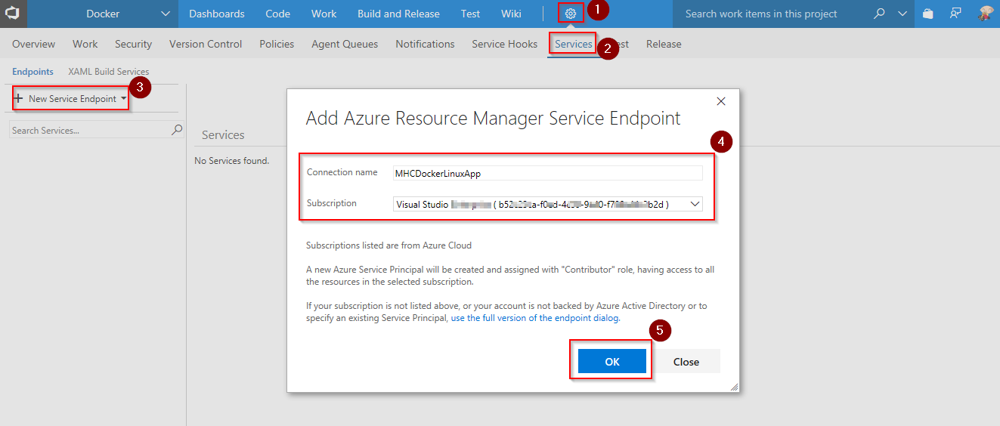

   You will be prompted to authorize this connection with Azure credentials. 

   **Note:** Disable pop-up blocker in your browser if you see a blank screen after clicking **OK**, and retry the step. 

2. Click **+ New Service Endpoint**, and select **Docker Registry** from the list. We use this endpoint to connect **VSTS** and **Azure Container Registry** (where images would be hosted).

   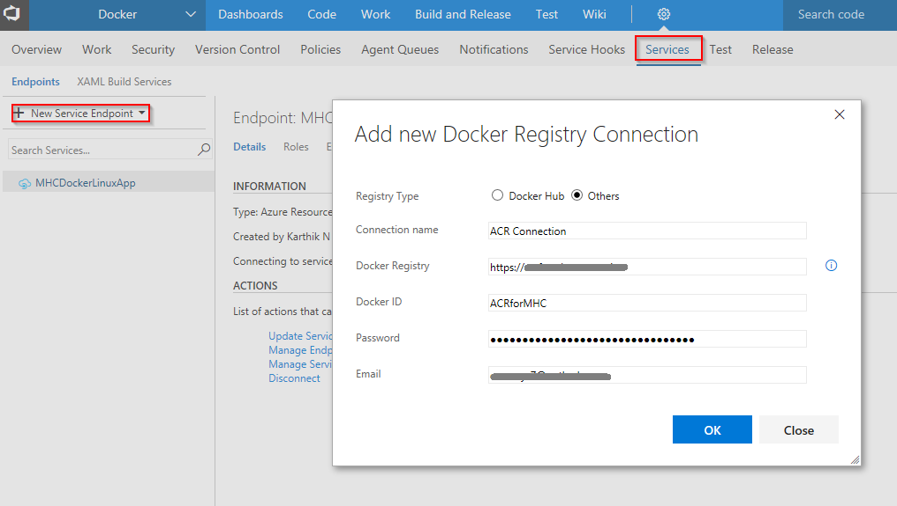

   For **Registry Type** select **Others**. Map the details to **Docker Registry Connection** from **Azure Container Registry** (in azure portal) with the parameters as shown:

    <table width="100%">
     <thead>
      <tr>
         <th width="50%"><b>Docker Registry Connection</b></th>
         <th><b>Azure Container Registry</b></th>
      </tr>
   </thead>
    <tr>
      <td>Docker Registry (starts with https://)</a></td>
      <td>Login server</td>
    </tr>
    <tr>
      <td>Docker ID</a> </td>
      <td>Username</td>
     </tr>
     <tr>
      <td>Password</b></a> </td>
      <td>Password </td>
     </tr>
     <tr>
      <td>Email</a> </td>
      <td>Email id of azure account</td>
     </tr>
   </table>

## Exercise 2: Configure CI-CD

 Now that connections are established, we will manually map the endpoints to build and release definitions.

1. Go to **Builds** under **Build and Release** tab, **Edit** the build definition **Docker**.

   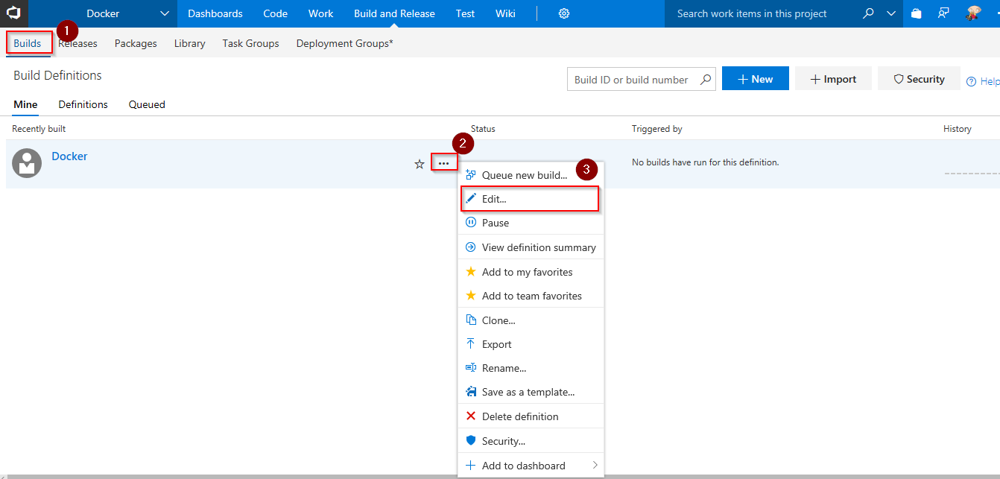

2. Click on **Process** section, select endpoint components from the dropdown under **Azure subscription** and **Azure Container Registry** as shown.

   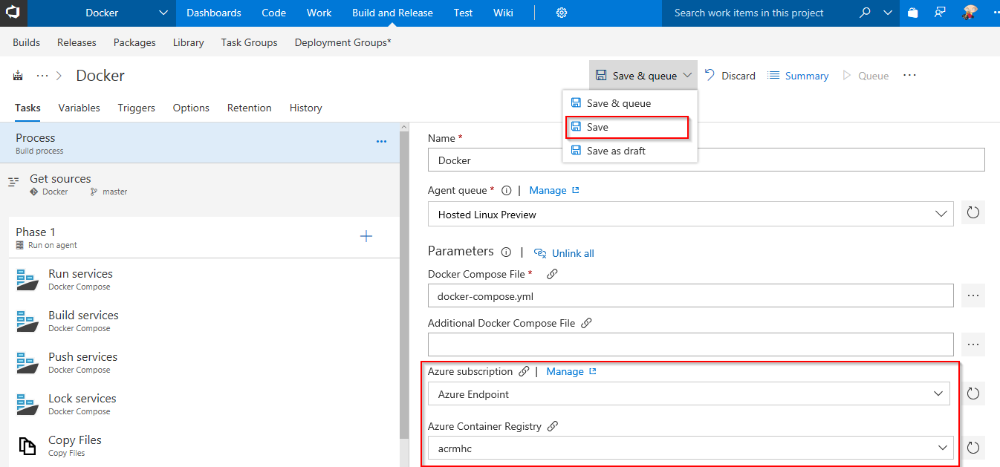

    

   <table width="100%">
   <thead>
      <tr>
         <th width="50%"><b>Tasks</b></th>
         <th><b>Usage</b></th>
      </tr>
   </thead>
   <tr>
      <td><a href="http://bit.ly/2zlTspl"><b>Run services</b></a> </td>
      <td>runs <b>service images</b> specified in a <b>docker-compose.ci.build.yml</b> file  in an isolated environment to enable workloads such as integration testing</td>
   </tr>
   <tr>
      <td><a href="http://bit.ly/2zlTspl"><b>Build services</b></a> </td>
      <td>builds <b>service images</b> specified in a <b>docker-compose.yml</b> file with registry-qualified names and additional tags such as <b>$(Build.BuildId)</b></td>
   </tr>
    <tr>
      <td><a href="http://bit.ly/2zlTspl"><b>Push services</b></a> </td>
      <td>pushes <b>service images</b> specified in a <b>docker-compose.yml</b> file, with multiple tags, to container registry</td>
   </tr>
    <tr>
      <td><a href="http://bit.ly/2zlTspl"><b>Lock services</b></a> </td>
      <td>pulls image from default tag <b>latest</b> in container registry and verifies if uploaded image is up to date</td>
   </tr>
   <tr>
      <td><a href="http://bit.ly/2iDhjpO"><b>Copy Files</b></a>  </td>
      <td>used to copy files from source to destination folder using match patterns </td>
   </tr>
   <tr>
      <td><a href="http://bit.ly/2zGD6bn"><b>Publish Build Artifacts</b></a>  </td>
      <td> used to share the build artifacts </td>
   </tr>
   </table>

3. Click **Save**.

   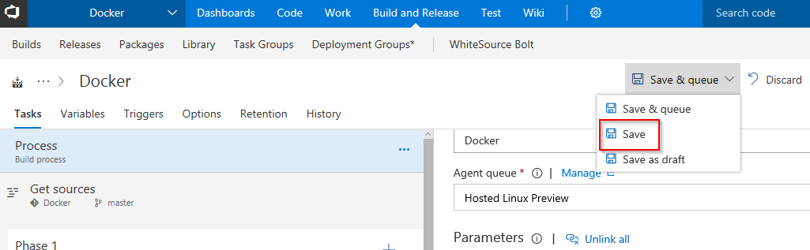

4. Go to **Releases** under **Build & Release** tab, edit the release definition **Docker** and select **Tasks**.

   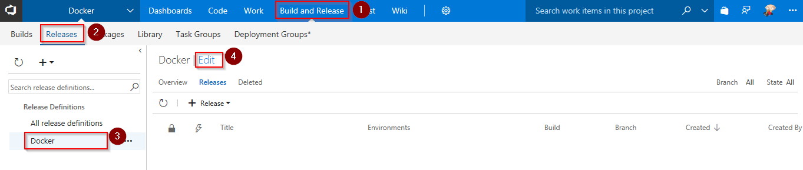

    

   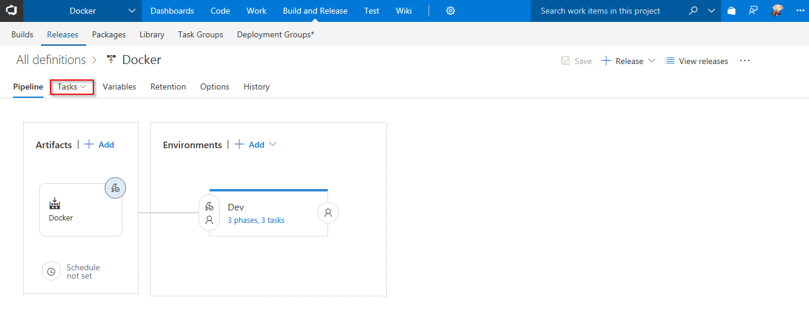

5. Under **Deploy Azure App Service** task, update **Azure subscription** and **Azure Service name** with the endpoint components from the dropdown. In the **Registry or Namespace** field, enter **Azure Container Registry Login Server** as shown and click **Save**.

   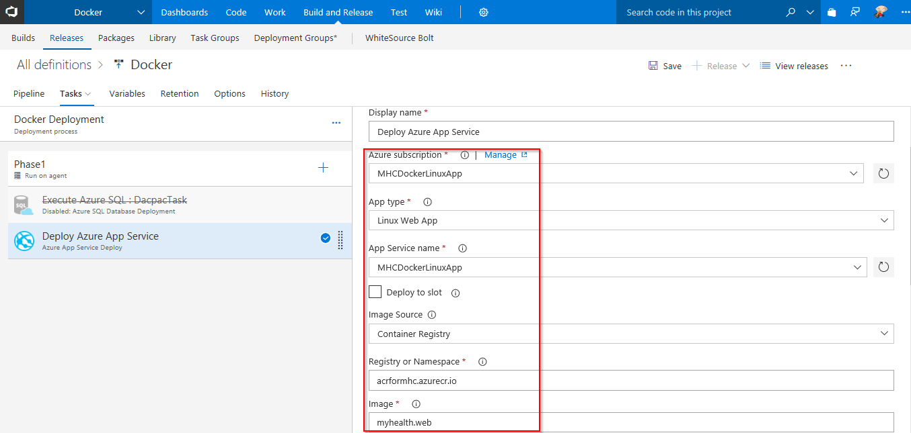

## Exercise 3: Code update

We will update the code to trigger CI-CD by leveraging **Docker** components installed in **Hosted VSTS agent** to build and deploy custom images to containers. 

1. Go to **Code** tab, and navigate to the below path to edit the file- 

   >Docker/src/MyHealth.Web/Views/Home/**Index.cshtml**

   

2. Go to line number **28**, update **JOIN US** to **JOIN US TODAY**, and click **Commit**.

    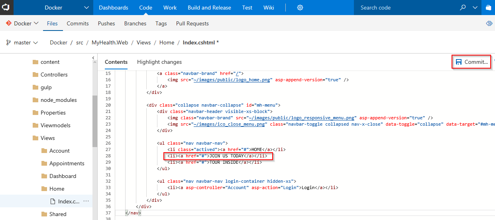

3. Go to **Builds** tab to see the CI build in-progress.

    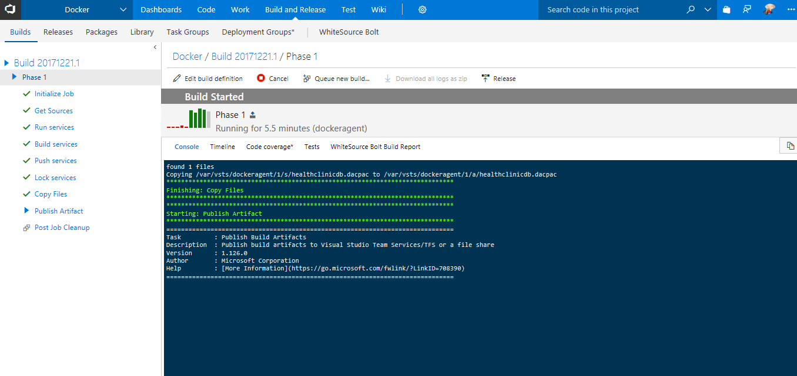

4. The build will generate and push the image to ACR. After build completes, you will see the build summary. 
    
    
   

5. Go to **Releases** tab to see the CD in-progress.

    

6.  The release will deploy the image to App Service and you will see the release summary with logs as shown.

    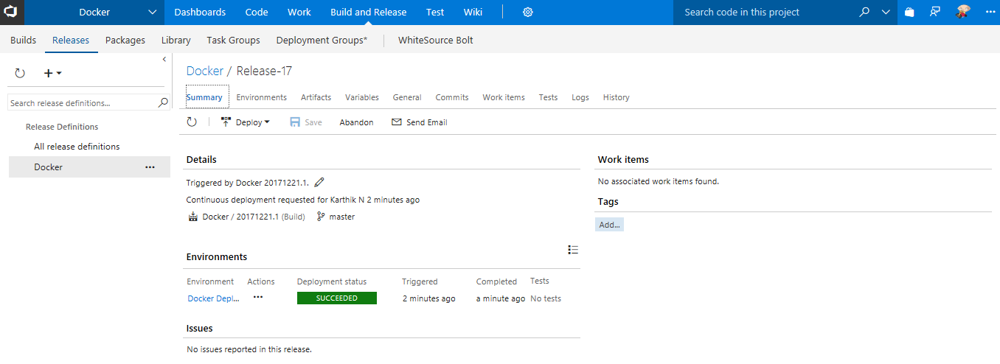

     

    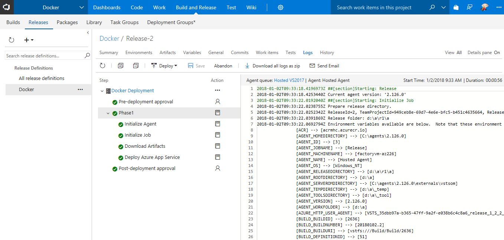

7. Go to <a href="https://portal.azure.com">Azure Portal</a>, navigate to the **App Service** which was created at the beginning of this lab. Click on the **URL** to see the changes in your app.

    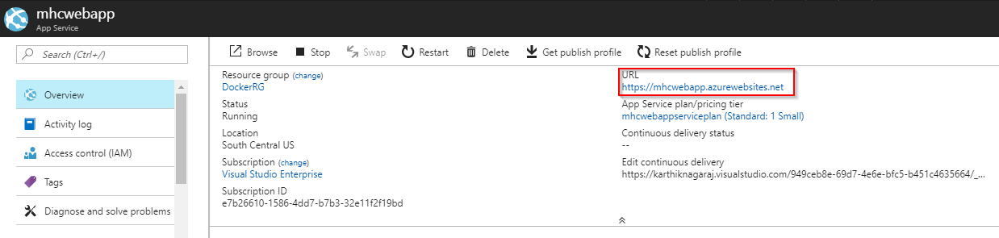

      

    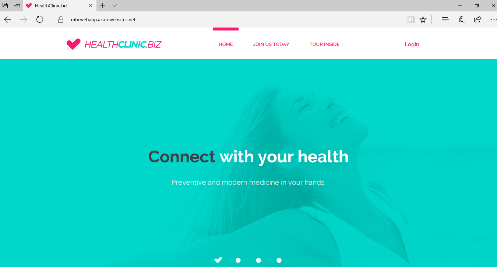

8. To see the generated images in Azure Portal, go to **Azure Container Registry** and navigate to **Repositories**.

    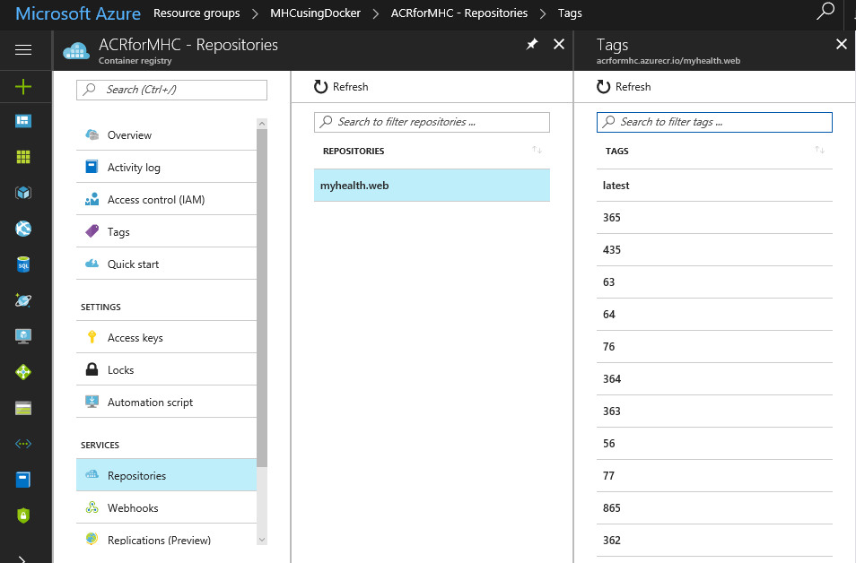

## Summary

With **Visual Studio Team Services** and **Azure**, we can build DevOps for dockerized applications.

## Feedback

