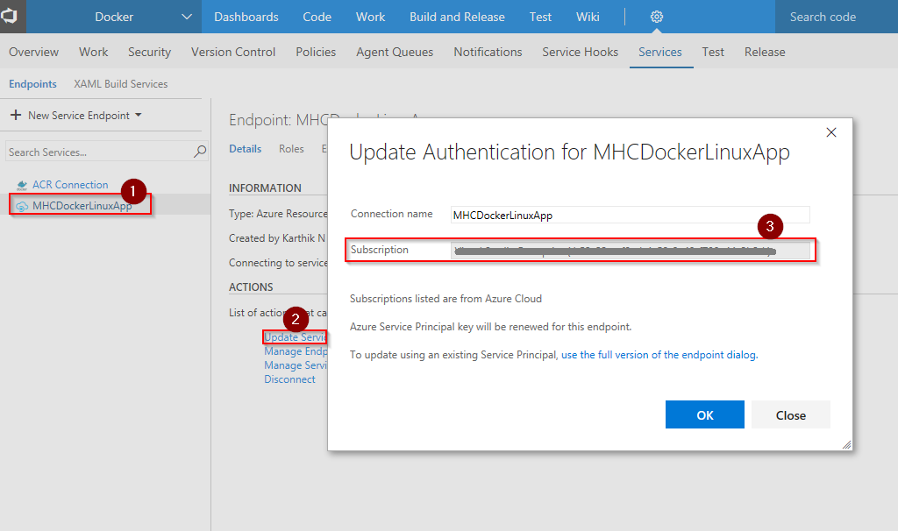
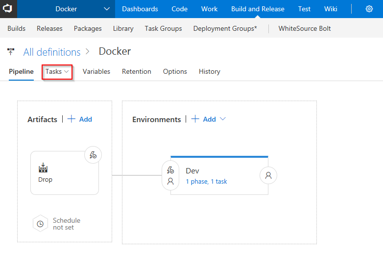

## Docker Deployment for ASP.NETCORE Application with Visual Studio Team Services and Azure

## Overview

This lab shows how you can build, push and deploy images of **Dockerized ASP.NETCORE** application to  **Azure Web App (Linux)** using Visual Studio Team Services.

Web App for Containers lets you bring your own Docker formatted container images and easily deploy and run them at scale with Azure. Combination of Team Services and Azure integration with Docker will enable you to:

1. Build your own custom images 
2. Push and store images in your private repository
3. Deploy and run images in containers

## Pre-requisites

1.  You need a <b>Visual Studio Team Services Account</b> and <a href="http://bit.ly/2gBL4r4">Personal Access Token</a>

2. You need to install **Docker Integration** extension from <a href="http://bit.ly/2hurgK3">Visual Studio Marketplace</a>

## Setting up the Environment

1. Click on **Deploy to Azure** to spin up **Azure Container Registry** and **Azure Web App (Linux)**.

    

    

   

2. It takes upto **4 minutes** to provision the environment. 

   

3. Four components are created post deployment as seen below. Now, click on newly created **Azure Container Registry**.

   

4. Click on **Access keys** under **Settings** node. Note down the **Login server**,  **Username** and **Password**.

   

## Setting up the Project

1. Use <a href="https://vstsdemogenerator.azurewebsites.net" target="_blank">VSTS Demo Data Generator</a> to provision a project on your VSTS account 

2. Select **Docker** for the template.

3. Once the project is provisioned, select the URL to navigate to the project that you provisioned.

   

## Exercise

We have an **ASP.NETCORE code** provisioned by the demo generator system. We will leverage **Docker** components installed in **Hosted VSTS agent** to build and deploy custom images to containers.

1. Click on existing **Azure Resource Manager Endpoint** which was provisioned from the template, and click on **Update Service Configuration**. Choose your subscription from the dropdown.

   

2. In VSTS, navigate to **Services** by clicking on the gear icon, and click on **+ New Service Endpoint**. Select **Docker Registry** from the list. 

   

   Map the details from **ACR** (in azure portal) to **Docker Registry** by passing the parameters as given below-

   - **Login server**: Docker Registry (starts with https://)
   - **Username**: Docker ID
   - **Password**: Password
   - **Enter email id associated with your account**: Email

3. Go to **Builds** under **Build and Release** tab, and edit the build definition **Docker**.

   

4. Click on **Process** section, and select newly added endpoint components from the dropdown under **Azure subscription** and **Azure Container Registry** as shown below.

   

    

   <table width="100%">
   <thead>
      <tr>
         <th width="50%"><b>Tasks</b></th>
         <th><b>Usage</b></th>
      </tr>
   </thead>
   <tr>
      <td><a href="http://bit.ly/2zlTspl"><b>Docker Compose</b></a> </td>
      <td>build, push, run Docker images and multi-container Docker applications</td>
   </tr>
   <tr>
      <td><a href="http://bit.ly/2iDhjpO"><b>Copy Files</b></a>  </td>
      <td>Used to Copy files from source to destination folder using match patterns </td>
   </tr>
   <tr>
      <td><a href="http://bit.ly/2zGD6bn"><b>Publish Build Artifacts</b></a>  </td>
      <td> Used to share the build artifacts </td>
   </tr>
   </table>

5. Click on **Save**.

   

6. Click on **Releases** under **Build & Release** tab, and edit the Release Definition **Docker**.

   

7. Click on **Tasks**.

   

8. Click on **Deploy Azure App Service** task, and select newly added endpoint components from the dropdown under **Azure subscription** and **Azure Service name**. Manually update **Registry or Namespace** with **Azure Container Registry Login Server** as shown below and click on **Save**.

   

9. Let us do a code change to verify CI-CD pipeline. Go to **Code** tab, and navigate to the below path to edit the file- 

   >Docker/src/MyHealth.Web/Views/Home/**Index.cshtml**

   

10. Scroll down to line number **28**, and change the code from **JOIN US** to **JOIN US TODAY**, and click on **Commit**.

    

11. Navigate to **Builds** section to see CI build in progress.

    

12. You can see the build summary once completed.
    
    
   

13. Once the Build is complete, navigate to **Releases** section to see CD in progress.

    

14. Once the release is completed, you can see the summary which shows **Release Summary, Logs** etc.

    

     

    

15. After **Release** tasks are complete, copy the **Web App URL** from Azure Portal by navigating to the **Linux Web App** which was created at the beginning of this lab.

    

16. Paste the above **URL** in browser to verify if the code we changed is reflected in the Web App.

    

17. To see the images created you have to navigate to **Repositories** under **Azure Container Registry** in Azure Portal.

    

## Summary

With Visual Studio Team Services and Azure, we can have DevOps for dockerized applications where images will be deployed to **ACS DC/OS**, **Kubernetes** or **Docker Swarm**.

## Feedback

