## Docker Deployment using VSTS and Azure for ASP.NETCORE

## Overview

This lab shows how to build custom images of <a href="https://docs.docker.com/engine/examples/dotnetcore/">**Dockerized ASP.NETCORE**</a> application, push those images to <a href="https://docs.docker.com/registry/"> **Private Repository** </a> (<a href="https://azure.microsoft.com/en-in/services/container-registry/"> Azure Container Registry </a>), and pull these images to deploy to containers in **Azure Web App** (Linux) using Visual Studio Team Services.

Web App for containers lets you bring your own <a href="https://www.docker.com/what-docker">Docker</a> formatted container images, easily deploy and run them at scale with Azure. Combination of Team Services and Azure integration with Docker will enable you to:

1.  <a href="https://docs.docker.com/engine/reference/commandline/build/"> Build </a> your own custom images using <a href="https://docs.microsoft.com/en-us/vsts/build-release/concepts/agents/hosted"> VSTS Hosted Linux agent </a>
2. <a href="https://docs.docker.com/engine/reference/commandline/push/"> Push </a> and store images in your private repository
3. Deploy and  <a href="https://docs.docker.com/engine/reference/commandline/run/"> run </a> images inside containers

Below screenshot helps you understand the VSTS DevOps workflow with Docker: 

## Pre-requisites

1.  **Microsoft Azure Account**: You need a valid and active azure account for the labs.

2. You need a **Visual Studio Team Services Account** and <a href="https://docs.microsoft.com/en-us/vsts/accounts/use-personal-access-tokens-to-authenticate">Personal Access Token</a>.

3. You need to install **Docker Integration** extension from <a href="https://marketplace.visualstudio.com/items?itemName=ms-vscs-rm.docker">Visual Studio Marketplace</a>.

## Setting up the Environment

We will create an **Azure Container Registry** to store the images generated during VSTS build. These images contain environment configuration details with build settings.  An **Azure Web App** (with Linux OS) is created where custom built images will be deployed to run inside containers. 

1. Click on **Deploy to Azure** (or right click and select ***Open in new tab***) to spin up **Azure Container Registry**, **Azure Web App** and **Azure SQL Database** along with **Azure SQL Server**. Enter required details such as Acr name, Site Name and DB Server Name. Agree to Terms and Conditions, and click **Purchase**.

    

    

   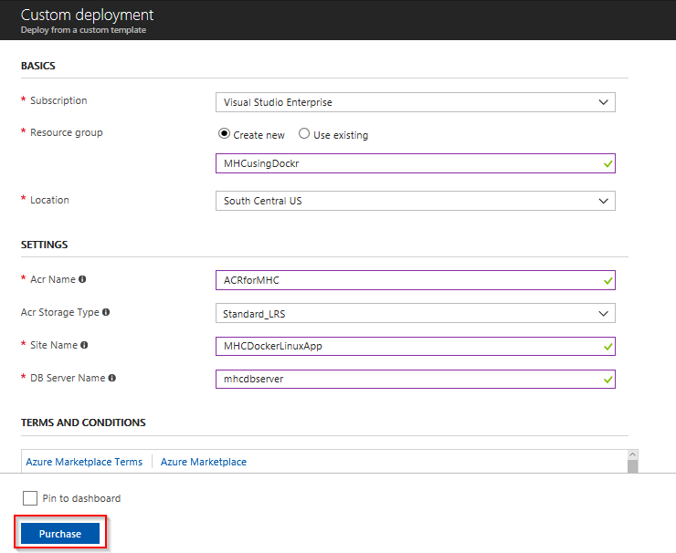

2. It takes approximately **3 to 4 minutes** to provision the environment. Click on **Go To resource group**.

   

3. Below components are created post deployment. Click on **Azure Container Registry**.

     
    <table width="100%">
     <thead>
      <tr>
         <th width="50%"><b>Azure Components</b></th>
         <th><b>Description</b></th>
      </tr>
    </thead>
    <tr>
      <td><b>Azure Container Registry</b></td>
      <td>Used to store images privately</td>
    </tr>
    <tr>
      <td> <b>Storage Account</b></td>
      <td>Container Registry resides in this storage account</td>
    </tr>
    <tr>
      <td> <b>App Service</b></td>
      <td>Docker images are deployed to containers in this App Service</td>
    </tr>
    <tr>
      <td> <b>App Service Plan</b></td>
      <td>Resource where App Service resides</td>
    </tr>
    <tr>
      <td> <b>SQL Server</b> </td>
      <td>SQL Server to host database</td>
    </tr>
    <tr>
      <td> <b>SQL database</b> </td>
      <td>SQL database to host MyHealthClinic data</td>
    </tr>
    </table>

     

    
   

4. Click on **mhcdb** SQL database. Note down the **Server name**. We need these details later in Excercise 2.

   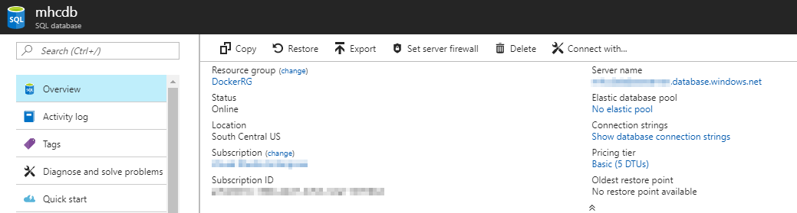

5. Go back your resource group. Click on container registry. Note down the **Login server** name. We need these details later in Excercise 2.

   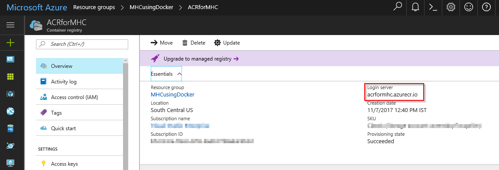
   

## Setting up the Project

1. Use <a href="https://vstsdemogenerator.azurewebsites.net/?name=Docker&templateid=77364" target="_blank">VSTS Demo Data Generator</a> to provision a project on your VSTS account 

    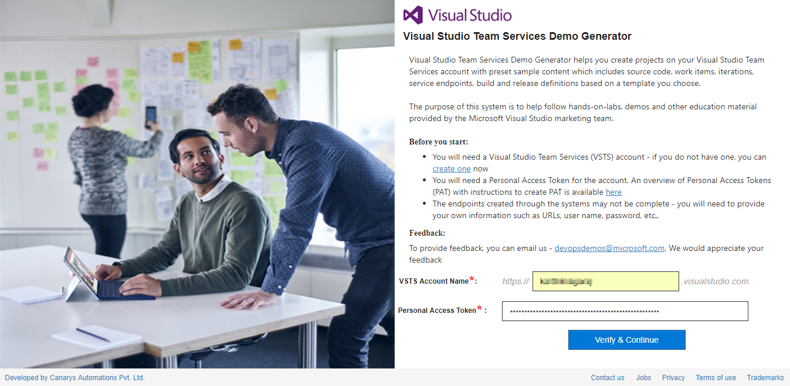 

2. Select **Docker** for the template. Provide a Project Name, and click on Create Project. Once the project is provisioned, click the URL to navigate.
   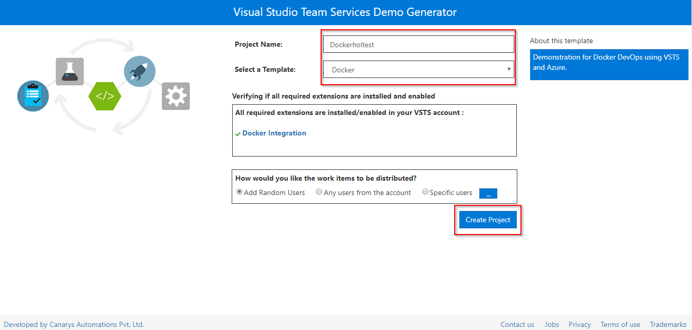

3. Once the project is provisioned, select the URL to navigate to the project that you provisioned.

   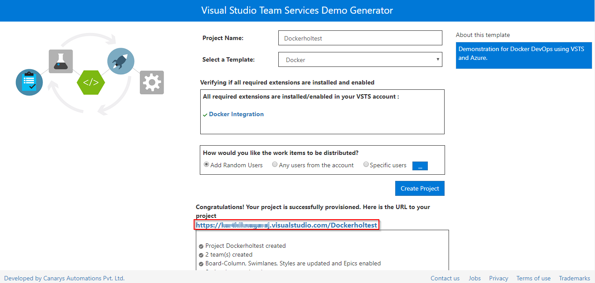

## Exercise 1: Endpoint Creation

Since the connections are not established during project provisioning, we will manually create the Azure endpoint. 

1. In VSTS, navigate to **Services** by clicking on the gear icon, and click on **+ New Service Endpoint**. Select **Azure Resource Manager**. Specify **Connection name**, select your **Subscription** from the dropdown and click **OK**. We use this endpoint to connect **VSTS** and **Azure**.

   

   You will be prompted to authorize this connection with Azure credentials. 

   **Note:** Disable pop-up blocker in your browser if you see a blank screen after clicking **OK**, and retry the step. 

## Exercise 2: Configure CI-CD

 Now that the connection is established, we will manually map the Azure endpoint and Azure Container Registry to build and release definitions.

1. Go to **Builds** under **Build and Release** tab, **Edit** the build definition **Docker**.

   

2. Click on **Process** section, select appropriate contents from dropdown under **Azure subscription** and **Azure Container Registry**. 

   

    
    

   <table width="100%">
   <thead>
      <tr>
         <th width="50%"><b>Tasks</b></th>
         <th><b>Usage</b></th>
      </tr>
   </thead>
   <tr>
      <td><b>Run services</b></td>
      <td>prepares suitable environment by restoring required packages</td>
   </tr>
   <tr>
      <td><b>Build services</b></td>
      <td>builds images specified in a <b>docker-compose.yml</b> file with registry-qualified names and additional tags such as <b>$(Build.BuildId)</b></td>
   </tr>
    <tr>
      <td><b>Push services</b></td>
      <td>pushes images specified in a <b>docker-compose.yml</b> file, with multiple tags, to container registry</td>
   </tr>
    <tr>
      <td><b>Lock services</b></td>
      <td>pulls image from default tag <b>latest</b> in container registry and verifies if uploaded image is up to date</td>
   </tr>
   <tr>
      <td><b>Copy Files</b></td>
      <td>used to copy files from source to destination folder using match patterns </td>
   </tr>
   <tr>
      <td><b>Publish Build Artifacts</b> </td>
      <td> used to share the build artifacts </td>
   </tr>
   </table>
3. Click **Save**.

   

4. Go to **Releases** under **Build & Release** tab, **Edit** the release definition **Docker** and select **Tasks**.

   

    

   

5. Update the **Azure Connection Type**, **Azure Subscription** and SQL DB Details such as **Azure SQL Server Name**. Click **Save**. Note: **Database Name** is set to **mhcdb**. **Server Admin Login** is **sqladmin** and **Password** is **P2ssw0rd1234**.

    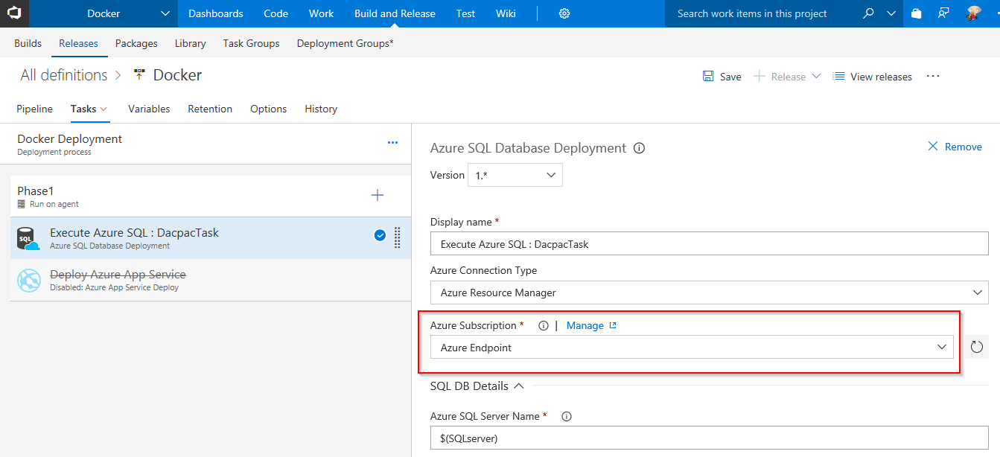

6. Click on **Builds** tab and then click on build definition **Docker**. 

    

7. Queue a build by clicking **Queue new build**. Click on **Queue** in the pop-up window.

    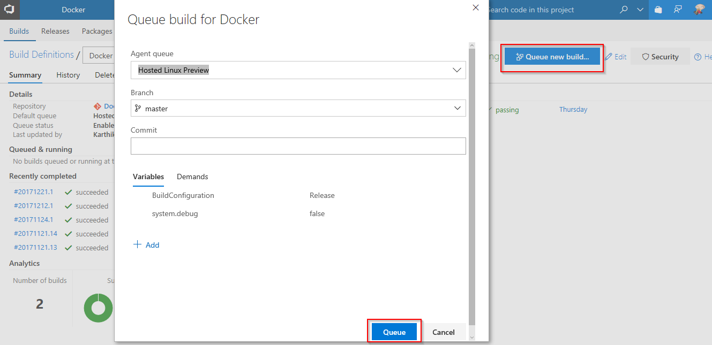

    The build will copy the dacpac to artifacts folder, which will be used in release for deploying this dacpac to database you created earlier. After this step is complete, the database schema will be deployed to SQL Database **mhcdb**.

    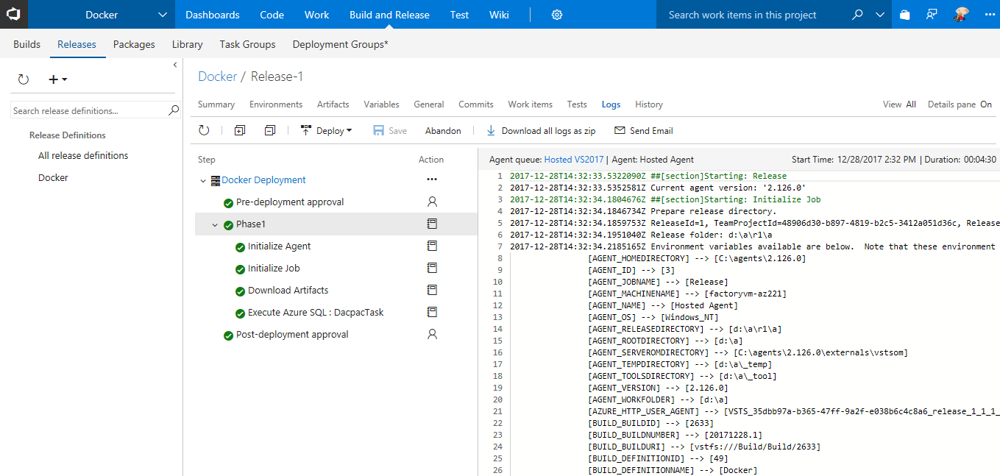

8. Navigate to release definition **Docker** under **Releases** tab, and click on **Edit**. Click on **Phase1** and select **Hosted Linux Preview** under **Agent queue**.

    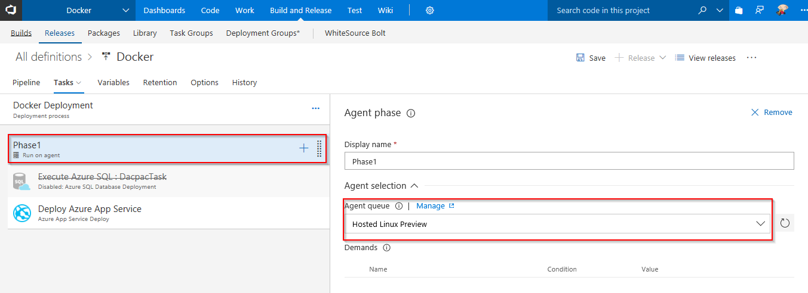

9. Right click on task **Execute Azure SQL : DacpacTask**, and select **Disable Selected Task(s)**. After this, right click on **Deploy Azure App Service** task, and select **Enable Selected Task(s)**.

    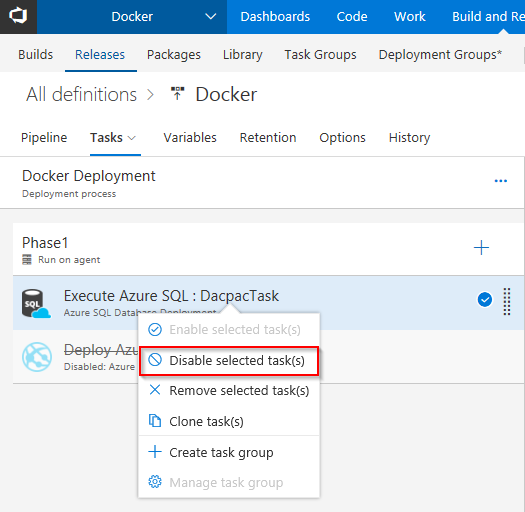

     

    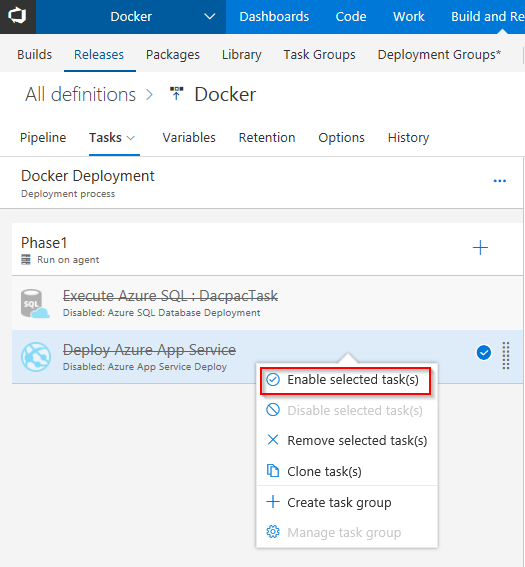

10. Under **Deploy Azure App Service** task, update **Azure subscription** and **Azure Service name** with the endpoint components from the dropdown. In the **Registry or Namespace** field, enter **Azure Container Registry Login Server** from Azure portal. Let the image name be **myhealth.web**. Click **Save**.

    

    **Deploy Azure App Service** will pull the appropriate image corresponding to the BuildID from repository specified, and deploys the image to Linux App Service. 

## Exercise 3: Update Connection String

1. Click on **Code** tab, and navigate to **healthclinic.sql** file under **Docker** repository. Copy entire content of this file.

    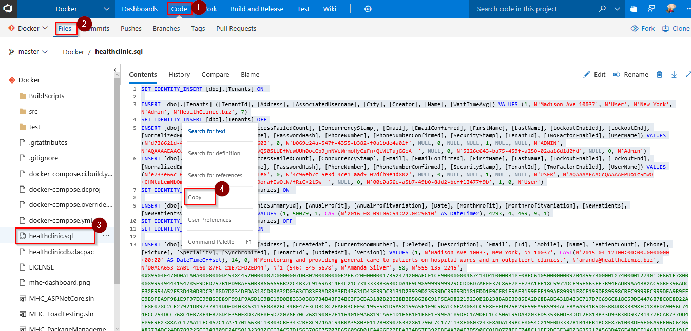   

2. Switch to **Azure Portal**, and navigate to the **SQL Database** which you created at the beginning of this lab.Click on **Data Explorer**, and provide database **Password:** **P2ssw0rd1234** to login. 

    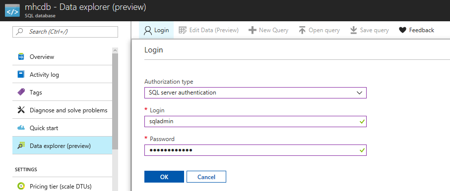   

3. Under **Query** section, paste the content copied from **healthclinic.sql** file as shown, and click on **Run**. This will now push required data into the database, so that our sample application MyHealthClinic could interact with it. Verify that message **Query succeeded** is displayed at the bottom.

    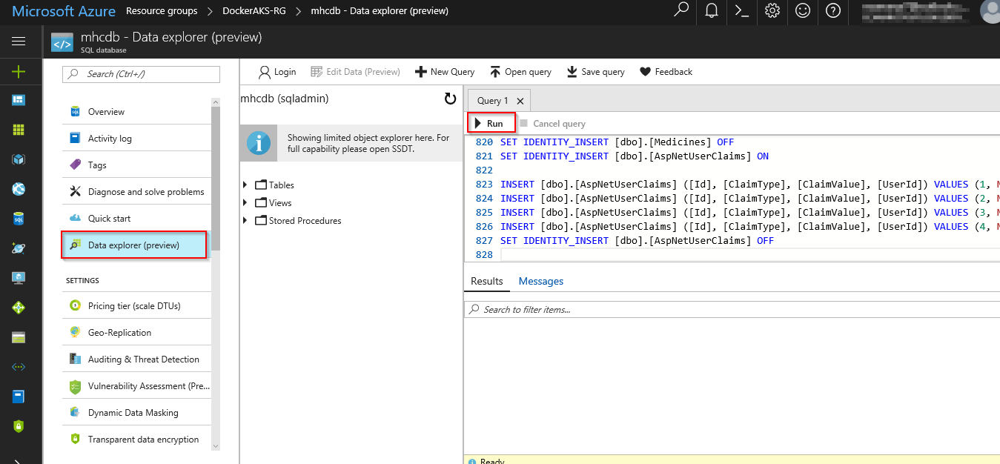 

4.  Scroll down and select **Connection Strings** section. Copy the contents as shown.

    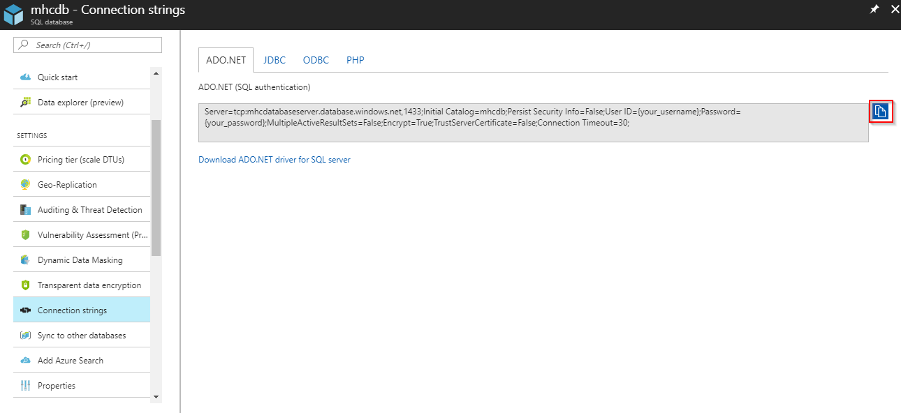 

5. Switch to your VSTS account. Go to **Code** tab, and navigate to the below path to **edit** the file- 

    >Docker/src/MyHealth.Web/appsettings.json

    Go to line number **9**. Paste the connection string as shown and manually update the **User ID** to **sqladmin** and **Password** to **P2ssw0rd1234**. Click on **Commit**.

   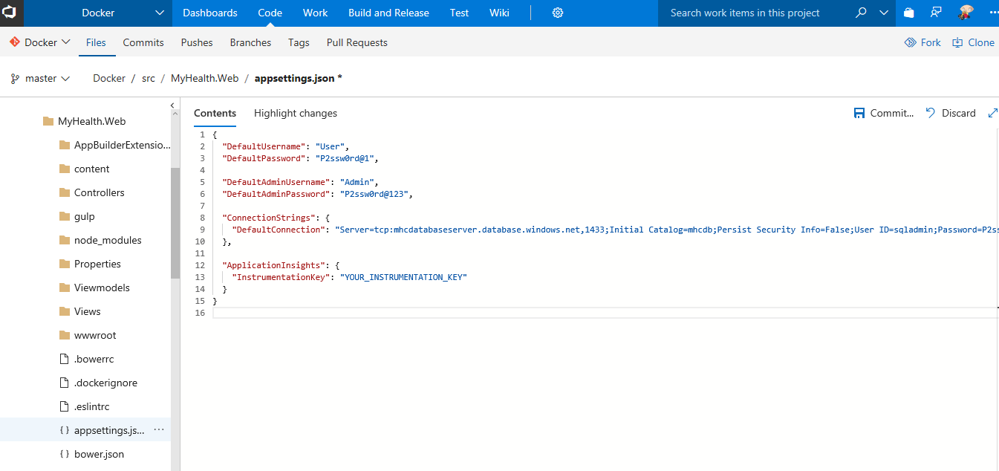

## Exercise 4: Code Update

In this excercise, we will enable the continuous integration trigger to create a new build for each commit to the master branch, and update the code to trigger CI-CD. 

1. Go to **Builds** under **Build and Release** tab, **Edit** the build definition **Docker**.

   

2. Right click on each task **Run Services**, **Build Services**, **Push Services** and **Lock Services** one by one. Click on **Enable Selected Task(s)** to enable all of these tasks. Disable **Copy Files** and **Publish Artifact** tasks by selecting **Disable Selected Task(s)** after right clicking on each of them.

    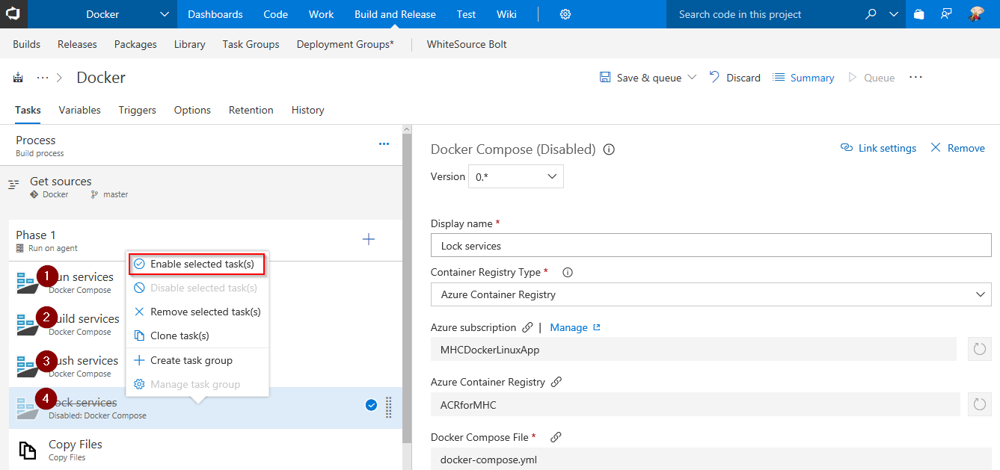

3. Under **Tasks**, click on **Triggers** section. Check the option to **Enable continuous integration**. Click **Save**.

    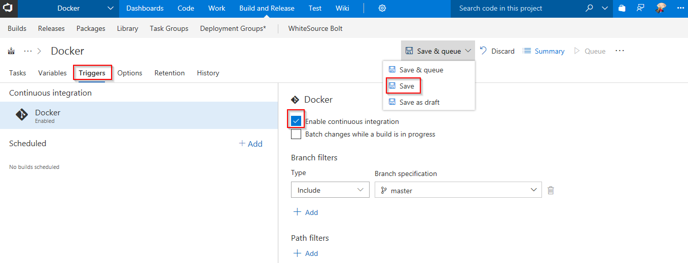

4. Go to **Code** tab, and navigate to the below path to edit the file- 

   >Docker/src/MyHealth.Web/Views/Home/**Index.cshtml**

   

5. Go to line number **28**, update **JOIN US** to **JOIN US TODAY**, and click **Commit**.

    

6. Go to **Builds** tab to see the CI build in-progress.

    

7. The build will generate and push the image to ACR. After build completes, you will see the build summary. 
    
    

8. Go to <a href="https://portal.azure.com">Azure Portal</a>, navigate to the **App Service** which was created at the beginning of this lab. Select **Docker Container** section. Under **Image Source** highlight **Azure Container Registry**. Select your **Registry** from the dropdown. Under **image** dropdown select **myhealth.web** and under **Tag** dropdown select **latest**. This is required to map Azure Container Registry with the Web App. Click **Save**.

    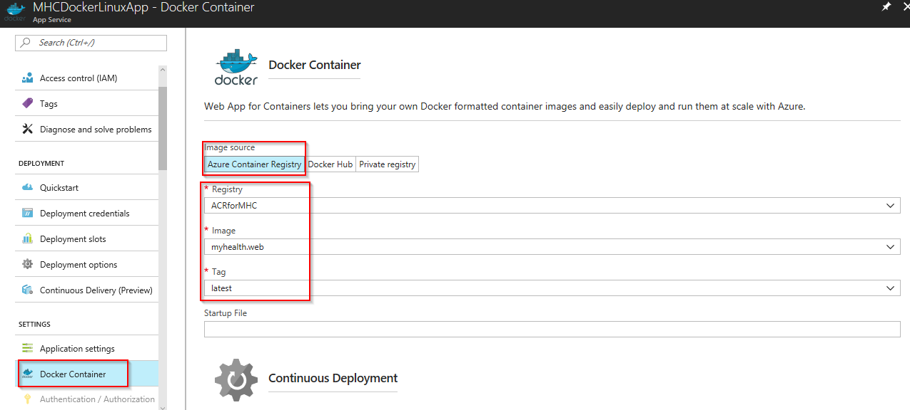

    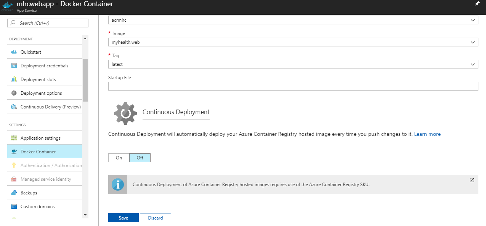
 
9.  Go to **Releases** tab to see the release summary with logs. The release will deploy the image to App Service based on the **BuildID**, which is tagged with the image. 

    

     

    

10. Switch back to <a href="https://portal.azure.com">Azure Portal</a>, navigate to the **Overview** section of your **App Service**. Click on the **URL** to see the changes in your app.

    

      

    

11. To see the generated images in Azure Portal, go to **Azure Container Registry** and navigate to **Repositories**.

    

## Summary

With **Visual Studio Team Services** and **Azure**, we can build DevOps for dockerized applications by leveraging docker capabilities enabled on VSTS Hosted Agents.

## Feedback

Please let <a href="mailto:devopsdemos@microsoft.com">us </a> know if you have any feedback on this lab.