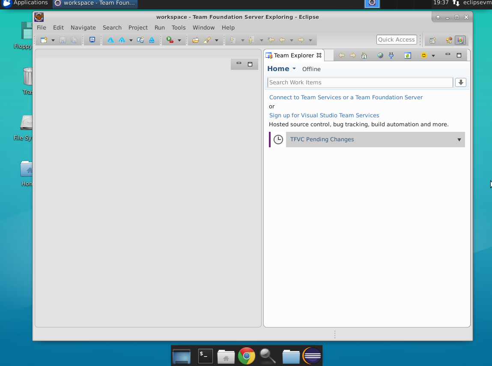
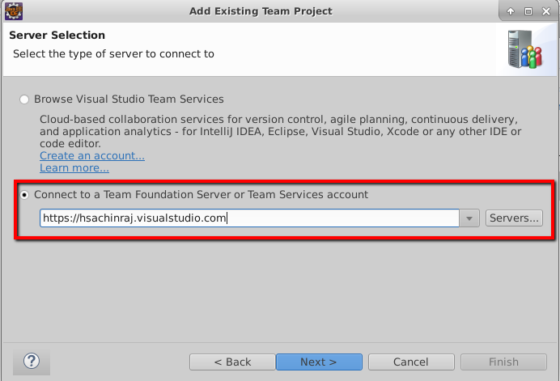

# Working with Eclipse

VSTS helps teams modernize their application development lifecycle and go from idea to deployment with continuous integration, testing, and deployment for any app targeting any platform. VSTS works with (m)any development tool including Visual Studio, Eclipse, IntelliJ, Android Studio, XCode, etc., to make it easy for developers to use VSTS.

In this exercise, you are going to see a typical end-to-end workflow for a Java developer using VSTS and working with Eclipse. We will install and explore how **Team Explorer Everywhere** helps teams using Eclipse-based IDE to collobarate across teams with Visual Studio Team Services / Team Foundation Server. 

You should have completed the labs that set up automated build and release (this is a CI/CD pipeline). In this scenario, you will open the running MyShuttle application and discover a bug. You will then use the [Exploratory Testing extension](https://marketplace.visualstudio.com/items?itemName=ms.vss-exploratorytesting-web) to create a Bug work item in VSTS. You will then branch the code for fixing the bug. Once the bug is fixed on the branch, you will merge the code in via a Pull Request and code review. This will then automatically queue the build/release pipeline and your fix will be deployed.


## Pre-requisites

1.  **Microsoft Azure Account**: You need a valid and active azure account for the labs.

2. You need a **Visual Studio Team Services Account** and <a href="https://docs.microsoft.com/en-us/vsts/accounts/use-personal-access-tokens-to-authenticate">Personal Access Token</a>.


## Setting up the project

1. Use <a href="https://vstsdemogenerator.azurewebsites.net" target="_blank">VSTS Demo Data Generator</a> to provision a project on your VSTS account.

 

1. Select **** for the template.

 


3. Once the project is provisioned, select the URL to navigate to the project that you provisioned.

## Provisioning Eclipse VM on Azure

Click on **Deploy to Azure** to provision a Ubuntu VM pre-installed with Eclipse. 

<a href="https://portal.azure.com/#create/Microsoft.Template/uri/https%3A%2F%2Fraw.githubusercontent.com%2FMicrosoft%2FVSTS-DevOps-Labs%2Feclipse%2Feclipse%2Farm%2520template%2Fazuredeploy.json" target="_blank">

</a>

Once the machine is provisioned, you can RDP to it. 

## Installing Team Explorer Everywhere


We wil install **Team Explorer Everywhere (TEE)**, the official plug-in for Eclipse from Microsoft to connect VSTS/TFS with Eclipse-based IDE on any platform. It is supported on Linux, Mac OS X, and Windows and is compatible with IDEs that are based on Eclipse 4.2 to 4.6. 

With Team Explorer Everywhere, you can:
* Browse and clone Git repositories
* Full access to TFS Version Control (TFVC), including check-in, check-out, sync, branch, merge, diff, etc.
* Full access to TFS agile tools, work items, and issue tracking capabilities allowing you to add, edit and query work items
* Full access to TFS Build functionality including the ability to create Ant, Maven, or Gradle based builds in TFS, publish JUnit test results into TFS or Visual Studio Team Services, monitor progress and handle results. This is fully compatible with all Team Foundation Build types including Gated Check-in and Continuous Integration Builds.

1.  Open Eclipse from the Launcher by clicking on the **Eclipse** icon from the panel below

1. Click **OK** to select the default folder for the workspace
The plugin can be acquired and installed in the following ways"

1. Eclipse MarketPlace:  The plug-in is freely available on the Eclipse Marketplace -https://marketplace.eclipse.org/content/team-explorer-everywhere. To install it from the marketplace, you can drag the **install** button to a running Eclipse or install it using the Help |Eclipse Marketplace option

1. Eclipse download site:   
   1. Choose **Help** menu | **Install New Software**
   1. Select **Add**
   1. In the **Add Repository** dialog, enter **Team Explorer Everywhere** for the name and specify **http://dl.microsoft.com/eclipse/** for the location
   1. Click **OK**
   1. This should populate the list of features in the install dialog box.  Select the check box that corresponds to the **Team Explorer Everywhere**
   1. Choose the **Next** button two times 
   1. The last page of the wizard shows you the **Microsoft Software License Terms**. Select the **Finish** button to accept if you agree with the terms

1. GitHub Repository:You can also manually download and install the plug-in from the Releases section of this [GitHub](https://github.com/Microsoft/team-explorer-everywhere) repository.

Restart Eclipse if required.

## Connecting to Visual Studio Team Services

The TEE plugin, when installed adds a new perspective **"Team Foundation Server Exploring"** and couple of views (windows) to access VSTS/TFS. 

1. Select **Window | Perspective | Open Perspective | Other...** and choose **"Team Foundation Server Exploring"**. If you do not want to change *perspective*, select **Window | Show View | Team Foundation Server | Team Explorer** 

1. On the **Team Explorer** window, select **Connect to Team Services or Team Foundation Server**

 

1. Select the checkbox to accept the **End User License Agreement**

1. On the **Server Selection** page, select the **Connect to a Team Foundation Server or Team Services account** option and enter the URL of the team services. 
  

1. Select **Next** and complete the login process

 Eclipse can save the login information for future attempts. It uses secure storage to manage encrypted information such as passwords. You can provide a master password for the secure storage. You can also opt to provide hints for password recovery 

1. Select the **Team Project** that you provisioned and select **Finish** to finish and connect to the VSTS project

1. Upon successful connection, you will see Team Explorer window showing source control, work items, build and settings menu.

## Working with Queries

1. If you click the **Work Items** tile, you can access the Work Items hub - via **Queries**. Queries make it easy to find and work with sets of work items based on criteria you define. You can access exisiting queries or create a new one.

1. Right-select **All Work Items** from the **Queries** menu and select **View Results**. The results of the query will open in the editor window.

1. If you want to open a particular work item, you can select and double click on the work item. This will open the work item in a browser.

1. You can also select a work item and associate it to the *pending changes* when you make a commit. We will see this later.

1.  Click the **New Query** link.

    

    Queries make it easy to find and work with sets of work items based on criteria you define. The new query you’ve just created, when run, will
    return all of the work items in the current Team Project (@Project is known as a macro and gets replaced automatically by the query engine),
    regardless of type or state. So far you’ve worked with a few work item types: Features, Product Backlog Items, and Tasks.

1.  Expand the combo-box next to work item type and scroll through the list.

    

    As you can see there are a number of different types. The list displayed varies based on the process template you choose when you create a Team Project. Remember for this project you used the Scrum template.

1.  Collapse the combo-box leaving **\[Any\]** as the value. Click the **Run Query** button the toolbar to execute.

    

    A new tab opens showing the results of the query.

    

As you can see a number of different type of work items are returned.
The columns shown can be controlled both on the query definition and in
the results pane by using the **Column Options** dialog.

1.  Click the **Column Options** button on the toolbar.

    

    The Column Options dialog opens up. There are two tabs. The first
    controls what fields a query returns, the ordering of the columns (left
    to right), and the default width of the column.

    

    The second controls the sort order of the data returned.

    

1.  Go ahead and click **Cancel** after you’re looked around.

2.  Now close the query result and new query tabs. Click **No** when
    prompted to save your new query.

3.  Go back the **Team Explorer** window.

4.  Expand the **Current Sprint** folder.

    

1.  You’ll note that there are a number of pre-created queries.

2.  Double-click on the **Unfinished Work** query. This runs the query
    and opens a results window.

    

1.  Double-click on **Add Master Branding** work item. This opens the
    Task you created earlier. It uses the built-in web browser to
    render the Task (you may be prompted to log in when you open your
    first work item).

    

1.  In the Discussion section, add a note like **Working on site
    changes**.

    

1.  Click the **Save** button to save your changes and then close the
    tab for the Task.

    You’re can create a Product Backlog Item and child tasks in
    Eclipse too.

2.  Back in the Team Explorer, click the **New Work Item** link and pick
    **Product Backlog Item**.  
    

3.  Once the new PBI opens, in the **Title**, enter **Fare Information
    Retrieval**.

4.  Assign the work item to yourself.

5.  Set the Iteration to **Sprint 1**

6.  Add a description like **Configure results form to show formatted
    data for fares.** Also feel free to add extra items like
    Acceptance Criteria, Effort and Business Value if you’d like.

    

1.  Save the work item.

2.  Then like before add the following child Task items, assigning each
    to yourself:  
    \* **Add formatting for fare data  
    \* Test new site**

    Save and close each task after you create it.

3.  Change the PBI to **Committed** and save it.

    

1.  When done, close the PBI tab.

2.  Next, refresh the **Unfinished Work** query.

    

1.  Close the **Unfinished Work** query tab.

## Working with Source Control

Visual Studio Team Services supports two different types of version control system a) **Team Foundation Version Control**, a *centralized* SCM and b)**Git**, a pouplar open-source *distributed* version control. If you want to know more on the differences between TFVC and Git, you can refer [this article](https://docs.microsoft.com/en-us/vsts/tfvc/comparison-git-tfvc)

 Git is the recommended and default version control for new projects. 


Install the Exploratory Testing Extension for Chrome
----------------------------------------------------
In this task you will install the [Exploratory Testing extension](https://marketplace.visualstudio.com/items?itemName=ms.vss-exploratorytesting-web) into Chrome.

1. Open chrome and navigate to `https://chrome.google.com/webstore`. Enter "exploratory testing" into the search box. Find the "Test & Feedback" extension from Microsoft Corporation and click "Add to Chrome". Click Install in the dialog.

    
   
    

1. Once installed, a beaker icon appears in the top right of the Chrome toolbar. Click it to open the UI.
1. Click on the gear icon to open the settings. Select "Connected" and enter your VSTS account URL and click Next.

    

1. Select your team project and expand it and select the default team (which should have the same name as your team project). Click Save.

    

    > **Note**: Your team name may be different

Configure Branch Policies
-------------------------
In this task you will enforce quality on the master branch by creating branch policies.

1. In Chrome, connect to your VSTS Team Project. Click on Code to open the Code Hub.
1. Click the Repo dropdown and select "Manage Repositories".

    

1. In the tree, expand the MyShuttle2 repo and click on the master branch. Click the Branch Policies tab.

    

1. Check the Protect this branch checkbox.
1. Check "Check for linked work items" and set the radio to required.
1. Under Build validation, click Add build policy. Select MyShuttle2 from the list of build definitions and click Save.

    

    > **Note**: You can enforce other policy options like comment resolution and minumum number of reviewers, as well as specify the merge options (like squashing). You can also add default reviewers.

Log a Bug using the Exploratory Test Extension
----------------------------------------------
In this task you will start a test session, discover a bug in the MyShuttle app and log it to VSTS.

1. In the Test extension toolbar of the Exploratory Test extension, click the Play icon to start a testing session.

    

    > **Note**: The test extension is now recording all of your interactions. You can see the test icon beaker has a green dot indicating that a session is currently running.

1. Enter `http://localhost:8081/myshuttledev` in the toolbar to navigate to the application. Enter `fred` for the username and `fredpassword` for the password and click Log In.

    

1. On the Dashboard page, click "Access Your Fare History" to navigate to the fare history page.
1. If you look at the totals for the Fare and Driver column in the table, you will note that the total for the driver column is incorrect.
1. Click the Test Extension beaker icon and click the Camera icon (capture image).

    

1. Capture the grid with the incorrect total. Annotate the image appropriately and click the tick (accept) icon.

    

1. Click the Test Extension beaker icon and click flyout (lower right) of the icon with the page and exclamation mark (new bug). From the menu click Create bug.

    

1. In the title box, enter "Driver total incorrect" and click Save.

    

    > **Note**: All the pages visited, notes, screenshots and other information from the test session is included as details for the Bug, so you don't have to add these details manually. You also should see a button next to the title box reading "0 Similar". VSTS checks to see if there are bugs already logged with similar titles, therefore minimizing duplicate bugs being logged.

1. Once the bug has been created, click the Stop button in the Test Extension toolbar to end the test session.
1. Navigate to your VSTS team project. Click Work to navigate to the Work Hub. In the toolbar, enter "driver" into the Search Work Items box and press enter or click the magnifying glass icon.

    

1. You should see the Bug that you logged. Take a moment to look at the Repro Steps.

    

1. Assign the Bug to yourself and change the state to Active. Click Save.

    

Fix the Bug
-----------
In this task you will create a branch of the code to fix the Bug. You will then checkout the branch, fix the bug and commit the code. You will then create a Pull Request to merge the fix into master and see that this triggers the CI/CD pipeline to automatically deploy the fix to the dev environment.

>Note: Use the personal access token (PAT) generated from the "Set up a Docker Build" lab that should be located at: `home/vmadmin/pat.txt`. Otherwise, follow the instructions from that lab again to generate a new PAT. 

1. Open Eclipse if it is not already open. Open the MyShuttle2 project.

1. In Team Explorer change the drop down to "Work Items".  If the dropdown does not show work items connect to your VSTS account via the Team Explorer Home page.

1. If there are no queries saved in VSTS, a query can be created in Eclipse (but not saved at this time). Right-click on the My Queries folder and select "New Query."

    

1. Run an existing query by double clicking it to find the bug. Or, right click in the New Query panel and select "Run Query." The output of the query will show the bug. Note the ID value of the bug.

    

    > **Note**: If you do not see the bug, ensure that it is assigned to you, since by default only work items assigned to you will appear in the work item list.

1. Create a new branch

    

1. In the dialog, change the branch name to "totalsBug" and click Create.

    


1. In the project view of Eclipse, browse to `src/main/java/com.microsoft.example.servlet` and open the LoginServlet class.

1. Around line 35, you will see what is causing the bug: the `totalDriverFee` is being calculated but the `driverFeeTotal` session attribute is being set to `totalFareForDriver` (this looks like a classic copy/paste error).

    Change this line of code:
    ```java
        session.setAttribute("driverFeeTotal", totalFareforDriver);
    ```
    to 
    ```java
        session.setAttribute("driverFeeTotal", totalDriverFee);
    ```

1. Commit your changes by right clicking the file and selecting Team->Commit. Enter "Fixing totals bug #{ID of bug}" as the commit message. By putting the # symbol followed by an ID of a work item in a commit message, VSTS will automatically associate the work item with the commit when it's pushed to VSTS. In the example of the screenshot, the ID is #698. Click "Commit and Push" to push the changes to VSTS.

    

1. If a window pops up that prompts for credentials, use the following values: 

    | Name | Value |
    |---|---|
    | User | `_VSTS_Code_Access_Token` |
    | Password | `{PAT that you copied earlier}` |
        
    

    In the Push commits dialog click the Push button.

1. Now that the fix has been pushed to VSTS on a branch, you can create a Pull Request. This will be done in VSTS following the standard process for pull requests. Under the Code hub, click on Files in the MyShuttle2 repo and there should be a notification that you updated the `totalsBug` branch. Click the link next to it, "Create a pull request." 

    

1. Then, in the pull request panel, click "Create" to create the pull request. Note that the bug is associated with the commit. 

    

1. Once the PR has been created, right-click it in the PR list and click Open in Browser. You should see that the build is running (this is the build mandated by the Branch Policy you set up earlier).

    

    > **Note**: If there was a merge conflict, VSTS would warn you on the overview page. If there is no warning to this effect, then Git will be able to auto-merge the PR into the target branch.

    > **Note**: You configured the release to only trigger when successful builds off the master branch are available. Since this build is not building from the master branch, these changes will not yet be deployed.

1. Click on the Files tab to open the file compare. Note the changes.

    
    
    > **Note**: You can comment on code or files in the PR and have conversations with the team throughout the review process.

1. Click Approve to approve the PR.
1. Now that the policies have been fulfilled, you can complete the PR which will merge the changes into master (the target branch). Click Complete to do the merge.
1. In the dialog, accept the defaults and click Complete merge.

    

1. The PR completion triggers a new build off the master branch, which in turn will trigger a release. _It also transitions the Bug work item to Resolved_.
1. Click on Builds to watch your build. When the build completes, you will see the unit test and code coverage results as well as SonarQube analysis and quality gates (if you have configured SonarQube integration).
1. Click on Releases and open the latest release which should have triggered off the PR merge build completion event.
1. On the Release Summary page, you will see the linked Bug work item.

    

1. Click on commits to see the incoming commits for this release. There is the commit to fix the bug as well as the commit to merge into master.

    

1. Click on the Tests tab to see the test results. The UI tests should be passing.
1. Open the MyShuttle2 app by navigating to `http://localhost:8081/myshuttledev`. Log in again and verify that the totals column is correct and the Bug has been fixed.

    