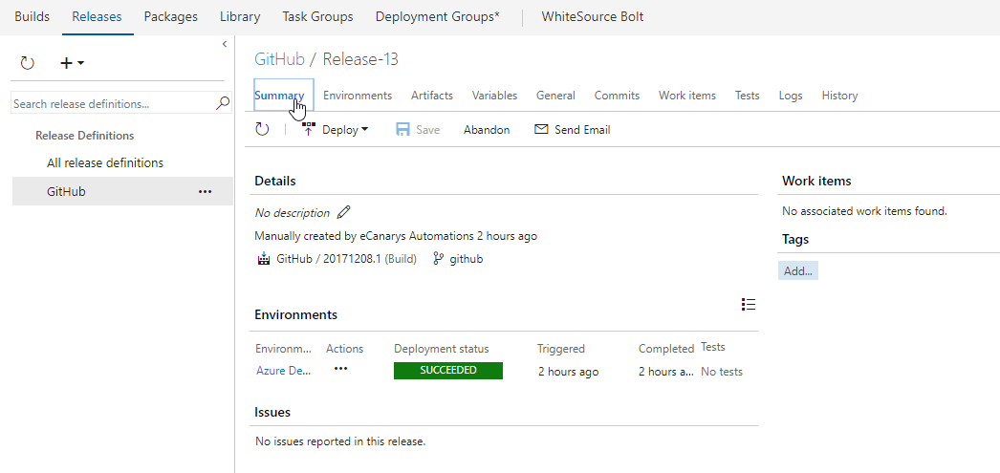

# CI-CD using GitHub and Visual Studio Team Services

## Overview

**GitHub** is a web based **Git** version control repository hosting service which offers distributed version control and source code management functionality of Git. 

Visual Studio Team Services provides a first-class support for **Git** with several advantages including

* Unlimited free private repositories
* Powerful code reviews
* Advanced branch policies
* Integrated CI/CD pipeline
* Semantic code search

The primary difference between the two is that VSTS is focused on closed source projects and GitHub is focused more on open source projects. GitHub offers both private and public repositories. However, it doesn't have an integrated build server.

Teams can overcome this shortfall by using Visual Studio Team Services (VSTS) as a continuous integration platform for GitHub.

In this hands-on lab, we will introduce you to open source DevOps using **GitHub, Visual Studio Team Services** and **Azure**.
You will learn how to deploy an **ASP.Net** application to Azure App Service using CI/CD pipeline in Visual Studio Team Services with code repository in GitHub.We will cover the following steps:

* Forking project repository to your GitHub account
* Linking GitHub account to VSTS
* Editing the existing build definition to include source code from GitHub
* Configuring build Triggers
* Executing Build

## Pre-requisites

1. **Microsoft Azure Account:** You will need a valid and active azure account for the lab

2. You need a **Visual Studio Team Services Account** and <a href="https://docs.microsoft.com/en-us/vsts/accounts/use-personal-access-tokens-to-authenticate">Personal Access Token</a>

3. A **GitHub** account. If you don't have one already, you can setup <a href="https://github.com/join?source=header-home">GitHub Account</a> for free.

## Setting up the code repository on GitHub

There are many ways to add code to a GitHub repository. We can start with a new empty repository and manually add files, commit and push. But for the purpose of this lab, we will ***Fork*** an existing repository. A *Fork* is a copy of a repository.  When you *Fork*, you are creating a personal copy of the repository - any changes that you make will not affect the original code. If you want  to contribute back to the original, you can submit a *Pull Request*

1. Go to [**GitHub**](http://www.github.com) and make sure you are logged in with your GitHub user account.

2. Navigate to the [**PartsUnlimitedE2E**](https://github.com/Microsoft/PartsUnlimitedE2E) repository and select **Fork** to your GitHub account.

   

## Setting up VSTS project

1. Use <a href="https://vstsdemogenerator.azurewebsites.net/?name=GitHub&templateid=77366" target="_blank">VSTS Demo Data Generator</a> to provision a project on your VSTS account.

   

2. Once the project is provisioned, click the URL to navigate to the project.

     

## Exercise 1: Connecting VSTS to GitHub repository

1. In VSTS, navigate to **Services** by clicking the gear icon .

      

2. Create a new GitHub connection by clicking on **+ New Service Endpoint** and click **GitHub**.

    

   >You will need to specify what authorization method you want to provide. If you choose **Grant Authorization**, the default option, as the authorization method, the dialog shows an **Authorize** button that opens the GitHub login page. If you select **Personal access token**, you must obtain a suitable token and paste it into the Token textbox. The dialog shows the recommended scopes for the token: ***repo, user, admin:repo_hook***. See [this page](https://help.github.com/articles/creating-an-access-token-for-command-line-use/) on GitHub for information about obtaining an access token.

3. Select **Grant Authorization**. Click on the **Authorize** button which opens the **GitHub login page**.

   Follow the steps required by GitHub to authorize access to your account.

   
    
   

   **Note:**  The authorization is in a new pop-up window, you may have to unblock the pop-up window in your browser.

     

4. When access is granted, you will see a message that confirms the connection and you can name the connection accordingly and Click OK. 

    

5. You will now see the service endpoint along with GitHub icon that you created under the **Endpoints** sub-tab.

     

## Exercise 2: Configure Build
        
1. Go to **Builds** under **Build & Release**. Click the ellipsis next to the build definition **GitHub** and choose **Edit**.

      

2. Click on **Get Sources** under the Tasks tab. Select **GitHub** as the source, confirm that the service endpoint connection created in #2 of the previous exercise shows up as a drop down value, select it. Select the appropriate **Repository** and choose the **master Branch** from which the source will be fetched. Save the build definition.

   

## Exercise 3: Configure Release

Since the connections are not established during project provisioning, we will manually create the endpoints.

In VSTS, navigate to **Services** by clicking the gear icon . Select **Azure Resource Manager** as the service endpoint. Specify Connection name, select your Subscription from the dropdown and click OK. We use this endpoint to connect VSTS with Azure.

You will be prompted to authorize this connection with Azure credentials. Disable pop-up blocker in your browser if you see a blank screen after clicking OK, and retry the step.

> **Note** : You will encounter an error - **TFS.WebApi.Exception: Page not found** for Azure tasks in the release definition. This is due to a recent change in the VSTS Release Management API. While we are working on updating VSTS Demo Generator to resolve this issue, you can fix this by typing a random text in the **Azure Subscription** field and click the **Refresh** icon next to it. Once the field is refreshed, you can select the endpoint from the drop down.

1. Go to Releases under Build & Release tab, edit the release definition GitHub.

   

2. Select Tasks and click **Dev**.

     

3. Under **Azure Resource Group Deployment** task, update Azure subscription with the endpoint component from the dropdown and select the desired location.

    

4. Under **Azure App Service Deploy** task, update Azure subscription with the endpoint component from the dropdown. Save the release definition.

     

## Exercise 4: Triggering CI and CD 

Navigate to your forked GitHub repository. Let's make a simple change in the code to trigger the CI build. 

1. From your forked GitHub repository, open the file **Index.cshtml** under **master** branch by navigating to the below path-

   >PartsUnlimitedE2E/PartsUnlimited-aspnet45/src/PartsUnlimitedWebsite/Views/Home/Index.cshtml

    

   

2. Edit the code. For this example, let's change **line 28** to increase discount from **50%** to **70%**.

3. Navigate to **Preview changes**, enter a commit message and click on **Commit Changes**.

    

4. The code commit will trigger a CI build. Go to the **Build** tab in your VSTS project to see the CI build in progress.

5. Once the build is complete, you will see the summary which shows **Test Results** and **Code Coverage**.

   

   > The release uses **Infrastructure as a Code** to automate the provisioning of Azure App service and SQL Azure service. The release is configured to trigger upon successful completion of the CI build.

  
6. Go to **Releases** tab under Build and Release hub. Select the **GitHub** definition, you will see a release in-progress.

     

7. Let us explore the release definition. Click edit to see the release pipeline where the target environment is **Dev**.

     

8. This release definition uses the artifact (Webapp package and ARM template) of **CI Build** to deploy to Azure. Continuous Deployment condition has been enabled for this artifact.

    

9. Navigate to the **Dev** environment and you will see 2 tasks are used. Let us explore the tasks.

      

- **Azure Resource Group Deployment**: The project used in this lab has the **Azure App service** as its front-end and **Azure SQL DB service** as its back-end. We will provision these services as <a href="https://azure.microsoft.com/en-in/overview/what-is-paas/">PAAS</a> on Azure using <a href="https://docs.microsoft.com/en-us/azure/azure-resource-manager/resource-manager-create-first-template">ARM templates</a>. This task will create the above services in a resource group.

- **Azure App Service Deploy**: The task is used to deploy a Web project to the Azure App Service created above.

      

10. Once the release is complete, you will see the task-wise summary.

      

      

11. Login to <a href="https://portal.azure.com/">Azure Portal</a> and search for **Github** resource group.

    

12. Navigate to either Dev or Staging web app in the resource group and you will see the application deployed successfully with the changes.

     

## Summary

Whether your code lives in **Visual Studio Team Services** or **GitHub** (or both), manage build, test, and deploy in one place. Create and manage a Continuous Integration process that connects to GitHub, gets the source files, compiles and deploys the binaries to any environment with Continuous Deployment feature.

## Feedback

Please let <a href="mailto: devopsdemos@microsoft.com" target=_blank>us</a> know if you have any feedback on this lab.
