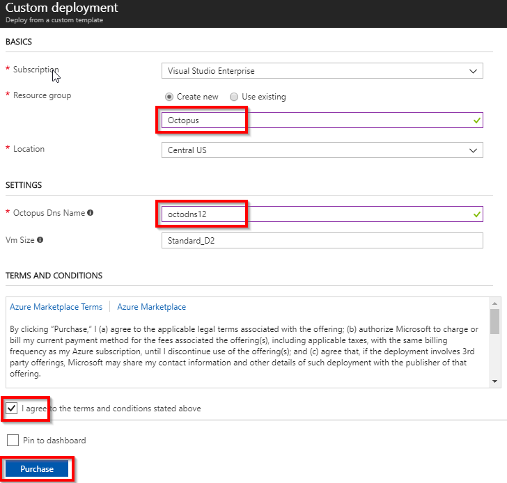
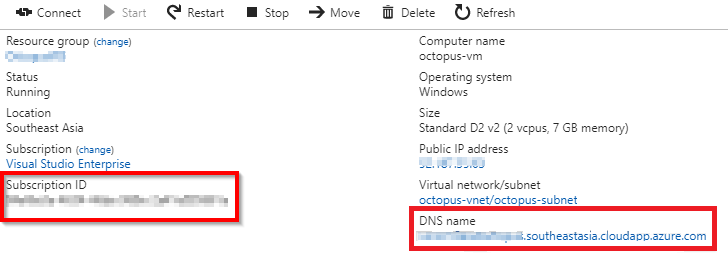
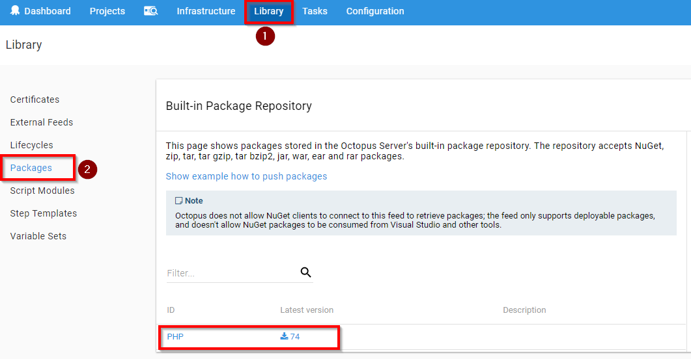

## Automate Deployment Using Octopus Deploy & VSTS

[Octopus Deploy](https://Octopus.com) is an automated deployment server that makes it easy to automate the deployment of ASP.NET web applications, Java applications, database updates, NodeJS application, and custom scripts into development, test, and production environments.

This lab shows how you can deploy an ASP.NET application to Azure App Service using CI-CD pipeline with VSTS and Octopus.

## Pre-requisites

1. **Microsoft Azure Account:** You will need a valid and active azure account for the labs

2. You need a **Visual Studio Team Services Account** and <a href="http://bit.ly/2gBL4r4">Personal Access Token</a>

## Setting up the project

1. Use <a href="https://vstsdemogenerator.azurewebsites.net" target="_blank">VSTS Demo Data Generator</a> to provision a project on your VSTS account.

   

2. Once the project is provisioned, select the URL to navigate to the project that you provisioned.

## Setting up the Environment

We will use ARM template to provision below resources on Azure:

- VM with Octopus server

- #To be added

1. Click on **Deploy to Azure** to provision Octopus Server.

    

   Provide the following details as shown:

   - **Subscription**: Choose your Azure Subscription

   - **Resource Group**: Provide a name for resource group as  **Octopus**

   - **Location**: Select the location to **South Central US**

   - **Octopus Dns Name**: Provide a unique name.

2.  It takes approximately x minutes to deploy.

    

3. Once the VM is provisoned, note down the **DNS** Name. We will need this to connect to Octopus Server.

   >**Note**: In Azure portal, go to the VM overview which was provisioned and copy the DNS name as shown. 

   

## Exercise 1: Configure Octopus Server

In this exercise, we will create **Deployment Environment** in Octopus server. Since we are deploying the application to Azure App Service, we will link the environment to Azure using **Management Certificate**.

1. Login to Octopus server using DNS name from your browser. Use the below credentials to login.

   - **Username**: admin
   - **Password**: P2ssw0rd@123

    

   

2. Click **Create environment** and **Add Environment**.

   

    

   

3. Provide the environment name as **Dev** and click **Save**.

   

4. You will see **Dev** environment. Click on **Dashboard**

   

4. Add **Azure Subscription** to **Dev** environment by clicking on **ADD an account** and **ADD ACCOUNT**

   
    
   
   

5. Enter the following details as shown:

   - **Name**: Provide a name as **Azure Deployment**
   - **Subecription ID**: Your [Azure Subscription ID](https://blogs.msdn.microsoft.com/mschray/2016/03/18/getting-your-azure-subscription-guid-new-portal/)
   - **Authentication Method**: Set to **Use Management Certificate** 

    

   

6. You will see a failure message because the management certificate is not uploaded to Azure portal. Click **OK**

   

7. You will see a management certificate will be generated. Download this certificate.

   

8. To upload the certificate to azure, go to [Azure Portal](portal.azure.com), and click on **Subscriptions**.

   

9. Click on your Subscription.

   

10. Scroll down and click **Management certificates**.

    

11. Click **Upload** to upload the certificate which you downloaded in the step 7.

    

     

    

12. Go back to Octopus portal and click **Save and Test**. You will see the verification for azure connection will be successful.

    

## Exercise 2: Link VSTS to Octopus Server

In this exercise we will create an **API** key in Octopus. This key is required to link VSTS with Octopus.

1. Under user profile, go to **MY API Key** and click **New API Key** to create one.

   

2. Give the purpose as **VSTS Integration** and click **Generate New**.

   

3. Note down the API Key.

   

4. Create a **Service Endpoint** in VSTS. Go to Parts Unlimited team project in **VSTS**, click on gear icon and click **Services**.

   

5. Click **+ New Service Endpoint** and select **Octopus Deploy** from the dropdown.

    

6. Provide **Connection name**, **URL** of Octopus server and **API Key** and click **OK**. 

   

7. You will see service endpoint created successfully.

   

## Exercise 3: Push the Package to Octopus Server

In this exercise, we will build ASP.NET application and push the generated web package to Octopus Server.

1. Go to **Builds** under **Build and Release** tab and click on **PartsUnlimitedE2E** definition.

    
 
2. Click **Edit**.

   

3. In **Push Packages to Octopus** task, update **Octopus Deploy Server** and click **Save and queue**.

   

4. Once the build is completed, you will see the build summary.

   

5. Go to Octopus Server. You will see the green check mark showing **Application PACKAGING** uploaded successfully. Click **Upload package** to see the package.

   

    

   

## Exercise 4: Project Creation in Octopus

[Projects](https://octopus.com/docs/deploying-applications/deployment-process/projects) allow you to define all the details required to deploy a project including the steps to run and variables to configure it.
In this exercise, we will create project in Octopus which will deploy the package to **Azure Web Service**

1. Go to Octopus dashboard and click **Create a project** and **ADD PROJECT**.

   

    

   

2. Give the project name **Parts Unlimited** and click on **SAVE**.

   

3. Once the project is created, click **Define your deployment process**. The [deployment process](https://octopus.com/docs/deploying-applications/deployment-process) is like a recipe for deploying your software.

   

4. Click on **ADD STEP**.

   

5. Search for **Azure Web App** template and **Add**.

   

6. Provide **Name** and select **Package ID**.

   

    

   

7. Save and click on **Create Release**.

   

