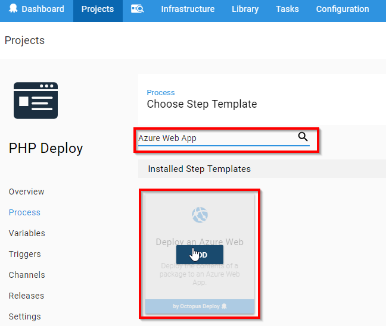
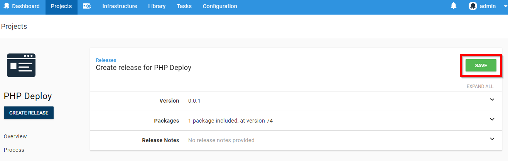
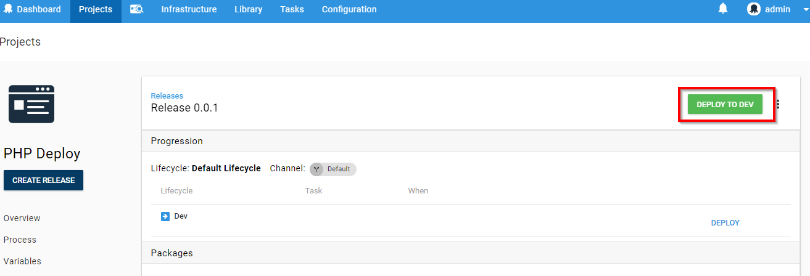
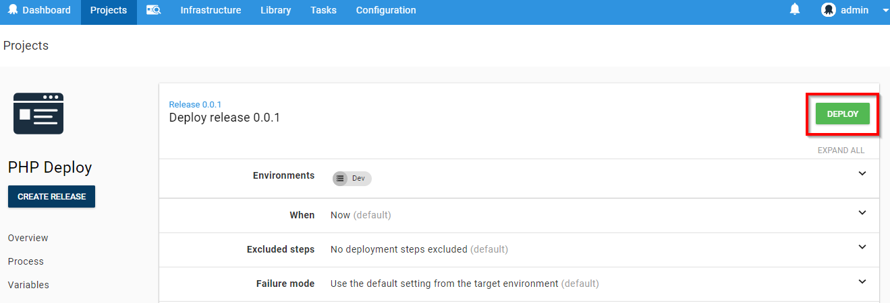
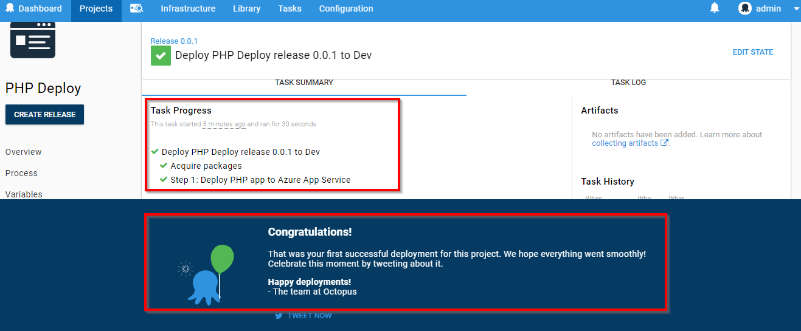
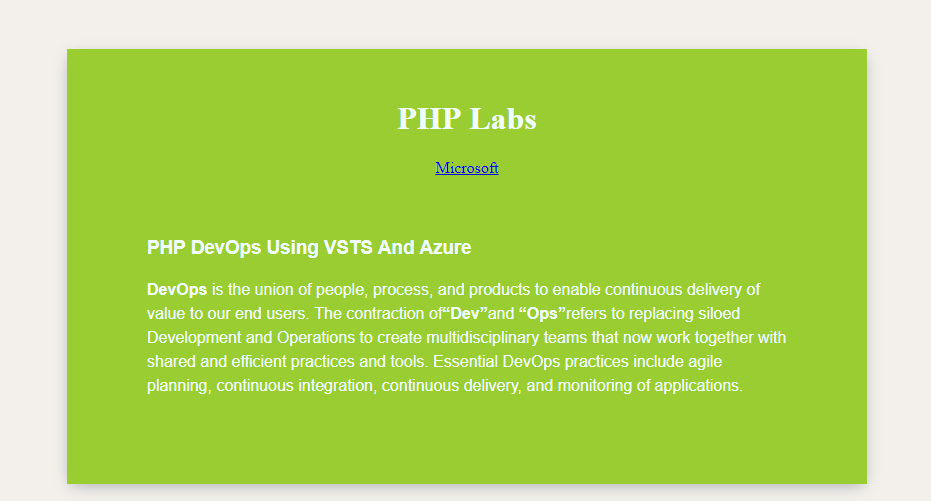

## Automate Deployment using Octopus Deploy & VSTS

[Octopus Deploy](https://Octopus.com) is an automated deployment server that makes it easy to automate the deployment of ASP.NET web applications, Java applications, database updates, PHP application, and custom scripts into development, test, and production environments.

This lab shows how you can integrate VSTS and Octopus to deploy PHP application to Azure.

## Pre-requisites

1. **Microsoft Azure Account:** You will need a valid and active azure account for the lab.
 

2. You will need a **Visual Studio Team Services Account** and <a href="http://bit.ly/2gBL4r4">Personal Access Token</a>

## Setting up the project

1. Use <a href="https://vstsdemobuildertest.azurewebsites.net/" target="_blank">VSTS Demo Data Generator</a> to provision a project on your VSTS account.

   

2. Once the project is provisioned, select the URL to navigate to the project that you provisioned.

   
## Setting up the Environment

1. Click on **Deploy to Azure** to provision Octopus Server.

    

2. Provide **Resource group** and **Octopus DNS Name**, check the **terms and conditions** and click **Purchase**

    

3. It takes approxinately 15 minutes to deploy. Once the deployment is succeeded, following resources will be provisioned in Azure:

    - Windows server 2012 VM with **Octopus** 
    - **App Service** to deploy PHP application

     

    

4. Click on the octopus-vm and note down the **DNS name**. We will need this to access Octopus server.

   

## Exercise 1: Configure Octopus server

In this exercise, we will create **deployment environment** in Octopus server. Since we are deploying the application to Azure App Service, we will link the environment to Azure using **Management Certificate**.

1. Login to Octopus server using DNS name from your browser. Use the below credentials to login.

   - **Username**: admin
   - **Password**: P2ssw0rd@123

    

   

2. Click **Create environment** and **Add Environment**. In Octopus, an environment is a group of machines or cloud services, that you will deploy to at the same time; common examples of environments are Dev, Test, Staging or Production.

   

    

   

3. Provide the environment name and click **Save**.

   

4. You will see the created environment name on your screen . Now, link Azure account to this environment by clicking on **Accounts**

   

5. Click on **ADD ACCOUNT** beside **Azure Subscriptions**

   
   

6. Enter the following details as shown and click **Save**

   - **Name**: Provide the account name.
   - **Subecription ID**: Your [Azure Subscription ID](https://blogs.msdn.microsoft.com/mschray/2016/03/18/getting-your-azure-subscription-guid-new-portal/).
   - **Authentication Method**: Choose **Use Management Certificate**.
   >You can also use Service Principal authentication method by following [this link](https://octopus.com/docs/infrastructure/azure/creating-an-azure-account/creating-an-azure-service-principal-account)
    

   

7. You will see a management certificate generated. Download this certificate.

   

8. To upload the certificate on Azure, go to [Azure Portal](https://portal.azure.com), and click on **Subscriptions**.

   

9. Click on your Subscription.

   

10. Scroll down and click **Management certificates**.

    

11. Click **Upload** to upload the certificate which you downloaded in the step 7.

    

     

    

12. Go back to Octopus portal and click **Save and Test**. You will see the verification for azure connection will be successful.

    

## Exercise 2: Link VSTS and Octopus Server

In this exercise we will create an **API** key in Octopus. This key is required to link VSTS with Octopus.

1. Under user profile, go to **MY API Key** and click **New API Key** to create one.

   

2. Give the **purpose** and click **Generate New**.

   

3. Note down this API Key.

   

4. Go to **VSTS project** which was provisioned earlier, click on  **icon --> Services --> + New Service Endpint**, scroll down and select **Octopus Deploy**

   

6. Provide **Connection name**, **Octopus server URL** and **API Key** and click OK. 

   

7. You will see service endpoint created successfully.

   

## Exercise 3: Push the Package to Octopus Server

In this exercise, we will package PHP application and push the package to Octopus Server.

1. Go to **Builds** under **Build and Release** tab and click on **Octopus** build definition.

    
 
2. **Edit** the build defination to update Octopus server endpoint.

   

3. In **Push Packages to Octopus** task, update **Octopus Deploy Server** and click **Save and queue**.

   

  <table width="100%">
     <thead>
      <tr>
         <th width="50%"><b>Tasks</b></th>
         <th><b>Usage</b></th>
      </tr>
     </thead>
     <tr>
        <td><b>Package Application</b></td>
        <td>Packages the PHP code files into a zip file with version number</td>
     </tr>
     <tr>
      <td><b>Copy Files</b></td>
      <td>Copies the package from source directory to artifacts directory in build server</td>
     </tr>
      <tr>
        <td><b>Push packages to Octopus</b></td>
        <td>Pushes the packages to Octopus server</td>
 

  </table>
 

4. Once the build completes, you will see the build summary.

   

5. Go to Octopus Server. You will see the green check mark which indicates **Application package** is pushed successfully. Click **Upload package** to see the package.

   

    

   

## Exercise 4: Project Creation in Octopus

[Projects](https://octopus.com/docs/deploying-applications/deployment-process/projects) allow you to define all the details required to deploy a project including the steps to run and variables to configure it.
In this exercise, we will create project in Octopus which will deploy the package to **Azure Web Service**

1. Go to Octopus dashboard and click **Create a project** and **ADD PROJECT**.

   

    

   

2. Give the project name and click on **SAVE**.

   

3. Once the project is created, click **Define your deployment process**. The [deployment process](https://octopus.com/docs/deploying-applications/deployment-process) is like a recipe for deploying your software.

   

4. Click on **ADD STEP**.

   

5. **Search** for **Azure Web App** template and **Add**.

   

6. Provide **step name** and select **package ID, Azure account** & **Web App** and then click **Save**.

   

    

   

## Exercise 5: Trigger Release in Octopus
In this exercise we will trigger the release manually from octopus project. Deployment will happen to Azure App Service.

1. Click on **Create Release** and **Save** it.

    

    

    

8. Trigger the deployment to Azure App service by clicking on **DEPLOY TO DEV**, then click **Deploy** and wait untill the deployment steps are passed.  

   

    
   
    
   

9. Once the deployment is successful, go to Azure Web App and click on **Browse**

    

10. You will see the PHP application up and running 

   

## Enabling Continuous Build and Release

## Summary

We can integrate Octopus with VSTS for delpoying applications to Azure.

## Feedback

Please email [us](mailto:devopsdemos@microsoft.com) if you have any feedback on this lab.