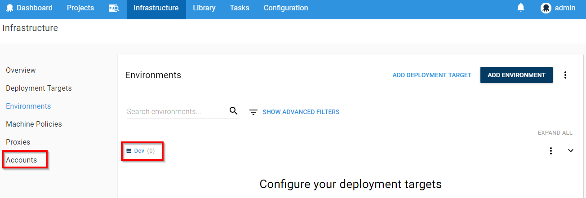
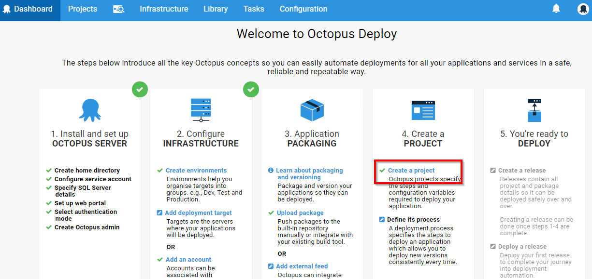
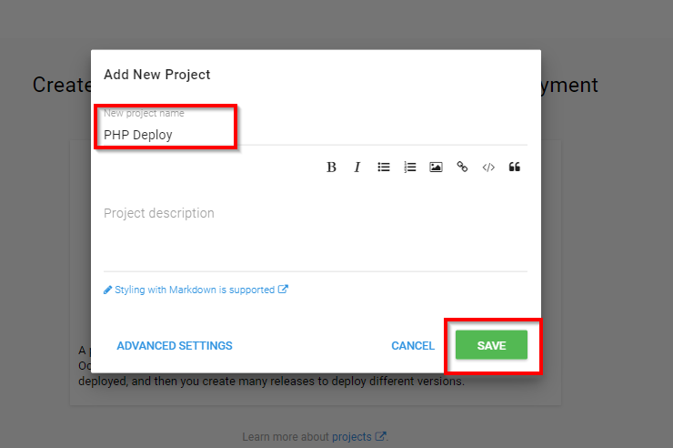
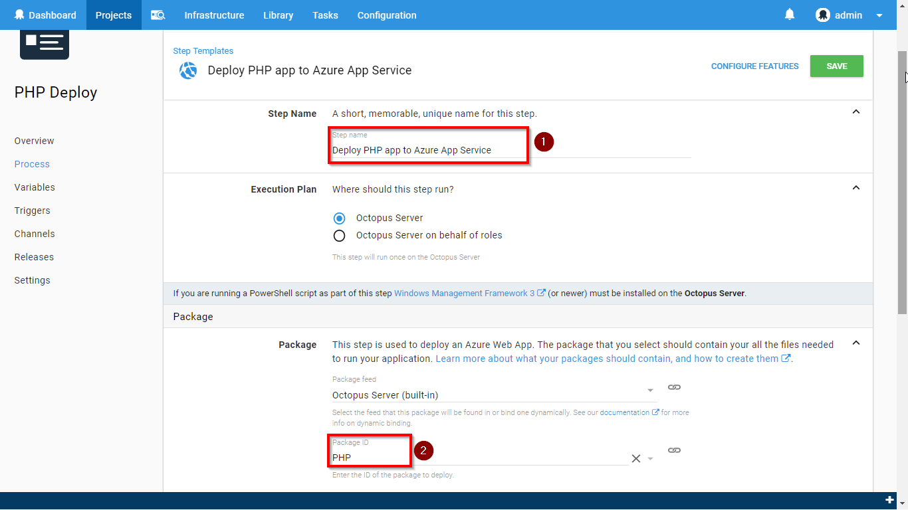
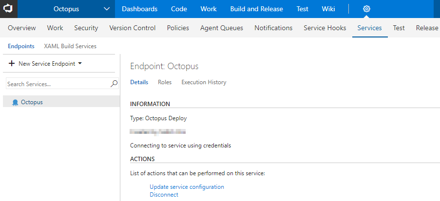
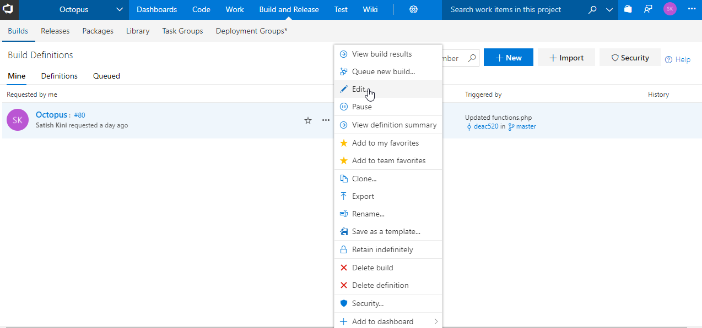
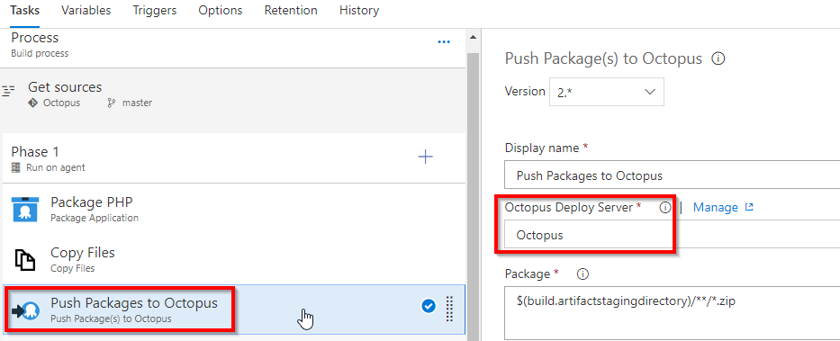
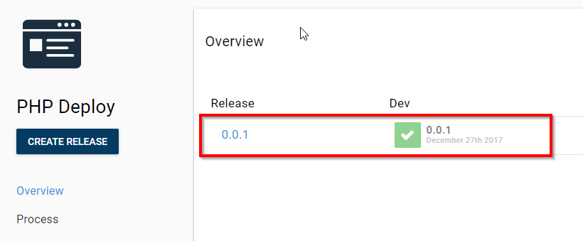

## Automate Deployments from VSTS to Octopus Deploy

[Octopus Deploy](https://Octopus.com) is an automated deployment server that makes it easy to automate the deployment of web applications and custom scripts to multiple environments.

This lab shows how you can integrate VSTS and Octopus to deploy PHP application to Azure.

## Pre-requisites

1. **Microsoft Azure Account:** You will need a valid and active azure account for the lab.

2. You will need a **Visual Studio Team Services Account** and <a href="https://docs.microsoft.com/en-us/vsts/accounts/use-personal-access-tokens-to-authenticate">Personal Access Token</a>

## Setting up the Environment

1. Click on **Deploy to Azure** to provision Octopus Server.

    

2. Provide **Resource group** and **Octopus DNS Name**, check the **terms and conditions** and click **Purchase**.

    

3. It takes approximately 15 minutes to deploy. Once the deployment is successful, the following resources will be provisioned in Azure:

    - Windows server 2012 VM with **Octopus Deploy server**
    - **Azure App Service** to deploy PHP application

     

    

4. Click on the **octopus-vm** and note down the **Subscription ID** and **DNS name**. We will need this in later exercises.

   

## Setting up the VSTS project

1. Use <a href="https://vstsdemogenerator.azurewebsites.net/?TemplateId=77370&name=octopus" target="_blank">VSTS Demo Data Generator</a> to provision a project on your VSTS account. 

   

2. Once the project is provisioned, select the URL to navigate to the project.

   

## Exercise 1: Configure Deployment Target in Octopus Server

In this exercise, we will create **deployment environment** in Octopus server and link to Azure using **Management Certificate**.

Octopus authenticates with Azure using the Management Certificate.

1. Login to Octopus server using the DNS name and below credentials:

   - **Username**: admin
   - **Password**: P2ssw0rd@123

    

   

2. Click **Create environment** and **Add Environment**. In Octopus, an environment is a group of machines or cloud services, that you will deploy to at the same time. Common examples of environments are **Dev, Test, Staging** or **Production**.

   

    

   

3. Provide the environment name and click **Save**.

   

4. Once the environment is created, click on **Accounts** 

   

5. Click on **ADD ACCOUNT** to link your Azure subscription to the created environment.

   
   

6. Enter the following details and click **Save**.

   - **Name**: Provide the account name (any name)
   - **Subscription ID**: Your [Azure Subscription ID](https://blogs.msdn.microsoft.com/mschray/2016/03/18/getting-your-azure-subscription-guid-new-portal/)
   - **Authentication Method**: Choose **Use Management Certificate**
   >You can also use Service Principal authentication method by following [this link](https://octopus.com/docs/infrastructure/azure/creating-an-azure-account/creating-an-azure-service-principal-account)
    

   

7. You will see a management certificate generated. Download this certificate.

   

8. To upload the certificate in Azure, go to [Azure Portal](https://portal.azure.com) and search for **Subscriptions**.

   

9. Click on your Subscription.

   

10. Scroll down and click **Management certificates**.

    

11. Click **Upload** to upload the certificate which you downloaded in the **step 7**.

    

     

    

12. Once the certificate is uploaded successfully, go back to Octopus portal and click **Save and Test**. You will see the verification for azure connection is successful.

    

## Exercise 2: Create Project in Octopus

[Projects](https://octopus.com/docs/deploying-applications/deployment-process/projects) allow you to define all the details required to deploy an application.
In this exercise, we will create a project to deploy the package to **Azure App Service**.

1. Go to Octopus dashboard and click **Create a project**.

   

2. Click on **ADD PROJECT**, provide the project name and click on **SAVE**

   

    

   

3. Once the project is created, click **Define your deployment process**. The [deployment process](https://octopus.com/docs/deploying-applications/deployment-process) is like a recipe for deploying your software.

   

4. Click on **ADD STEP**.

   

5. **Search** for **Azure Web App** template and **Add**.

   

6. Provide below details and click **Save**.

   - **Step Name**                   : Any name
   - **Package ID**                  : PHP (if you are providing different package ID, update it in build definition)
   - **Azure account** & **Web App** : Select from the dropdown

   

    

   

## Exercise 3: Link VSTS and Octopus Deploy Server

In this exercise we will create an **API** key in Octopus. This key is required to link VSTS with Octopus.

1. In Octopus portal, top right corner click on the currently logged in user and click on **Profile**.

   

2. In My Profile page click on **My API Keys** and click on **New API Key** to create a new key.

   

2. Give the **purpose** and click **Generate New**.

   

3. Note down the API Key.

   

4. Go to **VSTS project**, click on gear  icon --> **Services --> + New Service Endpint**, scroll down and select **Octopus Deploy**

   

6. Provide **Connection name**, **Octopus server URL** and **API Key** and click OK. 

   

7. We will see service endpoint created.

   

## Exercise 4: Triggering CI-CD

In this exercise, we will package PHP application and push the package to Octopus Server.

1. Go to **Builds** under **Build and Release** tab and click on **Octopus** build definition.

    
 
2. **Edit** the build definition to update Octopus server endpoint.

   

3. In **Push Packages to Octopus** task, update **Octopus Deploy Server**.

   > **Note** : You will encounter an error - **TFS.WebApi.Exception: Page not found** for Azure tasks in the release definition. This is due to a recent change in the VSTS Release Management API. While we are working on updating VSTS Demo Generator to resolve this issue, you can fix this by typing a random text in the **Azure Subscription** field and click the **Refresh** icon next to it. Once the field is refreshed, you can select the endpoint from the drop down.

   

2. Update **Octopus Deploy Server** and **Project** fields in Create Octopus Release.

    

3. Update **Octopus Deploy Server**, **Project** and **Deploy to Environments** fields in Deploy Octopus Release.

     

3. Save the build definition.

    

  <table width="100%">
     <thead>
      <tr>
         <th width="50%"><b>Tasks</b></th>
         <th><b>Usage</b></th>
      </tr>
     </thead>
     <tr>
        <td><b>Package Application</b></td>
        <td> We will package the PHP source code into a zip file with the version number</td>
     </tr>
     <tr>
      <td><b>Copy Files</b></td>
      <td> The <b>Copy Files</b> task will copy the generated package to artifacts directory in VSTS</td>
     </tr>
      <tr>
        <td><b>Push packages to Octopus</b></td>
        <td>The copied package will be pushed to Octopus server from VSTS artifacts directory</td>
     <tr>
      <td><b>Create Octopus Release</b></td>
      <td>This task is used to automate the creation of release in Octopus server</td>
     </tr>
     <tr>
      <td><b>Deploy Octopus Release</b></td>
      <td>This task is used to automate the deployment of release in Octopus server</td>
     </tr>

  </table>
 

4. Go to **Code** tab and edit the file **functions.php**

    

5. Update the **line 41** as shown, and **commit** the changes.

    

6. Go to **Build** tab, you will see in-progress build.

    

7. Once the build completes, go to Octopus project dashboard. You will see the release completion in Octopus.

    

8. Go to Azure Web App from your **[Azure Portal](https://portal.azure.com)** and click on **Browse**.

   

9. You will see the PHP application up and running.

   
   
## Summary

We can integrate Octopus with VSTS for delpoying applications to Azure.

## Feedback

Please email [us](mailto:devopsdemos@microsoft.com) if you have any feedback on this lab.