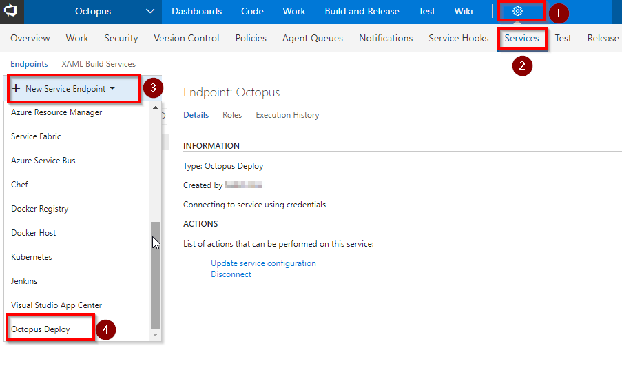
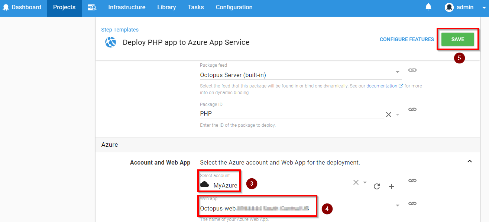

## Deploy ASP .Net application to Azure App Service using Team Services and Octopus

This lab shows how you can deploy an **ASP .Net application to Azure App Service using CI/CD pipeline in VSTS and Octopus**.

## Pre-requisites

1. **Microsoft Azure Account:** You will need a valid and active azure account for the labs

2. You need a **Visual Studio Team Services Account** and <a href="http://bit.ly/2gBL4r4">Personal Access Token</a>

## Setting up the project

1. Use <a href="https://vstsdemogenerator.azurewebsites.net" target="_blank">VSTS Demo Data Generator</a> to provision a project on your VSTS account.

   

2. Select **PartsUnlimited** for the template.

   

3. Once the project is provisioned, select the URL to navigate to the project that you provisioned.

## Provision Octopus Server on Azure
1. Click on **Deploy to Azure** to provision Octopus Server

    

Provide **Resource Group Name** and **Octopus DNS Name**, make sure the names are unique. You should see the green checkmark as shown before you click on **Purchase**

Once the VM is provisoned, note down the DNS Name. We will need this to connect to **Octopus Server**  

## Connectand Configure Octopus Server

1. Login to octopus server by browsing DNS name

   >Default credentials **Username**: admin
**Password**: P2ssw0rd@123

   

2. Click **Create environment** and **Add Environment**

   

    

   

3. Give environment name as **Dev** and **Save**

   

4. Add your Azure Subscription to Dev environment by clicking **ADD ACCOUNT**

   

5. Enter **Name** and **Subecription ID** select **Use Management Certificate** and click **Save and Test**

   

6. You will see a failure message click **OK**

   

7. You will see a management certificate generated. Download this certificate

   

8. Go to Azure portal, and click **Subscriptions**

   

9. Go to your Subscription, and select **Management certificates**

   

    

   

10. Upload the subscription which you had downloaded in **step 7**

    

    

11. Go back to Octopus portal and click **Save and Test** you will see verification will be successful

    

## Link VSTS to Octopus Server

1. Create **New API Key** in octopus server. Under user profile, go to **MY API Key** and click **New API Key**

   

2. Give the purpose as VSTS Integration and click **Generate New**

   

3. Note down the API Key.

   

4. Create a **Service Endpoint** in VSTS. Go to Parts Unlimited team project in **VSTS** click on gear icon and click **Services**

   

    

   

    

   

## Build Project and Push the Package to Octopus Server

1. Go to **Builds** under **Build and Release** tab and click on **PartsUnlimitedE2E** build 

    
 
2. Click **Edit**

   

3. In **Push Packages to Octopus** task, update **Octopus Deploy Server** then **Save and queue**. You will see the build progress.

   

    

   

4. Once the build completes, go to Octopus Server. You will see the **Application Package** uploaded. Click **Upload package** to see the package.

   

    

   

## Create Project in Octopus for Deployment

1. Go to Octopus dashboard and click **Create a project** and **ADD PROJECT**

   

    

   

2. Give the name for deployment project and click **SAVE**

   

3. Once the project is created click **Define your deployment process**

   

4. Add deployment step

   

5. Search for **Azure Web App** template and **Add**

   

6. Provide **Step Name** and Select **Package ID**

   

    

   

7. Save | Click **Create Release**

   

