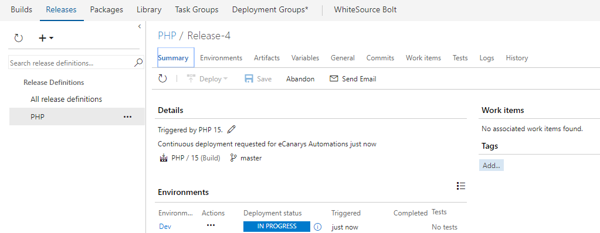
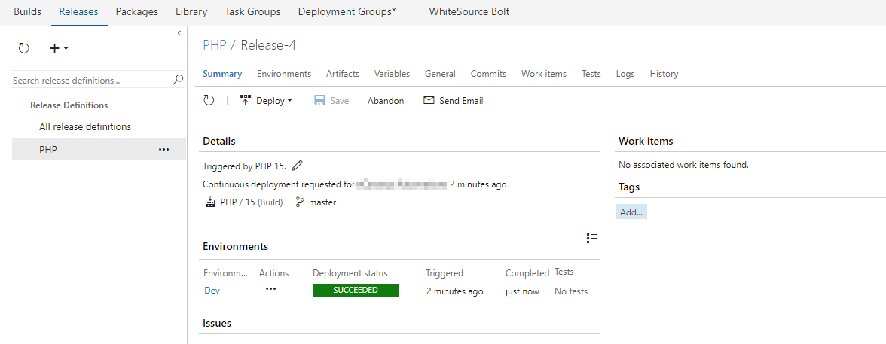

# Deploy PHP application to Azure App Service using Visual Studio Team Services

## Overview

This lab shows how you can deploy a **PHP application to Azure App Service using a CI/CD pipeline in Visual Studio Team Services**.

**PHP** is a server scripting language, and a powerful tool for making dynamic and interactive Web pages.

## Pre-requisites

 1. **Microsoft Azure Account:**  You will need a valid and active azure account for the labs
 
 2.  You need a **Visual Studio Team Services Account** and <a href="http://bit.ly/2gBL4r4">Personal Access Token</a>

 ## Setting Up the Environment

1. Use <a href="https://vstsdemogenerator.azurewebsites.net" target="_blank">VSTS Demo Data Generator</a> to provision a project on your VSTS account.

   

2. Select **PHP** for the template.

3. Once the project is provisioned, select the URL to navigate to the project that you provisioned.

## Configuring the CI/CD pipeline

1. Let's start from code. Navigate to the **Code** hub.

   

2. We have a PHP code provisioned by the demo generator system. We will deploy this to Azure App Service.

3. We have a Continious Integration (CI) build setup to run upon a code commit. Let's make a simple change to the code to trigger the CI build.

4. Open the file **config.php** by navigating to the below path-
   
   > php/config.php

   
   
5. Edit the code. For this example, let's change **line 11** to **DevOps For PHP using Visual Studio Team Services**

   

6. Select **Commit** to save and commit the changes.

7. The code commit will trigger the CI build. Go to the **Build and Release** tab to see the CI build running in progress.

   

   While the build is in progress, let's explore the build definition. The tasks that is used in the build definitaion are listed in the table below.

   <table width="100%">
   <thead>
      <tr>
         <th width="60%"><b>Tasks</b></th>
         <th><b>Usage</b></th>
      </tr>
   </thead>
   <tr>
      <td><a href="http://bit.ly/2zqe7b4"><b>Archive files</b></a> </td>
      <td>Creates an archive file from a source folder</td>
   </tr>
   <tr>
      <td><a href="http://bit.ly/2grMxTQ"><b>Copy Files</b></a> </td>
      <td>Used to Copy files from source to destination folder using match patterns</td>
   </tr>
   <tr>
      <td><a href="http://bit.ly/2yBgXde"><b>Publish Build Artifacts</b></a>  </td>
      <td> Used to share the build artifacts </td>
   </tr>
   </table>

    

   

8. Once the build is completed, you can see the summary as shown below.

   

## Continuous Delivery

We have a release pipeline configured to deploy the application. It is associated to the build and triggered when the build is successful. Let's look at the release pipeline.

1. Navigate to the **Releases** tab under **Build and Release** hub.

2. Select the **PHP** definition and choose Edit.

3. We have one environment called **Azure Deployment**

   

4. Go to the **Azure Deployment** environment, you can see we have 2 tasks being used. Let's explore the release definition. The tasks that is used in the release definition are listed in the table below.

   <table width="100%">
   <thead>
      <tr>
         <th width="57%"><b>Tasks</b></th>
         <th><b>Usage</b></th>
      </tr>
   </thead>
   <tr>
      <td><a href="http://bit.ly/2ysg1It"><b>Azure Resource Group Deployment</b></a> </td>
      <td>Creates, Updates an existing resource group using ARM templates  </td>
   </tr>
   <tr>
      <td><a href="http://bit.ly/2zkks4L"><b>Azure App Service Deploy</b></a>  </td>
      <td>Updates Azure App Service to deploy WebApps </td>
   </tr>
   <tr>
  </table>

  We are using **Infrastructure as a Code** in the release pipeline with an ARM template to provision the required infrastructure **(Web App)** on Azure.

5. You can see in progress release as shown below.

   

6. Once the release is completed, you can see the summary which shows **Release Summary, logs etc.**

   

    

   

7. Login to [Azure Portal](https://portal.azure.com) and search a **Resource Group** with the name **PHP** that would have got created. It would be associated with resource like **WebApp,Host Plan** as shown below.

   

8. Navigate to WebApp from the resource group and you should see the application is deployed successfully with the changes made earlier as shown.

   

## Summary
  
With Visual Studio Team Services, we can implement DevOps to any language, any platform. In this lab we have achieved DevOps for PHP application using VSTS and Azure! 

## Feedback 

