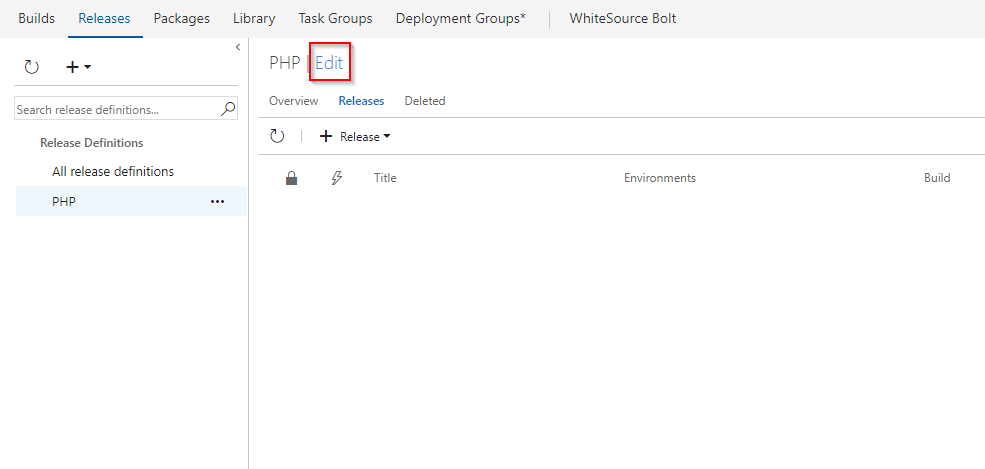
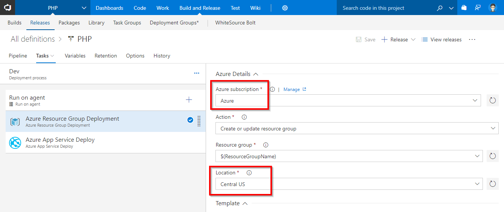
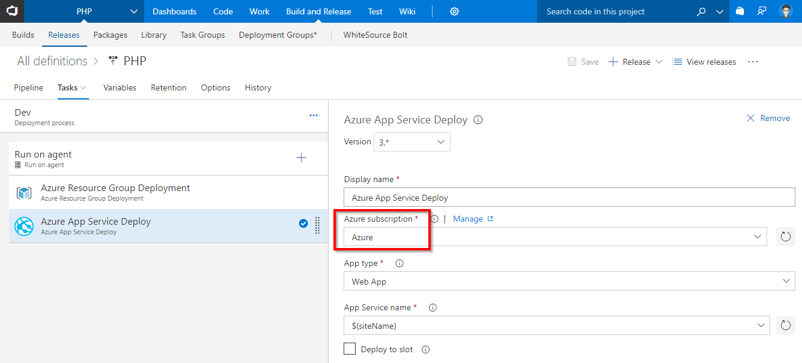
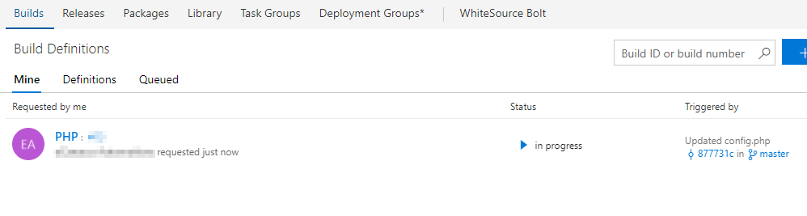
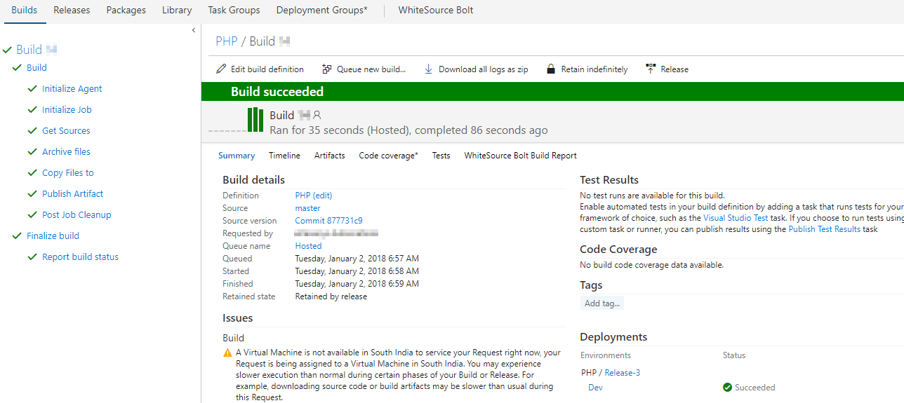
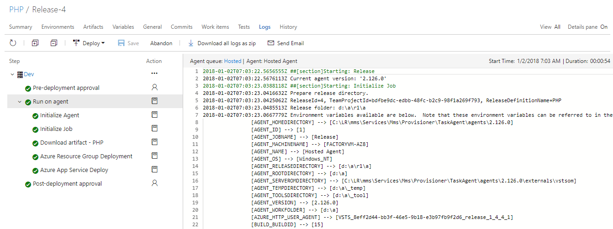

# Deploy PHP application to Azure App Service using VSTS

## Overview

**PHP** is a server-side scripting language, and a powerful tool for making dynamic and interactive Web pages.

This lab shows how to deploy **PHP** application to **Azure App** service using **Visual Studio Team Services**.

## Pre-requisites

 1. **Microsoft Azure Account:**  You need a valid and active azure account for the labs
 
 2.  You need a **Visual Studio Team Services Account** and <a href="https://docs.microsoft.com/en-us/vsts/accounts/use-personal-access-tokens-to-authenticate">Personal Access Token</a>

 ## Setting Up the VSTS Project

1. Use <a href="https://vstsdemogenerator.azurewebsites.net" target="_blank">VSTS Demo Data Generator</a> to provision a PHP project on your VSTS account.

   

2. Once the project is provisioned, click the URL to navigate to the project.

   

## Exercise 1: Endpoint Creation
Since the connections are not established during project provisioning, we will manually create the endpoints.

In VSTS, navigate to **Services** by clicking the gear icon, and click  **+ New Service Endpoint**. Select **Azure Resource Manager**. Specify connection name, select your subscription from the dropdown and click OK. We use this endpoint to connect VSTS with Azure.

   

You will be prompted to authorize this connection with Azure credentials.

**Note**: Disable pop-up blocker in your browser if you see a blank screen after clicking OK, and retry the step.

## Excercise 2: Configure Release

We will use ARM template as **Infrastructure as a Code**  in the release definition to provision the required resources (App Service) on Azure.
 
1. Go to **Releases** under **Build and Release** tab, Select release definition **PHP** and click **Edit**

   
 

2. Go to **Tasks** and select **Azure Deployment** environment

   

3. Under **Azure Resources Deployment** task, update **Azure subscription**

   

4. Under **Azure App Service Deploy** task, update **Azure subscription** and click **Save**. 

   

   <table width="100%">
   <thead>
      <tr>
         <th width="57%"><b>Tasks</b></th>
         <th><b>Usage</b></th>
      </tr>
   </thead>
   <tr>
      <td><a href="https://github.com/Microsoft/vsts-tasks/blob/master/Tasks/AzureResourceGroupDeployment/README.md"><b>Azure Resource Group Deployment</b></a>></td>
      <td>creates an resource group with App Service  </td>
   </tr>
   <tr>
      <td><a href="https://github.com/Microsoft/vsts-tasks/blob/master/Tasks/AzureRmWebAppDeployment/README.md"><b>Azure App Service Deploy</b></a>  </td>
      <td>deploys a PHP application to App service</td>
   </tr>
   <tr>
  </table>

  
## Excercise 3: Trigger CI with code change

**PHP** is an interpreted language, so we dont have to compile the code, instead let's archive the files to be used in the release task for deployment.
We will update the code to trigger CI-CD using **Hosted build agent**.

1. Go to **Code** tab and navigate to the below path to edit the file.

   >php/config.php

   

2. Go to line number **11**, modify **PHP** to **DevOps for PHP using VSTS** and commit the code.

   

3. Go to **Builds** tab to see the particular CI build in-progress.

   

    

   

   Let's explore the build definition. The tasks used in the build definition are listed as shown. 

   <table width="100%">
   <thead>
      <tr>
         <th width="60%"><b>Tasks</b></th>
         <th><b>Usage</b></th>
      </tr>
   </thead>
   <tr>
      <td><a href="https://docs.microsoft.com/en-us/vsts/build-release/tasks/utility/archive-files"><b>Archive files</b></a> </td>
      <td>creates zip file for deployment</td>
   </tr>
   <tr>
      <td><a href="https://docs.microsoft.com/en-gb/vsts/build-release/tasks/utility/copy-files"><b>Copy Files</b></a> </td>
      <td>copies ARM template which is used to provision resources on azure </td>
   </tr>
   <tr>
      <td><a href="https://docs.microsoft.com/en-gb/vsts/build-release/tasks/utility/publish-build-artifacts"><b>Publish Build Artifacts</b></a>  </td>
      <td> publishes the build artifacts </td>
   </tr>
   </table>

    

The build will generate artifact which is used to deploy. After build completes, you will see the build summary.

  

## Continuous Deployment 

Once the build is complete, navigate to **Releases** under **Build and Release** and notice that a release is in-progress.

   

1. Once the release is complete, you  will see the summary.

   

    

   Click **Logs** to see the complete logs of the release.

   

2. Login to [Azure Portal](https://portal.azure.com) and go to  **Resource Group**. You will see a resource group with the name **PHP**. Which contains **App Service, App Services Plan** as shown.

   

3. Go to **App Service** click on **Browse** you will see the application deployed with the changes as shown.

   

## Summary
  
In  this lab, we will setup a Continuous Build and Deployment to Azure App Service for a PHP project using Visual Studio Team Services 

## Feedback 

