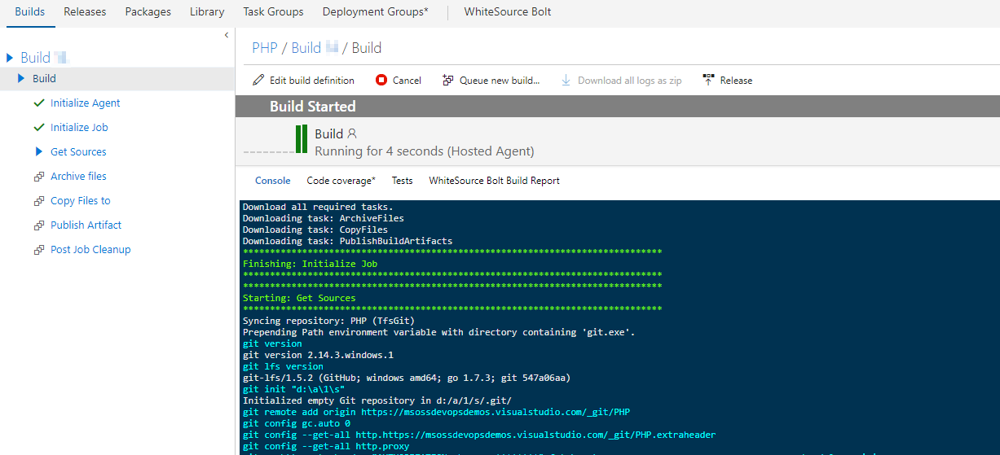

# Deploy PHP application to Azure App Service using VSTS

## Overview

This lab shows how to deploy **PHP** application to **Azure App** service using **Visual Studio Team Services**.

**PHP** is a server-side scripting language, and a powerful tool for creating dynamic and interactive Web pages.

## Pre-requisites

 1. **Microsoft Azure Account:**  You need a valid and active azure account for the labs
 
 2.  You need a **Visual Studio Team Services Account** and <a href="https://docs.microsoft.com/en-us/vsts/accounts/use-personal-access-tokens-to-authenticate">Personal Access Token</a>

 3. Your VSTS account  needs to be linked to a valid Azure subscription. Here's how you can <a href="https://docs.microsoft.com/en-us/vsts/billing/set-up-billing-for-your-account-vs#link-an-azure-subscription-to-your-vsts-account-for-billing" target=_blank>link</a>.

 ## Setting Up the VSTS Project

1. Use <a href="https://vstsdemobuildersite.azurewebsites.net/?name=PHP" target="_blank">VSTS Demo Data Generator</a> to provision the PHP project on your VSTS account.

   

2. Once the project is provisioned, click the URL to navigate to the project.

   

## Exercise 1: Endpoint Creation
Since the connections are not established during project provisioning, we will manually create the endpoints.

In the PHP project provisioned VSTS account, navigate to **Services** by clicking the gear icon, and click  **+ New Service Endpoint**. Select **Azure Resource Manager**. Specify connection name, select your subscription from the dropdown and click OK. We use this endpoint to connect VSTS with Azure.

   

You will be prompted to authorize this connection with Azure credentials.

**Note**: Disable pop-up blocker in your browser if you see a blank screen after clicking OK, and retry the step.

## Excercise 2: Trigger CI with code change

Since **PHP** is an interpreted language, we cannot compile the code. Instead, we archive the code files for deployment in the release task.

Let us update the code to trigger CI-CD using **Hosted Build agent**.

1. Navigate to **Code** tab within the project and edit **config.php** file under the code root path.

   >php/config.php

   

2. Go to line number **11**, modify the text "**PHP**" to "**DevOps for PHP using VSTS**" and click on **Commit** to commit the change.

   

3. Go to **Builds** tab to see the CI build triggered already.

   

    

   

   Now, Let's explore the build definition and check the tasks used in the build definition. 

   <table width="100%">
   <thead>
      <tr>
         <th width="60%"><b>Tasks</b></th>
         <th><b>Usage</b></th>
      </tr>
   </thead>
   <tr>
      <td><a href="https://docs.microsoft.com/en-us/vsts/build-release/tasks/utility/archive-files"><b>Archive files</b></a> </td>
      <td>creates zip file for deployment</td>
   </tr>
   <tr>
      <td><a href="https://docs.microsoft.com/en-gb/vsts/build-release/tasks/utility/copy-files"><b>Copy Files</b></a> </td>
      <td>copies ARM template which is used to provision resources on azure </td>
   </tr>
   <tr>
      <td><a href="https://docs.microsoft.com/en-gb/vsts/build-release/tasks/utility/publish-build-artifacts"><b>Publish Build Artifacts</b></a>  </td>
      <td> publishes the build artifacts </td>
   </tr>
   </table>

    

The build generates artifact which is used for deployment. After build completes, you will see the build summary.

  

## Excercise 3: Deploy to Azure

We will use ARM template as **Infrastructure as Code**  in the release definition to provision the required resources (App Service) on Azure.
 
1. Go to **Releases** under **Build and Release** tab, Select release definition **PHP** and click **Edit**

   
 

2. Go to **Tasks** and select **Azure Deployment** environment

   

3. Under **Azure Resources Deployment** task, update **Azure subscription**

   

4. Under **Azure App Service Deploy** task, update **Azure subscription** created in **Exercise 1** 

   

   <table width="100%">
   <thead>
      <tr>
         <th width="57%"><b>Tasks</b></th>
         <th><b>Usage</b></th>
      </tr>
   </thead>
   <tr>
      <td><a href="https://github.com/Microsoft/vsts-tasks/blob/master/Tasks/AzureResourceGroupDeployment/README.md"><b>Azure Resource Group Deployment</b></a>></td>
      <td>creates an resource group with App Service  </td>
   </tr>
   <tr>
      <td><a href="https://github.com/Microsoft/vsts-tasks/blob/master/Tasks/AzureRmWebAppDeployment/README.md"><b>Azure App Service Deploy</b></a>  </td>
      <td>deploys a PHP application to App service</td>
   </tr>
   <tr>
  </table>

5. You will see in progress release as shown.

   

6. Once the release is complete, you  will see the summary.

   

    

   

7. Login to [Azure Portal](https://portal.azure.com) and go to  **Resource Group**. You will see a resource group with the name **PHP**. Which contains **App Service, App Services Plan** as shown.

   

8. Go to **App Service** click on **Browse** you will see the application deployed with the changes as shown.

   

## Summary
  
With Visual Studio Team Services, we can implement DevOps for any language, any platform. In this lab we have achieved DevOps for PHP application using VSTS and Azure. 

## Feedback 

