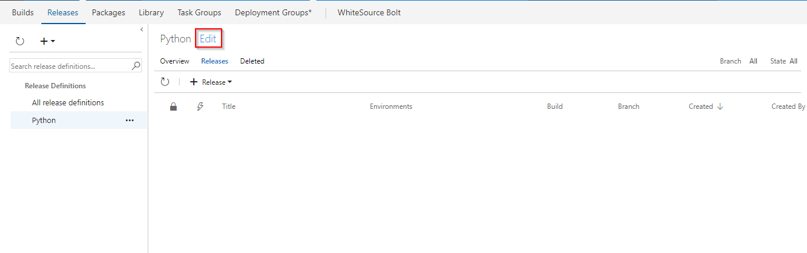
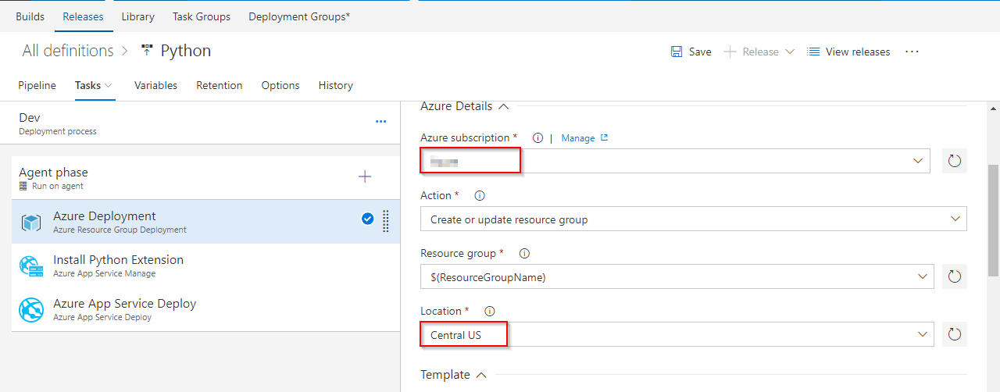
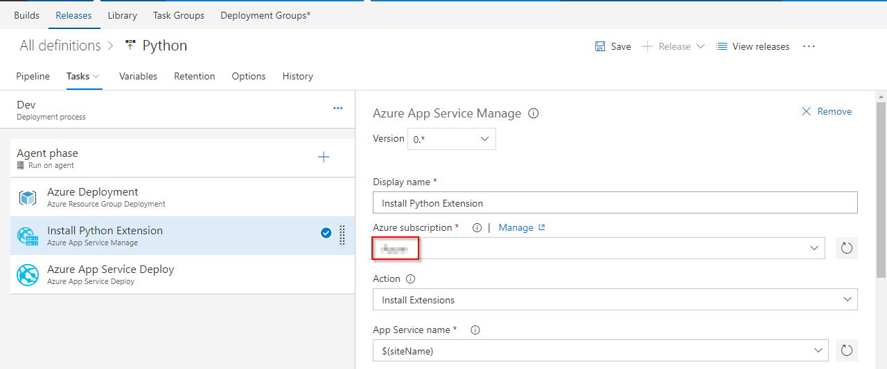
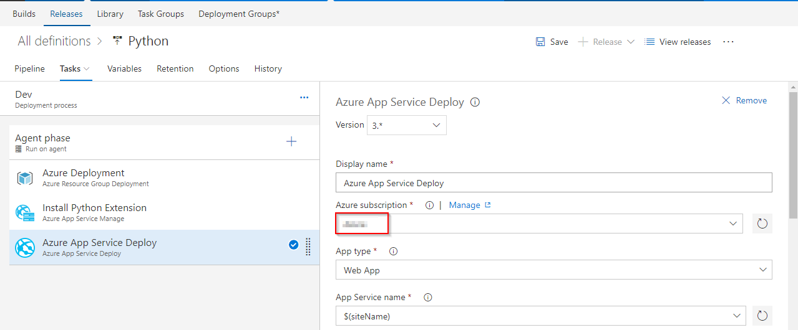
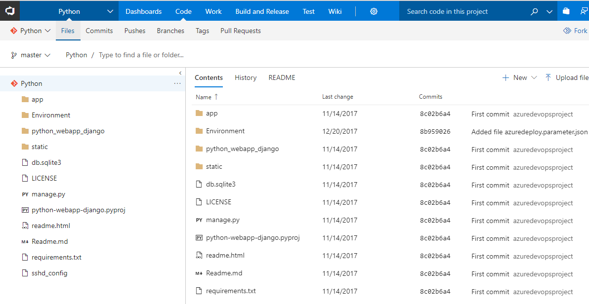
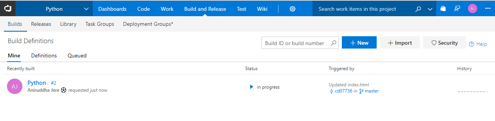
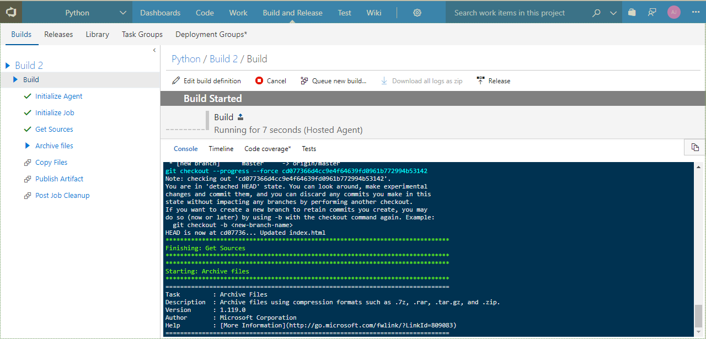
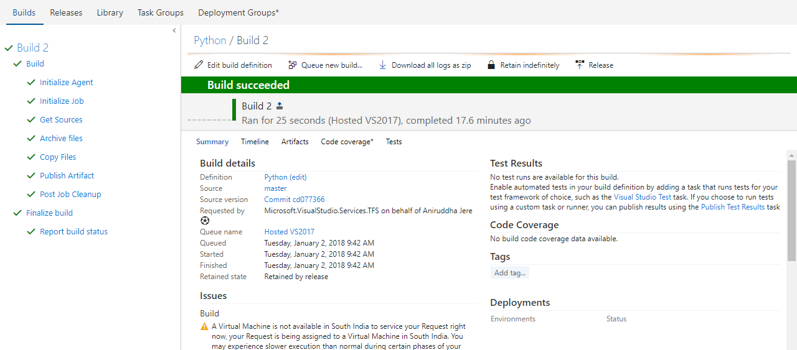
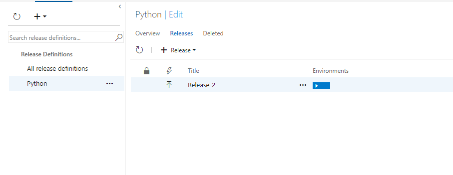
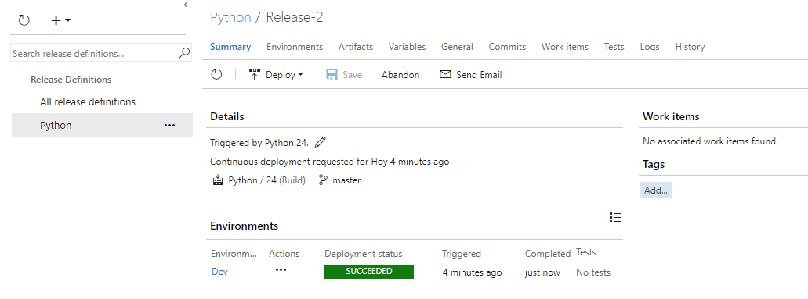

# Deploy Python application to Azure App Service using VSTS

## Overview

**Python** is a server-side scripting language, and a powerful tool for making dynamic and interactive Web pages.

This lab shows how to deploy **Python** application with [Django](https://www.djangoproject.com/) framework to **Azure App** service using **Visual Studio Team Services**.

## Pre-requisites

1. **Microsoft Azure Account:**  You need a valid and active azure account for the labs

 2.  You need a **Visual Studio Team Services Account** and <a href="https://docs.microsoft.com/en-us/vsts/accounts/use-personal-access-tokens-to-authenticate">Personal Access Token</a>

 ## Setting Up the VSTS Project

 1. Use <a href="https://vstsdemogenerator.azurewebsites.net" target="_blank">VSTS Demo Data Generator</a> to provision a Python project on your VSTS account.

    

 2. Once the project is provisioned, click the URL to navigate to the project.

 #image

 ## Exercise 1: Endpoint Creation
 Since the connections are not established during project provisioning, we will manually create the endpoints.

 In VSTS, navigate to **Services** by clicking the gear icon, and click  **+ New Service Endpoint**. Select **Azure Resource Manager**. Specify connection name, select your subscription from the dropdown and click OK. We use this endpoint to connect VSTS with Azure.

   

You will be prompted to authorize this connection with Azure credentials.

**Note**: Disable pop-up blocker in your browser if you see a blank screen after clicking OK, and retry the step.

## Excercise 2: Configure Release

We will provision the resources on **Azure** using ARM template in the **release definition**.

1. Go to **Releases** under **Build and Release** tab, Select release definition **Python** and click **Edit**

   

 2. Go to **Tasks** and select **Azure Deployment** environment.

    

 3. Under **Azure Resource Group Deployment** task, update **Azure subscription** and **Location**.

    

 4. Under **Install Python Extension** task, update **Azure subscription**. 

    

5. Under **Azure App Service Deploy** task, update **Azure subscription** and click **Save**.
   

   <table width="75%">
   <thead>
      <tr>
         <th width="67%"><b>Tasks</b></th>
         <th><b>Usage</b></th>
      </tr>
   </thead>
   <tr>
      <td> <b>Azure Resource Group Deployment</b></td>
      <td>This task will create a resource group with the name <b>Python</b>, creates an <b>App service</b> and <b>App Service Plan</b> on azure which will be used to deploy the application</td>
   </tr>
    <tr>
      <td> <b>Install Python Extension </b></td>
      <td>the task will install python extensions on the app service which was created above.</td>
   </tr>
   <tr>
      <td> <b>Azure App Service Deploy</b></td>
      <td>The task is used to update Azure App Service to deploy Web Apps to azure.</td>
   </tr>
   <tr>
  </table>

## Excercise 3: Trigger CI with code change

  **Python** is an interpreted language, and hence compilation is not required. We will archive the files in the build and use the package in the release for deployment. Update the code to trigger CI-CD using **Hosted build agent**.

1. Go to **Code** tab and navigate to the below path to edit the file.

   >python/app/templates/app/index.html

   

2. Go to line number **32**, modify **Continuous Delivery** to **Continuous Delivery for Python** and commit the code.

   

3. Go to **Builds** tab under **Build and Release** tab to see the build in-progress.

   

    

   

   Let's explore the build definition while the build is in-progress. The tasks used are listed as shown.

   <table width="100%">
    <thead>
      <tr>
         <th width="60%"><b>Tasks</b></th>
         <th><b>Usage</b></th>
      </tr>
    </thead>
    <tr>
        <td> <b>Archive files</b></td>
        <td>creates zip file for deployment</td>
    </tr>
    <tr>
        <td> <b>Copy Files</b></td>
        <td>copies ARM template which is used to provision resources on azure </td>
    </tr>
    <tr>
        <td> <b>Publish Build Artifacts</b></td>
        <td> publishes the build artifacts </td>
    </tr>
    </table>

    

4. The build generates artifact which is used to deploy. After build completes, you will see the build summary.

   

   
## Continuous Deployment

We will use the artifact generated from the build to deploy to App Service on azure. 

- Once the build is complete, navigate to **Releases** under **Build and Release** tab. You will see a release in-progress.

  

- Once the release is complete, you  will see the release summary.

  

 

- Click **Logs** to see the complete logs of the release.

  

- Login to [Azure Portal](https://portal.azure.com) and go to  the **Resource Group** with the name **Python**. You will see the resources **App Service** and **App Service Plan**.

  

- Go to **App Service**, click on **Browse**. You will see the application deployed with the changes as shown.

  

## Summary
  
In this lab, we will setup a Continuous Build and Deployment to Azure App Service for a Python project using Visual Studio Team Services.

## Feedback 

Please let <a href="mailto:devopsdemos@microsoft.com">us</a> know if you have any feedback on this lab.
 