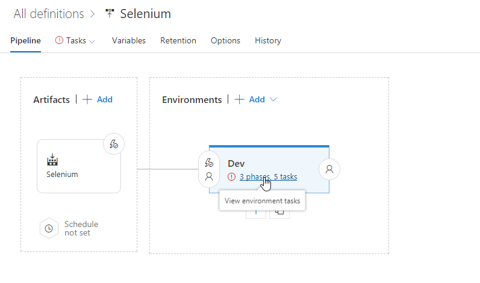
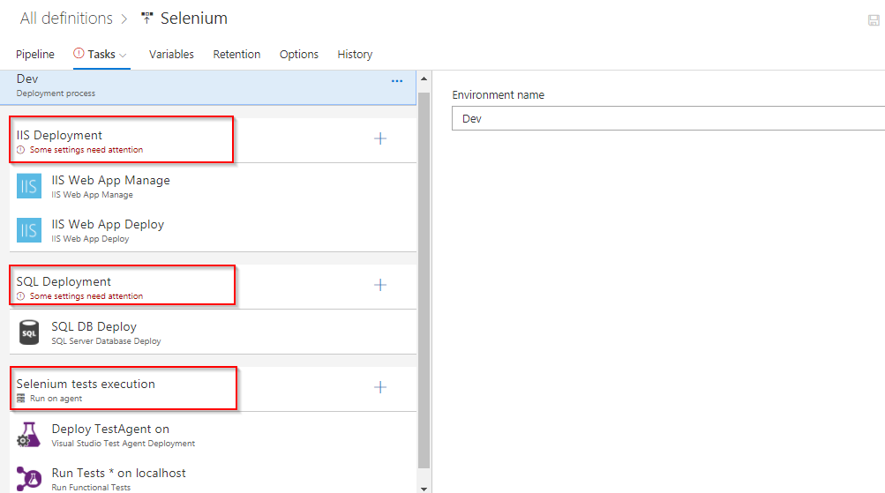
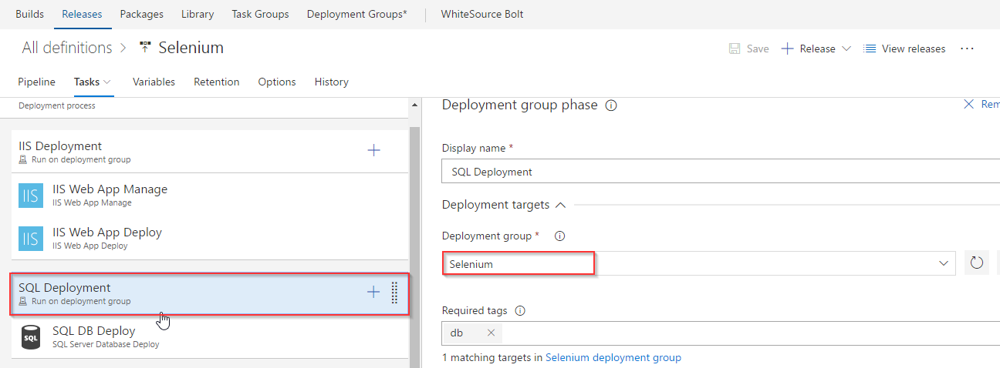
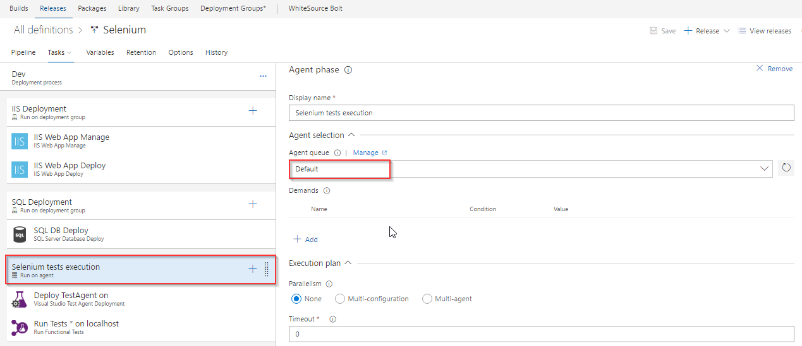
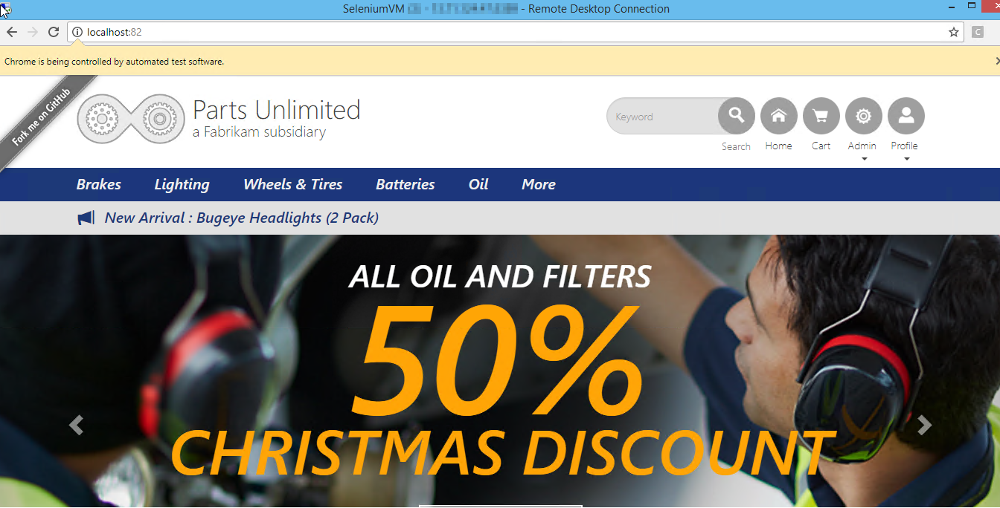

## Continuous Testing of a Web App with Selenium in VSTS

## Overview
<a href="http://www.seleniumhq.org/">
Selenium</a> is a portable open source software-testing framework for web applications. It has the capability to operate on almost every operating system. It supports all modern browsers and multiple languages including .NET (C#), Java.

In this lab, you will learn how to execute selenium testcases on a C# web application as part of the VSTS Continuous Delivery pipeline.

If you are not familiar with UI Automation using Selenium tests, [click here](https://almvm.azurewebsites.net/labs/vsts/selenium/) to get started.

## Pre-requisites

1. **Microsoft Azure Account:** You need a valid and active azure account for the lab. 

2. You need a **Visual Studio Team Services Account** and <a href="https://docs.microsoft.com/en-us/vsts/accounts/use-personal-access-tokens-to-authenticate">Personal Access Token</a>

## Setting up the Environment

1. Click **Deploy To Azure** to provision a Windows Server 2016 virtual machine along with SQL Express 2017 and browsers - Chrome and FireFox. 

   

## Setting up the VSTS project

 1. Use <a href="https://vstsdemogenerator.azurewebsites.net/?name=Selenium&templateid=77367" target="_blank">VSTS Demo Data Generator</a> to provision the project on your VSTS account.

    

2. Once the project is provisioned, click the URL to navigate to the project. 
 
   
   
## Exercise 1: Creating Deployment Group

[Deployment Groups](https://docs.microsoft.com/en-us/vsts/build-release/concepts/definitions/release/deployment-groups/) in VSTS make it easier to organize the servers that you want to use to host your app. A deployment group is a collection of machines with a VSTS agent on each of them. Each machine interacts with VSTS to coordinate deployment of your app.

We will use Deployment Groups here to deploy the application to the VM which was provisioned earlier to execute the Selenium test cases. Since the application's backend is a SQL Database, we will deploy the database in the VM using Deployment Groups. 

1. Go to **Deployment Groups** under **Build & Release** tab. Click **Add deployment group** .

   

2. Provide deployment group name and click **Create**. A powershell **Registration script** is generated to the right of the screen.

   

   

Select the **Use a personal access token in the script for authentication** check box and click on **Copy script to clipboard** to copy the script which will be used in the next exercise to associate the VM to  deployment group.

## Exercise 2: Associate the VM to Deployment Group

In this exercise, we will execute the **registration script** on the VM to associate with the deployment group.

1. Login to the VM using RDP with the following credentials

   - **Username**: vmadmin
   - **Password**: P2ssw0rd@123

2. Open **Windows PowerShell** in **administrator** mode, paste the copied **Registration script** and hit **Enter**.

   

3. When the **Enter deployment group tags for agent? (Y/N) (press enter for N) >** message is prompted in the PowerShell window, type **Y** and hit enter.

   

4. Tag VM by entering the tags as **web, db**. And hit **Enter**

   

5. When prompt -**Enter User account to use for the service (press enter for NT AUTHORITY\SYSTEM) >** is displayed, hit **Enter** to configure the service to run under **NT AUTHORITY\SYSTEM** account.

  

6. Refresh your VSTS Deployment Groups page, click the created Deployment Group and you will notice the online status, health status and the associated tags of the VM.

     

## Exercise 3: Configure agent on the VM

Let us configure a Windows private agent on this VM since Selenium requires the agent to be run in interactive mode to execute its UI tests.

1. Go to the VM and open the folder **C:\VSTSwinAgent**.

2. Open a command prompt in **administrator mode**. Change the path to **C:\VSTSWinAgent** and type **Config.cmd** and hit **Enter**.

3. Provide the following details:

    - Enter server URL: Your VSTS URL
    - Authentication type: Press **enter key** for PAT as the authentication type and paste the PAT in the next prompt.
    - Let us use the default options for rest of the configuration. Press **Enter** for all prompts until the command execution completes.
    - Once the agent is registered, type **run.cmd** and hit **Enter** to start the agent.

    Click [here](https://docs.microsoft.com/en-us/vsts/build-release/actions/agents/v2-windows) for more information on how to configure the agent.
   
   

## Exercise 4: Configure Release

The target machine is available in the deployment group to deploy the application and run selenium testcases. The release definition uses **[Phases](https://docs.microsoft.com/en-us/vsts/build-release/concepts/process/phases)** to deploy to target servers.

1. Go to **Releases** under **Build and Release** tab. Select **Selenium** release definition and **Edit**.

   

2. Open **Dev** environment to see the three deployment phases.

      

     

      

   - **IIS Deployment phase**: In this phase, we deploy application to the VM using following tasks- 
      
      - **IIS Web App Manage**: This task runs on the target machine registered with the Deployment Group. It creates a *website* and an *Application Pool* locally with the name **PartsUnlimited** running under the port **82** **http://localhost:82**

      - **IIS Web App Deploy**: This task deploys the application to the IIS server using **Web Deploy**.

    - **Database deploy phase**: In this phase, we use [**SQL Server Database Deploy**](https://github.com/Microsoft/vsts-tasks/blob/master/Tasks/SqlDacpacDeploymentOnMachineGroup/README.md) task to deploy [**dacpac**](https://docs.microsoft.com/en-us/sql/relational-databases/data-tier-applications/data-tier-applications) file to the DB server.
 

   - **Selenium tests execution**: Executing **UI testing** as part of the release process is a great way of detecting unexpected changes, and need not be difficult. In this phase, we will execute Selenium tests on the deployed web application. The below tasks describes using Selenium to test the website in the release pipeline.
   
     - **Deploy Test Agent**: The [Deploy Test agent](https://github.com/Microsoft/vsts-tasks/blob/master/Tasks/DeployVisualStudioTestAgent/README.md) task will deploy the test agent to the VM. The test agent is used to run distributed tests like Coded UI and Selenium.
     - **Run Functional tests**: This [task](https://github.com/Microsoft/vsts-tasks/blob/master/Tasks/RunDistributedTests/README.md) uses **vstest.console.exe** to execute the selenium testcases.

4. Click on **IIS Deployment** phase and select the Deployment Group which we have created in **Exercise 2**.

   

5. Repeat the above step for **SQL Deployment** phase

   

6. Click on **Selenium tests execution** phase and set Agent queue to **Default** then save the changes.

   

## Exercise 5: Trigger Build and Release

In this exercise, we will trigger the **VSTS build** to compile the Selenium C# scripts along with the Web application. The resulting binaries are copied to the Azure VM and finally, the Selenium scripts are executed as part of the automated **VSTS release**.

1. Navigate to **Builds** under **Build and Release** tab and queue the build.

   

2. This build will publish the test artifacts to VSTS, which will be used in release. 

   

3. Once the build completes, the release will be triggered. Navigate to **Releases** tab to see the deployment in-progress.

   

4. When **Selenium test execution** phase starts, connect back to the VM provisioned earlier to see UI tests execution.

   >Note : It takes approximately 8 minutes to deploy the test agent for the first time on the VM. Once this task is complete, you can connect to the VM to see the actual test execution.

   

5. In this lab, we are executing **4** UI test scenarios configured to run on **Chrome** and **Firefox** browsers.

   ### Tests running in Chrome

   
  

   ### Tests running in Firefox
   
   
  

6. Once the release succeeds, click the **Tests** tab to analyze the test results. Select **All** in the **Outcome** section to view all the tests and their status.

     

## Summary

With VSTS and Selenium, we can Continuously Build, Deploy and Test the web application.

## Feedback

Please let <a href="mailto:devopsdemos@microsoft.com" target="_blank" >us</a> know if you have any feedback on this lab.
