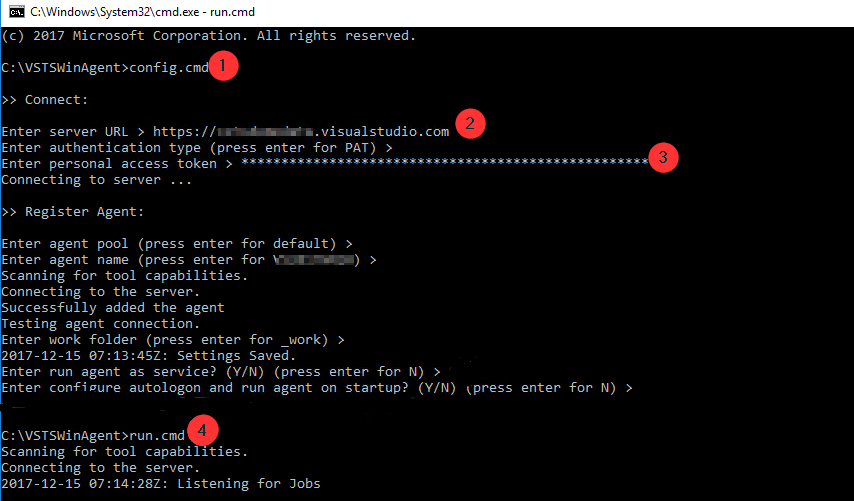
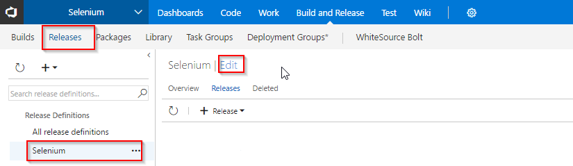
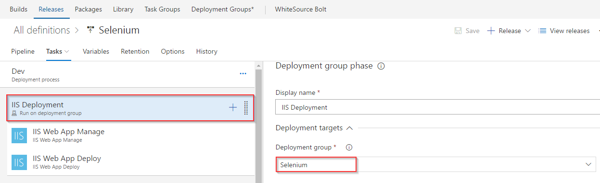
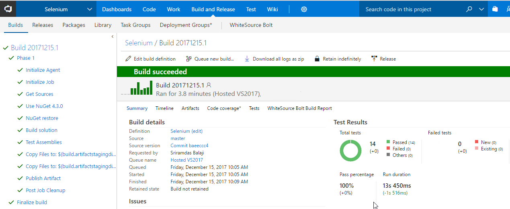

## Running Selenium Testcases in VSTS

## Overview
<a href="http://www.seleniumhq.org/">
Selenium</a> is probably the best option for automated testing of Websites today. It is becoming increasingly popular and it is the first choice of automation testers as well as organizations for automating the testing of Web-based applications for both the GUI as well as the functionality. Selenium can also be used as a unit testing tool for JavaScript.

### Why Selenium to use?
- Taking the other automation tools into consideration, Selenium has the capability to operate on almost every OS.
Selenium is an open source testing tool and hence it serves for cost-effective automation testing.

- Selenium supports multiple languages such as Python, Pearl, Ruby, PHP, .NET (C#) and Java. You are required to be comfortable in just a single language in order to operate Selenium.

- One highly beneficial feature of Selenium is that the language used for building the program is independent of the language that the web application or website is using. This implies that the test script can be developed in any of the languages that Selenium supports.

- This testing tool supports a range of browsers like Opera, Safari, Chrome, IE 6, 7, 8 and Mozilla Firefox.

In this lab, you will learn how to run selenium testcases as part of the CD Pipeline from VSTS

## Pre-requisites

1. **Microsoft Azure Account:** You need a valid and active azure account for the labs

2. You need a **Visual Studio Team Services Account** and <a href="https://docs.microsoft.com/en-us/vsts/accounts/use-personal-access-tokens-to-authenticate">Personal Access Token</a>

## Setting up the Environment

1. Click **Deploy To Azure** to provision the Windwos Server 2016 VM with SQL componenets and brwosersChrome and firefox. 

   

The following resources will be provisioned once successful
- WS 2016 VM
- SQL Express 2017
- Browsers (Chrome and FireFox)

## Exercise 1: Setting up the VSTS project

 Use <a href="http://bit.ly/2AWznna" target="_blank">VSTS Demo Data Generator</a> to provision a project on your VSTS account.

   

## Exercise 2: Creating Deployment Group

[Deployment groups](https://docs.microsoft.com/en-us/vsts/build-release/concepts/definitions/release/deployment-groups/) in VSTS make it easier to organize the servers that you want to use to host your app. A deployment group is a collection of machines with a VSTS agent on each of them. Each machine interacts with VSTS to coordinate deployment of your app.

We will use Deployment Groups to deploy the application to a VM which was provisioned earlier to run the Selenium TestCases. Since the application contains SQL Database, we will deploy the DB locally inside the VM. 

1. Go to **Deployment Groups** under **Build & Release** tab. Click **Add deployment group** .

   

2. Provide Deployment group name and click create. You will see the registration script generated.

   

   

Check the box Use the personal access token in the script for authentication and click on Copy script to dashboard.
This script is used to register/associate the VM we created to the Deployment group created above.

## Exercise 3: Associate the VM we created to Deployment group

1. Login to the VM through RDP with the following credentials
   - VMAdmin
   - P2ssw0rd@123

2. Run Powershell in an administrator mode and execute the script which you copied from the previous step.
Provide the details as following-
-Enter comma seperated list of tags- web,db

   

3. Now you see the Deployment gorup online
and the Vm is associated with tags web, db

   

## Exercise 4: Configure Windows agent on the VM

#TBA
We need to configure windows agent on the VM in order to run selenium test cases.
1. Open the folder C:\VSTSWinAgent folder in the VM
2. Navigate to this path in command prompt and run Config.cmd
3. provide the required details
We need to configure agent in interactive mode to run selenium UI testcases.
Click [here](https://docs.microsoft.com/en-us/vsts/build-release/actions/agents/v2-windows) for more info on how to configure agent
   

## Exercise 5: Configure Release

1. Click on Releases tab and select Selenium release definition and edit

   

2. Open Selenium Dev environment

   

3. You will see three phases

   - IIS Deployment: In this phase we have two tasks. First task will create website in the VM. And the second task deploy website content from build to the website created in first task.

   - SQL Deployment: In this phase we are deploying application DB to the SQL server in VM

   - Selenium tests execution: In this phase we are executing seleium test cases on the web application deployed above.Here we have two taks. Depoly test agent task will deploy Visual studio test agent on the VM which will help to invoke test cases. Run Functional tests tasks will run our selenium testcases using test agent deployed. 

4. Click on IIS deployment phase ans select the Deployement Group which we have created in Exerecise 2

   

   Repeat the same for SQL Deployment phase

   

5. Click on Selenium test execution phase and select Agent Queue as Default save the changes.

   

## Exercise 6: Trigger Build and Release

1. Navigate to Builds tab and queue the build

   

   

2. Click on Queued tab and you can see build is queued
   
   

3. Click on the build to see the build progress

   

4. Once the build success we can see a release has been triggred. click on the Release to see the deployment progress.

   

5. In Selenium test execution phase we can see selenium UI test cases running in the VM

   

6. To Analyze test results click on Tests tab in the Release

   

## Summary

With **Visual Studio Team Services** and its integration with **SeleniumTests**, we can achieve BuildDeployTest successfully

## Feedback

Please let <a href="mailto:devopsdemos@microsoft.com" target="_blank" >us</a> know if you have any feedback on this lab.
