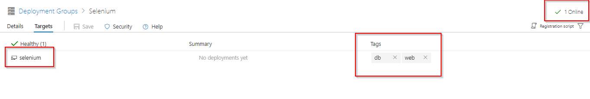
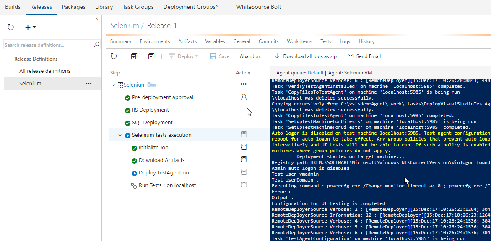
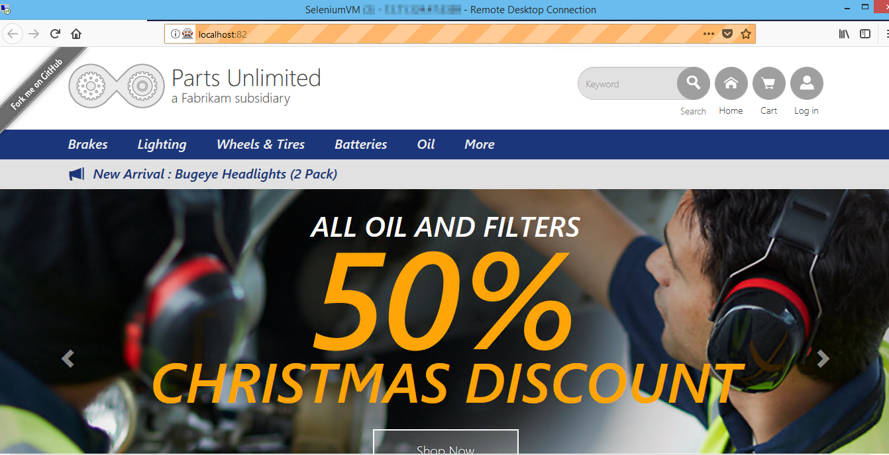

## Continuous Testing of a Web App with Selenium in VSTS

## Overview
<a href="http://www.seleniumhq.org/">
Selenium</a> is a portable open source software-testing framework for web applications. It has the capability to operate on almost every Operating System. It supports all modern browsers and multiple languages such as .NET (C#), Java.

In this lab, you will learn how to run selenium testcases on a C# web application as part of the VSTS Continuous Delivery pipeline. 

## Pre-requisites

1. **Microsoft Azure Account:** You need a valid and active azure account for the labs

2. You need a **Visual Studio Team Services Account** and <a href="https://docs.microsoft.com/en-us/vsts/accounts/use-personal-access-tokens-to-authenticate">Personal Access Token</a>

## Setting up the Environment

1. Click **Deploy To Azure** to provision the environment. 

   

   The following resources will be provisioned once the deployment is successful:

    - WS 2016 VM
    - SQL Express 2017
    - Browsers (Chrome and FireFox)

## Setting up the VSTS project

 1. Use <a href="http://vstsdemobuildertest.azurewebsites.net/" target="_blank">VSTS Demo Data Generator</a> to provision a project on your VSTS account.

    

2. Once the project is provisioned, select the URL to navigate to the project. 
 
   

## Exercise 1: Creating Deployment Group

[Deployment Groups](https://docs.microsoft.com/en-us/vsts/build-release/concepts/definitions/release/deployment-groups/) in VSTS make it easier to organize the servers that you want to use to host your app. A deployment group is a collection of machines with a VSTS agent on each of them. Each machine interacts with VSTS to coordinate deployment of your app.

We will use Deployment Groups to deploy the application to a VM which was provisioned earlier to run the Selenium TestCases. Since the application contains SQL Database, we will deploy the DB locally inside the VM. 

1. Go to **Deployment Groups** under **Build & Release** tab. Click **Add deployment group** .

   

2. Provide deployment group name and click create. You will see the registration script generated.

   

   

Check, **Use the personal access token in the script for authentication** and click on **Copy script to dashboard**.
This script is used to associate the VM to the deployment group.

## Exercise 2: Associate the VM to Deployment Group

In this exercise, we will run the registration script on the VM to associate with the deployment group.

1. Login to the VM through RDP with the following credentials

   - **Username**: VMAdmin
   - **Password**: P2ssw0rd@123

2. Copy the generated registration script. Open **Powershell** in **administrator** mode, paste and **execute** the script.

   

3. When **Enter deployment group tags for agent?(Y/N)** message is prompted in the powershell window, type **Y** and hit enter.

   

4. Tag VM by entering the tags as **web, db**.

   

5. Now go to your VSTS deployment groups, you will see the VM is online and associated with the tags web, db.

   

## Exercise 3: Configure Windows agent on the VM

In this exercise, we will configure windows agent on the VM to run selenium tests. We will use Private Agent because selenium tests will run interactively.

1. Go to the VM and open the folder **C:\VSTSWinAgent**.

2. Open the command prompt in **administrator mode**. Change the path to **C:\VSTSWinAgent** and run **Config.cmd**.

3. Provide the following details:

    - Enter server URL: Your VSTS URL
    - Authentication type: press **enter key** for PAT and copy paste the PAT
    - Press **Enter key** for default options
    - Once the agent is registered run the script **run.cmd** to start the agent.

    Click [here](https://docs.microsoft.com/en-us/vsts/build-release/actions/agents/v2-windows) for more info on how to configure agent
   
   

## Exercise 4: Configure Release

The target machine is available in the deployment group to deploy the application and run selenium testcases. The release definition uses **[Phases](https://docs.microsoft.com/en-us/vsts/build-release/concepts/process/phases)** to deploy to target servers.

1. Go to **Releases** under **Build and Release** tab. Select **Selenium** release definition and **Edit**.

   

2. Open Selenium Dev environment.

   

3. You will see three phases as shown. 

   

   - **IIS Deployment phase**: In this phase we deploy application to the VM using following tasks- 
      
      - **IIS Web App Manage**: This task runs on the target machine registered with the Deployment Group configured for the task/phase. It creates a website and application pool locally with the name **PartsUnlimited** running under the port **82** http://localhost:82

      - **IIS Web App Deploy**: This task deploys the application to the IIS server using **Web Deploy**.

    - **Database deploy phase**: In this phase we use [**SQL Server Database Deploy**](https://github.com/Microsoft/vsts-tasks/blob/master/Tasks/SqlDacpacDeploymentOnMachineGroup/README.md) task to deploy [**dacpac**](https://docs.microsoft.com/en-us/sql/relational-databases/data-tier-applications/data-tier-applications) file to the DB server.
 

   - **Selenium tests execution**: In this phase we will execute Selenium tests on the web application deployed using the following tasks.

     - **Deploy Visual Studio Test Agent**: The [Deploy Test agent](https://github.com/Microsoft/vsts-tasks/blob/master/Tasks/DeployVisualStudioTestAgent/README.md) task will deploy the test agent to the VM. The test agent is used to run distributed tests using the **Run Functional Tests** task.
     - **Run Functional tests**: Any test which you can run using **vstest.console.exe** can be run using this task. The [Run Functional Tests](https://github.com/Microsoft/vsts-tasks/blob/master/Tasks/RunDistributedTests/README.md) task is used to run Selenium tests on the VM.

4. Click on **IIS Deployment** phase and select the Deployement Group which we have created in **Exerecise 2**.

   

5. Repeat the above step for **SQL Deployment** phase

   

6. Click on **Selenium tests execution** phase and set Agent queue to **Default** then save the changes.

   

## Exercise 5: Trigger Build and Release

In this exercise, we will compile the Selenium C# scripts along with the Web application. The generated binaries are copied to the Azure VM. Selenium scripts are executed as part of the VSTS release.

1. Navigate to **Builds** under **Build and Release** tab and queue the build.

   

2. This build will publish the test artifacts to VSTS, which will be used in release. 

   

3. Once the build completes, the release will be triggered. Navigate to **Releases** tab to see the progress.

   

4. When **Selenium test execution** phase starts, connect back to the VM provisioned earlier to see UI tests execution.

   

5. The test scenarios are configured to run on **Chrome** and **Firefox** browsers.

   >Tests running in Chrome

   

   >Tests running in Firefox
   
   

6. Once the release completes, to analyze the test results click on **Tests** tab.

    

## Summary

With VSTS and Selenium, we can Continuously Build, Deploy and Test the web application.

## Feedback

Please let <a href="mailto:devopsdemos@microsoft.com" target="_blank" >us</a> know if you have any feedback on this lab.
