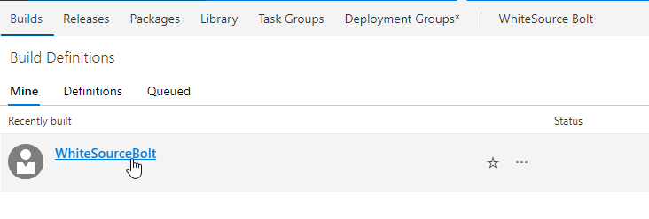
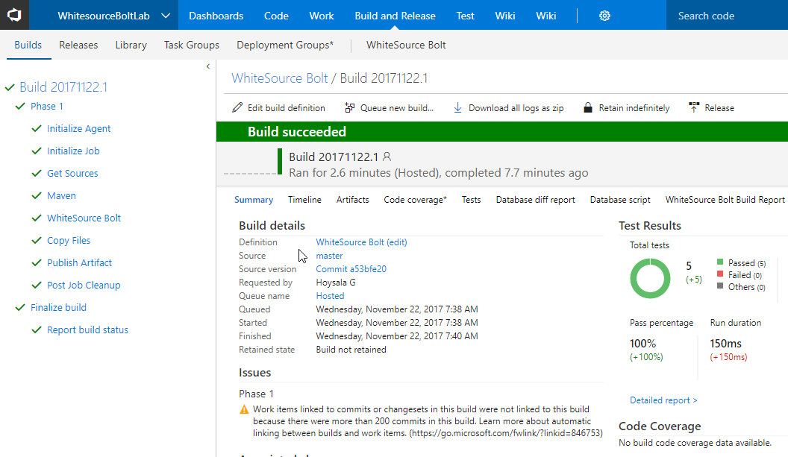

# Checking Vulnerabilities using WhiteSource Bolt with Visual Studio Team Services

## Overview

<a href="https://www.whitesourcesoftware.com/"  target =_blank>WhiteSource </a> is the leader in continuous open source software security and compliance management. WhiteSource integrates into your build process, no matter your programming languages, build tools, or development environments. It works automatically, continuously, and silently in the background, checking the security, licensing, and quality of your open source components against WhiteSource constantly-updated definitive database of open source repositories

WhiteSource provides WhiteSource Bolt, a lightweight open source security and management solution developed specifically for integration with Microsoft's Visual Studio Team Services (and TFS). It works per project and does not offer real-time alter capabilities like the **Full platform** offering which is generally recommended for larger development teams wanting to automate their open source management throughout the entire software development lifecycle (from the repositories to post-deployment stages) and across all projects and products.

This lab shows how you can use **WhiteSource Bolt with VSTS** to automatically detect and alerts on vulnerable open source components, outdated libraries, and licenses compliance issues in your code. We will be using WebGoat, a deliberately insecure web application maintained by OWASP designed to teach web application security lessons.

Team Services integration with WhiteSource Bolt will enable you to:

1. Detect and remedy vulnerable open source components.
2. Generate comprehensive open source inventory reports per project or build.
3. Enforce open source license compliance, including dependencies’ licenses.
4. Identify outdated open source libraries with recommendations to update.

## Pre-requisites

1. You need a Visual Studio Team Services Account and <a href="https://docs.microsoft.com/en-us/vsts/accounts/use-personal-access-tokens-to-authenticate"  target =_blank>Personal Access Token</a>
 
 2. You need to install the **Whitesource Bolt** extension from <a href="https://marketplace.visualstudio.com/items?itemName=whitesource.ws-bolt" target=_blank> Visual Studio Marketplace</a>

## Setting up the VSTS project

1. Use <a href="https://vstsdemogenerator.azurewebsites.net/?name=WhiteSource%20Bolt&templateid=77362" target="_blank">VSTS Demo Data Generator</a> to provision the  WhiteSource project on your VSTS account.

   

2. Once the project is provisioned, click the URL to navigate to the project.

   

## Exercise 1: Activate WhiteSource Bolt

After installing the extension, you will need to activate your project with an activation code.

In your Team project, under **Build and Release** section, go to **White Source Bolt** tab and activate **14-days** <a href="https://www.whitesourcesoftware.com/whitesource_bolt_visualstudio_2017/#activate">trial license</a>.

If you are a Visual Studio Enterprise subscriber, you are entitled to 6-months free subscription. You can get your activation code from the <a href="https://my.visualstudio.com/"> Visual Studio Enterprise benefit page</a> and follow the <a href="https://www.whitesourcesoftware.com/vse_whitesource_bolt//#activate">instructions</a>.

 

Upon activation, the below message is displayed.

## Exercise 2: Trigger a build

We have a **Java code** provisioned by the demo generator system. We will use **WhiteSource Bolt** extension to check the vulnerable components present in this code.

1. Go to **Build and Release** tab, click the build definition and click on **Queue new build...** to trigger a build.

   

    

   

2. You can see the build in progress status. 

   

3. While the build is in progress, let's explore the build definition. The tasks that is used in the build definition are listed in the table below.

    <table width="100%">
   <thead>
      <tr>
         <th width="50%"><b>Tasks</b></th>
         <th><b>Usage</b></th>
      </tr>
   </thead>
   <tr>
      <td> <b>Maven</b></td>
      <td>builds Java code with the provided pom xml file </td>
   </tr>
   <tr>
      <td> <b>WhiteSource Bolt</b></td>
      <td>scans the code in the provided working directory/root directory to detect security vulnerabilities, problematic open source licenses</td>
   </tr>
   <tr>
      <td><b>Copy Files</b></td>
      <td>copies the resulting JAR files from source to destination folder using match patterns </td>
   </tr>
   <tr>
      <td> <b>Publish Build Artifacts</b></td>
      <td>publishes the artifacts produced by the build </td>
   </tr>
   </table>

4. Once the build is completed, you will see the summary which shows **test results, code coverage** as shown below.

   

5. From the build summary, go to **Whitesource Bolt Build Report** to see the vulnerability report.

   

## Analyse Reports

WhiteSource bolt automatically detects OpenSource components in the software including transitive dependencies and their respective licenses.

### Security Dashboard

The security dashboard shows the vulnerability of the build. 
This report shows the list of all vulnerable open source components with **Vulnerability Score, Vulnerable Libraries, Severity Distribution**.

You can see the opensource license distribution and a detailed view of all components and links to their metadata and licensed references.

### Outdated Libraries

WhiteSource Bolt also tracks outdated libraries in the project getting all the detailed information and links to newer versions and recommendations.

## Summary

With VSTS and WhiteSource Bolt integration you can be rest assured having full control and visibility over your open source usage.

## Feedback

Please let <a href="mailto:devopsdemos@microsoft.com" target="_blank" >us</a> know if you have any feedback on this lab.
